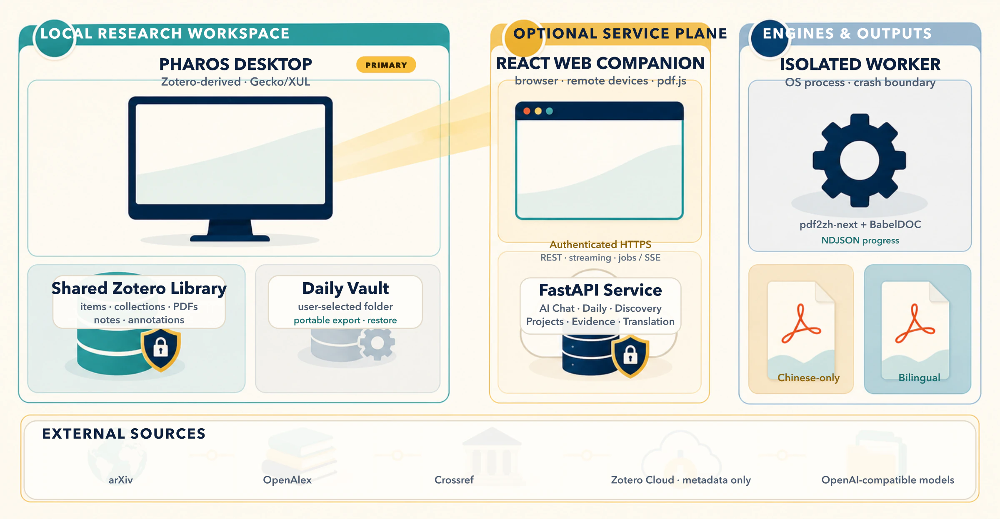
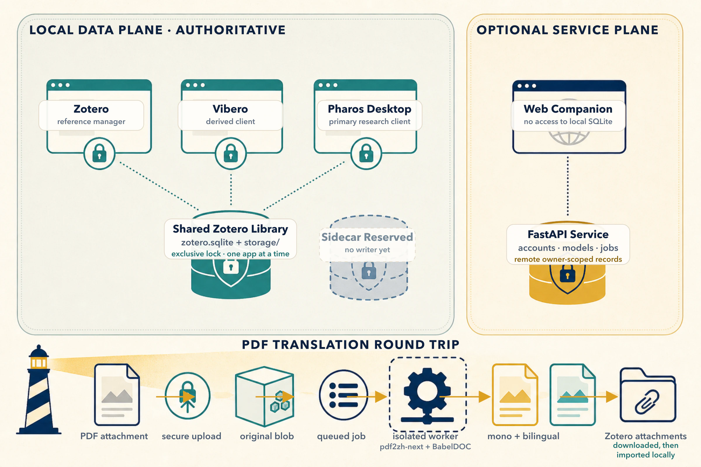

<p align="center">
  <strong>English</strong> · <a href="./README_CN.md">Simplified Chinese</a>
</p>

<div align="center">


### A Zotero-derived, evidence-first research workbench

Keep the Zotero library you already depend on, then add literature discovery,
paper translation, AI reading, evidence, and a durable research workflow in one
desktop-first platform.

[](LICENSE)
&nbsp;
&nbsp;
&nbsp;

[Official Website](https://hyyyyyyz.github.io/Pharos/) ·
[Web App](https://pharos.selab.top/) ·
[Architecture](docs/ARCHITECTURE.md) ·
[Research workflow](docs/RESEARCH_WORKFLOW.md) ·
[Roadmap](docs/ROADMAP.md) ·
[Client phases](docs/PHASE-CLIENT.md) ·
[Evidence phase](docs/PHASE-EVIDENCE.md) ·
[Parity phase](docs/PHASE-PARITY.md) ·
[Parity phase 2](docs/PHASE-PARITY-2.md) ·
[Parity phase 3](docs/PHASE-PARITY-3.md) ·
[Baseline & shared library](docs/PHASE-BASELINE.md) ·
[Contributing](CONTRIBUTING.md)

</div>

---

## What is Pharos?

Pharos is an open-source, Zotero-derived research client for the path from a
question to a defensible research output. It retains Zotero's mature local
library, collections, attachments, reader, annotations, citation styles, and
translators, then adds literature discovery, layout-preserving translation, AI
reading, daily monitoring, evidence, and persistent research workflows.

It is **not only a PDF translator**. Translation is an important foundation,
but the product is organized around the wider research loop:

```text
discover → screen → read → organize → hypothesize → plan → record → claim → draft → review
```

The primary product is the Zotero-derived desktop client. The public
[GitHub Pages site](https://hyyyyyyz.github.io/Pharos/) is the marketing site;
the React web app is a browser/remote companion. A FastAPI service provides
translation, model-backed tasks, accounts, and cross-device records when those
capabilities are needed.

<div align="center">
  
</div>

## What works today

The four primary modules are functional and backed by persistent server-side
data rather than static mockups.

| Module | Current capabilities |
| --- | --- |
| **Library** | Import PDFs, preserve bibliographic metadata, translate papers, search full text, organize collections, annotate passages, attach notes to highlights, and browse complete local Zotero libraries and PDFs from the desktop app. |
| **Daily Papers** | Follow user-defined research directions, fetch new arXiv papers, rank them for each user, optionally generate model-backed abstract readings, and import useful papers into the library. |
| **Literature Discovery** | Search arXiv and OpenAlex, merge duplicate records, retain partial results when a provider fails, reopen search history, inspect concise core-trick summaries, and save selected sources to a project. |
| **Research Projects** | Maintain research questions, source-selection rationale, a nine-stage project state, and durable hypothesis, experiment-plan, result, claim, draft, and review records. |

Both the web and desktop readers include paper-aware **AI Chat**. When a paper
opens in the desktop PDF Reader, the full-height conversation surface is the
default right-hand pane rather than a small section below item metadata. The
pane's sidenav still switches to Info, Notes, and the other standard reader
panes. Pharos starts preparing the current PDF before the first question, bound
to the exact attachment open in the reader even when one bibliographic item has
several PDFs. Each paper has persistent conversations and a reusable Chinese
research profile. The web app and desktop client read the same owner-scoped
state from the backend, so a conversation started in one continues in the
other.

### Reading and translation

- **Layout-preserving English-to-Chinese translation.** BabelDOC, invoked
  through `pdf2zh-next`, produces a Chinese-only PDF and a bilingual PDF while
  aiming to retain the original columns, figures, tables, and mathematics. In
  the desktop PDF Reader, a translation button to the left of Find
  offers **Translated Only** and **Side by Side**; the same choices remain in the
  library item's right-click menu.
- **A real PDF reader.** The React client uses pdf.js with a text layer, zoom,
  drag-to-pan, text selection, copy, in-document search, and annotations.
- **Coordinate-stable highlights.** Highlight locations are stored in PDF
  coordinates so they remain attached at different zoom levels and window sizes.
- **Optional translation providers.** Keyless Bing/Google translation and
  configured DeepSeek/OpenAI-compatible providers share the same engine boundary.
- **Per-account controls.** Whole-document translation can be disabled without
  hiding previously generated translated files.

### Discovery and research records

- Search arXiv and OpenAlex in parallel and normalize them into one result model.
- De-duplicate by DOI or normalized title and preserve all contributing sources.
- Keep successful results when one provider is unavailable and persist the
  provider-specific failure.
- Show deterministic title/abstract extraction by default, with an optional
  schema-validated model reading that is explicitly labelled as abstract-only.
- Save a paper to a research project together with the reason it belongs there
  and what still needs verification.
- Move a project through nine explicit stages:

```text
discovery → ideation → planning → experimentation → analysis
          → claims → drafting → review → complete
```

The current workflow stores researcher-owned records. It does **not** claim to
run experiments, reproduce results, verify claims, or write a complete paper
autonomously. Those capabilities require stronger evidence and execution
contracts and remain future work.

The first page-addressable evidence slice is already available: after a PDF's
pages have been extracted, the desktop Reader can save a selected passage as an
owner-scoped Evidence row. The server resolves the page from `PaperChunk`; a
verified single-page selection may retain PDF-point rectangles, while an
ambiguous or cross-page selection is saved as quote-only evidence.

### Library, accounts, and integrations

- Multi-user email/password accounts with Argon2id password hashing and signed
  bearer tokens.
- Owner-scoped papers, searches, projects, annotations, directions, and Zotero
  credentials.
- SQLite FTS5 full-text search and nested collection organization.
- PDF metadata extraction with Crossref/arXiv reconciliation where possible.
- One-way Zotero Web API metadata sync for browser and cross-device use. A server with a registered Zotero OAuth
  application offers one-click browser authorization; manual API-key linking
  remains available as a fallback.
- A desktop client for macOS, Windows and Linux built from Zotero source, so
  the library, PDF reader, annotations, citation styles and 760+ web translators
  are Zotero's own rather than reimplementations. Production builds open the
  user's existing Zotero library directly. Pharos-specific server records stay
  outside that library, and the reserved local sidecar path has no writer yet.

### AI Chat across web and desktop

- The web app reads only papers already owned by the signed-in account. It
  persists a reusable paper profile and independent conversations per paper on
  the backend, and restores them after a refresh or on another browser device.
- A user may bring an OpenAI-compatible provider from **Settings → AI Chat**.
  Its API key is encrypted with `PHAROS_CREDENTIAL_SECRET`, never returned to
  browser JavaScript, and never stored in `localStorage` or IndexedDB. An
  operator-configured `PHAROS_CHAT_PROVIDER` can be used as the server fallback.
- The desktop PDF Reader opens with **AI Chat** as its full-height right-hand
  primary pane. The section sidenav can switch back to Info, Notes, and other
  reader panes, while the toolbar entry restores chat after the context pane has
  been closed. When an account and model are configured, Pharos begins
  understanding the PDF before the first question. Collapsing the pane manually
  is respected when the user returns to that tab.
- Reader preparation is attached to the exact PDF on screen, not merely its
  parent library item. A parent with multiple PDF attachments therefore cannot
  make the model read an arbitrary sibling; linked PDFs are supported as well.
  Answers stream as they are generated.

### What the desktop client adds

Built from Zotero source rather than alongside it, so everything below happens
in the same window as the reading:

- **Layout-preserving translation.** Use the PDF Reader toolbar button to the
  left of Find, or right-click a PDF item in the library, then choose a
  translated-only or side-by-side bilingual rendering. BabelDOC rebuilds the
  document with figures, equations and pagination in place, and the result is
  imported as an ordinary attachment on the same item -- it opens in the same
  reader, takes highlights, and syncs.
- **AI chat** about the open paper. It occupies the Reader's full-height
  right-hand pane by default; the sidenav still reaches Info and Notes. The
  reader starts preparing the exact open attachment before the first question.
- **Daily papers**, **literature discovery** and **research projects** under the
  Tools menu. Anything found can be saved into the local library, PDF and the
  model's reading included.

Its application profile, backend token, credentials, and settings remain
separate. The reference library itself is Zotero's: the same items, collections,
attachments, PDFs, notes, and annotations are available when Zotero, Vibero, or
Pharos opens it. These applications take turns; they do not open one database
simultaneously. A path for a future local sidecar is reserved next to the
library, but current Pharos-native records are kept in the optional backend;
Daily Papers also has a versioned, user-owned portable Vault.

The compatibility transition is complete. The desktop client now follows the
Zotero 8.0.5 baseline and userdata schema 123, and production builds use the
same Zotero data directory and `zotero.sqlite`. A copied-library round trip was
verified with all 279 attachments intact. Development, tests, and CI remain
strictly isolated and must never open a real library. See
[`docs/CLIENT_DATA_ARCHITECTURE.md`](docs/CLIENT_DATA_ARCHITECTURE.md).

On first launch, a production build reads the installed Zotero profile's
`extensions.zotero.dataDir` setting and adopts it only when it is an absolute
path whose directory contains a regular `zotero.sqlite`. This discovers a
library moved to another drive or folder without copying Zotero's unrelated
preferences; older macOS profiles that retain a persistent descriptor are
handled through Zotero's accompanying `lastDataDir` path. An absolute
`-datadir` argument and an explicit Pharos data
directory preference always win; if the official profile is unavailable or
fails validation, Pharos falls back to the default `~/Zotero` and still accepts
`-datadir /path/to/Zotero`.

### Connect Zotero

The desktop client needs no import or Local API mirror: it is a Zotero-derived
application and opens the same local library directly. Zotero OAuth below is for
the web companion and remote devices that cannot access the local database or
local-only PDFs.

**Web/cloud connection.** The official web app at
[`pharos.selab.top`](https://pharos.selab.top/) uses the Pharos-managed Zotero
OAuth application. Users connect Zotero from Account Settings; they do not need
to register an OAuth application or handle its client secret.

The OAuth key and secret remain only on the official backend and are never
exposed to either client. Account Settings also retains the manual Zotero
user-ID/API-key flow. Both connection methods provide a one-way, metadata-only
import path for data already present in Zotero Cloud. Write-back remains
disabled.

The repository also contains a hardened Zotero 7/8 Connector transport preview.
It currently advertises data capabilities as disabled until pairing, notifier,
and transaction tests are complete. See
[`docs/ZOTERO_INTEGRATION.md`](docs/ZOTERO_INTEGRATION.md).

## Architecture

<div align="center">
  
</div>

Pharos is desktop-primary. The Zotero library is the local source of truth, and
the web application is a remote companion rather than a mirror of local SQLite.
Accounts, model calls, translation, cross-device continuity, and other remote
capabilities cross into the optional service plane only when needed.

<div align="center">
  
</div>

- **Desktop and local ownership:** Pharos is the primary local workbench, built
  from Zotero source. Zotero, Vibero, and Pharos may open the shared library one
  at a time. The reserved `pharos-local.sqlite` path is not written yet; the
  current Daily Vault is a separate versioned export/restore format. The full
  boundary is defined in
  [`docs/CLIENT_DATA_ARCHITECTURE.md`](docs/CLIENT_DATA_ARCHITECTURE.md).
- **Backend:** optional FastAPI services, SQLAlchemy 2.x, SQLite in WAL mode, a
  content-addressed PDF blob store, owner-scoped records, and background job
  managers.
- **Web companion:** React 18, TypeScript, Vite, TanStack Query, Zustand, and
  pdf.js. It reaches only authenticated server data; it cannot inspect a local
  `zotero.sqlite` or a PDF that has never been uploaded.
- **Translation boundary:** BabelDOC runs in its own Python environment and OS
  process. The backend consumes NDJSON progress; clients use authenticated
  upload/download, streamed replies, job polling, and SSE where appropriate.
  Desktop results are imported back as ordinary Zotero attachments.
- **External sources:** arXiv, OpenAlex, Crossref, Zotero, and optional
  OpenAI-compatible model providers. Zotero Cloud is a metadata-only companion
  path and does not make local-only PDFs appear on the web.

See [`docs/ARCHITECTURE.md`](docs/ARCHITECTURE.md) for the engine boundary,
storage model, request flow, licensing considerations, and the Apple-Silicon
`hyperscan` workaround.

## Repository layout

```text
Pharos/
├── backend/                 FastAPI core, services, database, tests
│   ├── pharos/              API, domain services, storage, engine adapter
│   └── engine_worker/       isolated BabelDOC worker; emits NDJSON progress
├── frontend/                React web product and PDF reader
├── client/                  Desktop client, built from Zotero source
├── zotero-connector/        secure Zotero 7/8 extension transport
├── site/                    Three.js/Vite GitHub Pages marketing site
├── scripts/                 environment and engine setup utilities
├── docs/                    architecture, roadmap, decisions, workflow specs
└── assets/brand/            shared logos, poster, and architecture artwork
```

The `site/` project is independent of the research application. Running the
marketing site does not start the FastAPI backend or the Pharos product UI.

## Local development

These commands are for source development and testing. Starting with 1.3.1,
official desktop releases connect to the Pharos cloud service at
`https://pharos.selab.top` and do not expose a server switch.

### Requirements

- Python **3.11 or newer**
- Node.js **20 or newer** and npm
- A modern browser
- For PDF translation on macOS Apple Silicon: conda and Rosetta 2
- For the desktop client: Node 20+ and the platform build tools listed in
  `client/app/scripts/check_requirements`

The documented engine bootstrap targets macOS Apple Silicon. Linux and Windows
x86_64 have native engine wheels, but their full installation path is not yet
wrapped by a repository setup script.

### 1. Clone and configure

```bash
git clone https://github.com/hyyyyyyz/Pharos.git
cd Pharos
cp .env.example .env
```

Generate a signing secret and place it in `.env` as `PHAROS_AUTH_SECRET`:

```bash
python -c "import secrets; print(secrets.token_urlsafe(48))"
```

The backend can generate an ephemeral secret for localhost development, but a
configured secret keeps sessions valid across restarts and is mandatory before
exposing the API beyond localhost.

### 2. Prepare the translation engine (macOS Apple Silicon)

```bash
bash scripts/setup_engine_env.sh
```

The script creates an isolated `osx-64` conda environment named
`pharos-engine`, installs `pdf2zh-next==2.9.0` and BabelDOC, and verifies the
native dependencies under Rosetta. If conda is installed somewhere other than
`~/miniconda3`, set `PHAROS_ENGINE_PYTHON` to the absolute interpreter path.

You may skip this step while working only on library, discovery, project, or UI
features; translation jobs will require the worker environment.

### 3. Start the backend

```bash
python3 -m venv .venv
source .venv/bin/activate
python -m pip install -e "backend[dev]"
python -m uvicorn pharos.main:app --host 127.0.0.1 --port 8848 --reload
```

On Windows, activate the environment with `.venv\Scripts\activate`.

The database and blob directories are created under `data/` on first start.
Check the API at `http://127.0.0.1:8848/api/health`.

### 4. Start the web client

In a second terminal:

```bash
npm ci --prefix frontend
npm --prefix frontend run dev
```

Open `http://localhost:5173`. The Vite development server proxies `/api` to
`http://127.0.0.1:8848`.

In the web app, use **Settings → AI Chat** to configure a personal
OpenAI-compatible endpoint, model, and API key. Opening an uploaded library
paper then prepares its reusable context and restores its per-paper chat
history automatically.

## Run the desktop client

`client/` is the desktop application, built from Zotero source with the
`.git` removed -- see `client/BRANDING.md` for what was changed and why. It
keeps Zotero's library, PDF reader, annotations and citation styles, and adds
layout-preserving translation, AI chat about the open paper, the daily arXiv
digest, literature discovery and research projects. It expects the Pharos
backend to be running.

```bash
cd client
npm install
npm run build                    # transpile JS/JSX, compile SCSS
app/scripts/dir_build -p m       # produces app/staging/Pharos.app
app/scripts/run_pharos_dev       # launch with an isolated data directory
```

Always launch development builds through `run_pharos_dev`. It passes `-datadir`
and refuses to run against `~/Zotero`: `-profile` isolates only the Gecko
profile, **not** Zotero's data directory. Production shared-library support does
not permit development or automated tests to use real data.

Sign in under **Settings → Pharos** to reach the backend. Tagging `desktop-v*`
builds all three platforms through `.github/workflows/desktop-release.yml`;
macOS builds are unsigned, so the first launch is refused and has to be allowed
once under System Settings → Privacy & Security → Open Anyway.

## Develop the marketing site

The public website is a separate static Vite/Three.js project and does not need
Python, the API, a database, or model keys.

```bash
npm ci --prefix site
npm --prefix site run dev -- --port 5174
```

Use port `5174` when the product frontend is already using `5173`.

```bash
npm --prefix site run build
npm --prefix site run preview
```

## Configuration

The backend reads the repository-root `.env` file. The most important settings
are:

| Variable | Purpose |
| --- | --- |
| `PHAROS_AUTH_SECRET` | Signs access tokens. Use at least 32 random characters in production; localhost development may use an ephemeral secret. |
| `PHAROS_CREDENTIAL_SECRET` | Independently encrypts stored Zotero credentials, temporary OAuth secrets, and users' web AI provider keys. Use at least 32 random characters and do not reuse the auth or OAuth secret. |
| `PHAROS_CREDENTIAL_SECRET_PREVIOUS` | Optional previous credential-encryption secret used temporarily during key rotation. |
| `PHAROS_ZOTERO_OAUTH_CLIENT_KEY` | Server-side key from the registered Zotero OAuth application. |
| `PHAROS_ZOTERO_OAUTH_CLIENT_SECRET` | Server-side secret from the registered Zotero OAuth application; never expose it through a `VITE_*` variable or commit it. |
| `PHAROS_ZOTERO_OAUTH_CALLBACK_URL` | Exact public callback registered with Zotero, for example `https://pharos.selab.top/api/zotero/oauth/callback`. |
| `PHAROS_ZOTERO_OAUTH_RETURN_URL` | Fixed product URL used after the callback completes, for example `https://pharos.selab.top/`. |
| `PHAROS_DATA_DIR` | Overrides the SQLite database and PDF blob root. Defaults to `data/`. |
| `PHAROS_ENGINE_PYTHON` | Absolute path to the Python interpreter inside the isolated translation-engine environment. |
| `PHAROS_TRANSLATOR_TYPE` | `bing`, `google`, `deepseek`, `openai`, or `custom`. |
| `PHAROS_CHAT_PROVIDER` | Selects the instance-wide provider used by optional model-backed reading tasks and as the web AI Chat fallback when a user has no personal provider. |
| `PHAROS_DEEPSEEK_*`, `PHAROS_OPENAI_*`, `PHAROS_CUSTOM_*` | API key, base URL, and model for named OpenAI-compatible providers. |
| `PHAROS_CORS_ORIGINS` | Comma-separated allowed web origins. Set explicit origins in production. |

The default translator is keyless Bing. Model-backed daily reading and
abstract analysis remain unavailable until a usable provider key and model are
configured; the rest of the application continues to work without one.

## API basics

- The API base path is `/api`.
- `POST /api/auth/register` and `POST /api/auth/login` issue bearer tokens.
- Business endpoints require `Authorization: Bearer <token>`; `/api/health` and
  the authentication entry points are the main public exceptions. The Zotero
  OAuth callback is also public because the browser redirect cannot carry the
  bearer token; it is protected by a short-lived, one-use server flow and a
  secure browser cookie.
- Translation progress is available from
  `GET /api/jobs/{job_id}/events` as an authenticated SSE stream.
- FastAPI exposes interactive OpenAPI documentation at `http://127.0.0.1:8848/docs`
  and the schema at `/openapi.json`.

Representative endpoint groups include `/api/papers`, `/api/search`,
`/api/daily`, `/api/discovery`, `/api/projects`, `/api/collections`,
`/api/highlights`, and `/api/zotero`.

## Verification

From the repository root:

```bash
# Backend tests
python -m pytest backend/tests

# Product and marketing builds
npm --prefix frontend run build
npm --prefix site run build

# Desktop client
(cd client && test/runtests.sh pharosAPI pharosTranslate pharosChat pharosReaderChat)

# Zotero Connector transport
npm --prefix zotero-connector test
npm --prefix zotero-connector run build
```

The live BabelDOC integration test is optional because it requires the isolated
engine environment and a real PDF fixture.

## Current boundaries and next directions

Pharos deliberately distinguishes implemented records from automated research:

- **AI Chat** works in both readers against the same owner-scoped server
  persistence, with encrypted BYOK.
- Literature Discovery reads search metadata and abstracts, not full papers.
- Research Projects persist plans and results supplied by the researcher; they
  do not run code, allocate GPUs, or validate metrics.
- A `verified` project record is a user decision, not independent reproduction.
- Tags and paper-level notes remain Zotero-native in the desktop client. The web
  client supports direct arXiv ID/official-link import into the signed-in
  library; one-click Discovery-to-Library promotion remains a separate
  incomplete flow.
- Page-addressable Evidence is implemented for the first vertical slice: the
  desktop Reader can save a selected passage, with server-verified page
  resolution and safe quote-only fallback when geometry is ambiguous. Grounded
  Q&A and automatic claim bindings are still future work.
- The desktop client directly uses the schema-compatible Zotero library rather
  than maintaining a Local API mirror. Zotero Cloud remains a limited companion
  path for the web app and remote devices; local-only PDFs stay local unless
  explicitly uploaded.
- The official Pharos cloud service is available at
  [pharos.selab.top](https://pharos.selab.top/); GitHub Pages hosts only the
  public marketing site.
- Desktop builds are unsigned. Signed and notarized releases, a Windows
  installer rather than a portable archive, and a mobile client are future work.

The next major workstreams are grounded paper Q&A, an evidence-aware idea
workflow, sandboxed experiment execution, claim-to-result bindings, and an
evidence-constrained drafting/review pipeline. The detailed contract is
recorded in [`docs/RESEARCH_WORKFLOW.md`](docs/RESEARCH_WORKFLOW.md).

## Contributing

Read [`AGENTS.md`](AGENTS.md) first. It is the operating manual for both human
and agent contributors, and it points at the two documents that keep separate
contributors aimed the same way: [`docs/ROADMAP.md`](docs/ROADMAP.md), whose
"Not doing" section matters more than its goals, and
[`docs/DECISIONS.md`](docs/DECISIONS.md), which records why the load-bearing
choices are what they are.

## License

Pharos is licensed under the **GNU Affero General Public License v3.0 or later**.
See [`LICENSE`](LICENSE). If you offer a modified Pharos to users over a network,
the AGPL requires those users to be offered the corresponding source code.

## Thanks

Pharos is built from the source of [Zotero](https://github.com/zotero/zotero).
We are deeply grateful to the Zotero maintainers and community for the mature
library model, PDF reader, annotation system, citation infrastructure, and web
translators that make this research workbench possible.

[Vibero](https://github.com/chenyu-xjtu/Vibero) demonstrated a practical path
for a Zotero-derived application to keep its own product identity while sharing
the user's local Zotero library. That precedent helped clarify Pharos's desktop
data architecture. Pharos does not copy Vibero's product features or interface;
the thanks here are for that valuable architectural inspiration.

Layout-preserving translation is powered by
[BabelDOC](https://github.com/funstory-ai/BabelDOC) and
[PDFMathTranslate / pdf2zh-next](https://github.com/PDFMathTranslate/PDFMathTranslate-next),
both maintained by funstory.ai and distributed under AGPL-3.0.

<div align="center">
  <br />
  
  <br />
  <sub><strong>Pharos</strong> · A clear line through the literature</sub>
</div>
