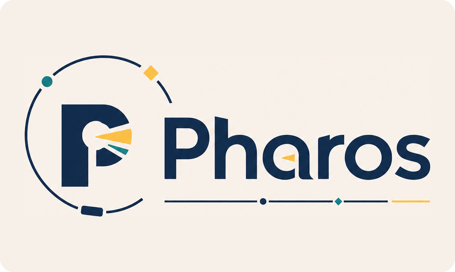
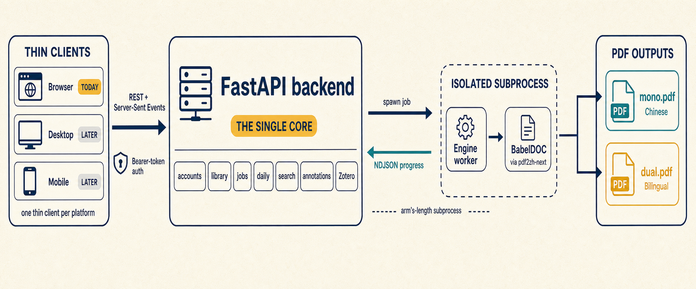
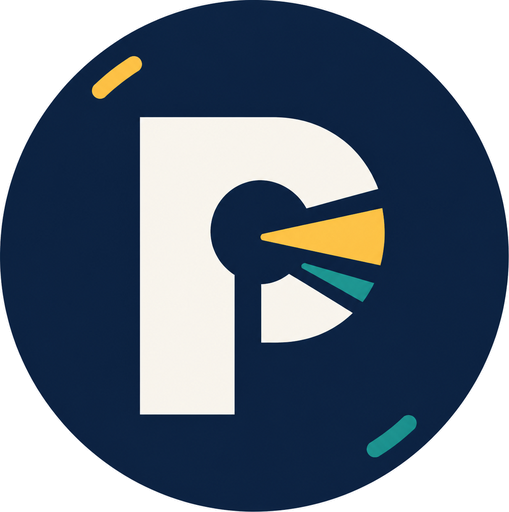

<p align="center">
  <a href="./README.md">英文</a> · <strong>简体中文</strong>
</p>

<div align="center">



### 一体化、证据优先的科研工作台

在同一个自托管平台中完成文献发现、论文翻译与精读、证据整理，并让一个研究想法沿着可持续的流程推进。

[](LICENSE)
&nbsp;
&nbsp;
&nbsp;

[项目官网](https://hyyyyyyz.github.io/Pharos/) ·
[浏览器客户端](https://pharos.selab.top/) ·
[架构说明](docs/ARCHITECTURE.md) ·
[科研工作流](docs/RESEARCH_WORKFLOW.md) ·
[参与贡献](CONTRIBUTING.md)

</div>

---

## Pharos 是什么？

Pharos 是一个开源、自托管的科研平台，面向从研究问题到可信研究产出的完整过程。它把文献发现、保留版式的论文翻译、深度阅读、批注、个人文库、每日方向跟进、Zotero 同步和持久化研究项目放进同一个工作台。

它**不只是一个 PDF 翻译器**。翻译是重要基础，但产品围绕更完整的科研链条组织：

```text
发现 → 筛选 → 阅读 → 整理 → 假设 → 规划 → 记录 → 主张 → 草稿 → 审阅
```

公开的 [GitHub Pages 页面](https://hyyyyyyz.github.io/Pharos/) 是项目宣传站。真正的产品由 React 网页客户端（或 Zotero 桌面客户端）、FastAPI 后端、SQLite 数据层以及隔离运行的 PDF 翻译工作进程共同组成。

<div align="center">
  
</div>

## 当前已经实现

四个主要模块已经具备真实的前后端和持久化数据链路，并非静态界面原型。

| 模块 | 当前能力 |
| --- | --- |
| **文库** | 导入本地 PDF、保存书目信息、翻译论文、检索全文、管理分类、阅读原文与译文、保存高亮和高亮笔记；桌面端直接沿用 Zotero 的文库、阅读器与标注。 |
| **每日论文** | 根据用户自定义的研究方向跟进 arXiv 新论文，按用户方向匹配和排序；配置模型后可生成摘要级中文解读，并把有价值的论文下载到文库。 |
| **文献探索** | 同时检索 arXiv 和 OpenAlex，合并重复记录，单个来源失败时保留其余结果，重新打开搜索历史，快速查看核心思路，并把选中的论文纳入研究项目。 |
| **研究项目** | 保存研究问题、文献纳入理由、九阶段项目状态，以及假设、实验计划、结果、主张、草稿和审阅记录。 |

网页端和桌面端都提供论文感知的 **AI 对话**：每篇论文拥有独立、持久化的对话；配置模型后，Pharos 会在第一次提问前先建立可复用的中文论文理解档案。网页端和桌面端读取后端同一份按账户隔离的状态，在一端开始的对话可以在另一端继续。

### 论文阅读与翻译

- **保留版式的英译中。** 系统通过 `pdf2zh-next` 调用 BabelDOC，生成纯中文 PDF 和双语 PDF，同时尽量保持原有分栏、图表、表格和数学公式的位置。
- **真正可操作的 PDF 阅读器。** React 客户端基于 pdf.js，支持文本层、缩放、拖动平移、文本选择与复制、全文查找、目录、缩略图和页码跳转。
- **缩放后仍稳定的高亮。** 高亮位置使用 PDF 坐标保存，因此更换缩放比例或窗口尺寸后仍能落在原文位置；高亮可附带笔记。
- **可选翻译服务。** 可以使用无密钥的 Bing/Google，也可以配置 DeepSeek 或其他兼容 OpenAI 接口的服务。
- **账户级翻译开关。** 用户可以关闭整篇翻译功能，同时继续阅读以前已经生成的译文。

### 文献探索与科研记录

- 并行请求 arXiv 和 OpenAlex，并统一为同一种结果结构。
- 根据 DOI 或规范化标题去重，同时保留所有命中的来源信息。
- 某个来源不可用时保留其他来源的成功结果，并持久化具体错误。
- 默认只从标题和摘要中进行确定性抽取；也可以主动调用模型生成经过结构校验的摘要级解读，并明确记录所用模型。
- 把论文保存进研究项目时，同时记录为什么纳入、它可能支持或反驳什么、下一步还需要核对什么。
- 研究项目按九个明确阶段推进：

```text
文献探索 → 想法构思 → 实验规划 → 实验执行 → 结果分析
         → 主张整理 → 论文草稿 → 反方审阅 → 项目完成
```

当前工作流保存的是研究者拥有和确认的科研记录。它**不会**自动运行实验、复现结果、验证主张，也不会自主写出一篇完整论文。页面级证据和自动执行需要更严格的数据与安全约束，仍属于后续工作。

### 文库、账户与外部集成

- 邮箱与密码账户，使用 Argon2id 进行密码哈希，并使用签名 Bearer Token 鉴权。
- 论文、搜索、项目、批注、研究方向和 Zotero 凭据均按用户隔离。
- SQLite FTS5 全文检索和嵌套分类管理。
- 从 PDF 中提取元数据，并在可以识别 DOI 或 arXiv 编号时通过 Crossref/arXiv 补全。
- 网页端和跨设备场景通过 Zotero Web API 单向同步云端书目元数据。服务器注册并配置 Zotero OAuth 应用后，用户可以在浏览器中一键授权，同时保留手动 API 密钥方式。
- 面向 macOS、Windows、Linux 的桌面客户端，由 Zotero 源码构建，因此文库、PDF 阅读器、标注、引文样式和 760+ 网页抓取器都是 Zotero 自己的，而非重新实现。数据放在 `~/Pharos`，不会动已有的 Zotero 安装。

### 网页端与桌面端的 AI 对话

- 网页端只读取当前登录账户已经拥有的论文，在后端保存每篇论文的理解档案和独立会话；刷新页面或换一台浏览器设备登录后仍可恢复。
- 用户可以在“设置 → AI 对话”中填写自己的 OpenAI 兼容接口。API Key 使用 `PHAROS_CREDENTIAL_SECRET` 在后端加密，绝不回传给浏览器 JavaScript，也不会进入 `localStorage` 或 IndexedDB。管理员配置的 `PHAROS_CHAT_PROVIDER` 可作为全站默认模型。
- 桌面端在条目面板里就着正在读的论文提问，请求同一个后端，回答边生成边显示。

### 桌面客户端加了什么

客户端由 Zotero 源码构建而成，而不是与之并行，所以下面这些都发生在读论文的同一个窗口里：

- **保排版翻译。** 右键 PDF 选「仅译文」或「中英对照」。BabelDOC 重建文档，图表、
  公式、分页全部保持原位，结果作为普通附件挂回同一条目——用同一个阅读器打开、
  能标注、能同步。
- **AI 对话**：在条目面板里就着正在读的论文提问。
- **每日论文**、**文献探索**、**研究项目** 都在工具菜单下。找到的论文可连同 PDF
  与模型解读一起存进本地文库。

数据放在 `~/Pharos`，与 Zotero 自己的 `~/Zotero` 分开。访问后端的令牌存在操作系统
凭据库里、经 OSKeyStore 加密，不会写入偏好设置、日志或 Git。

### 连接 Zotero

桌面客户端**不需要**连接 Zotero：它本身就是由 Zotero 衍生的应用，文库在 `~/Pharos`。下面的账号关联是给网页端用的，也用于在两者之间搬运元数据。

**网页/云端连接：** 自行部署时，需要先在 [Zotero OAuth 应用管理页面](https://www.zotero.org/oauth/apps) 注册网页应用：

- 网站地址：`https://pharos.selab.top/`（请替换为自己的公开产品地址）
- 回调地址：`https://pharos.selab.top/api/zotero/oauth/callback`

OAuth 客户端密钥只能配置在后端，不能进入前端构建产物。未配置 OAuth 时，账户设置仍会提供手动填写 Zotero 用户编号和 API 密钥的连接方式。两种云端连接方式都只同步已经存在于 Zotero Cloud 的数据；当前都不执行写回。

仓库中还包含一个面向 Zotero 7/8 的安全 Connector 传输预览。配对界面、Notifier 和事务测试完成前，它会如实把所有数据能力标为关闭。详见 [`docs/ZOTERO_INTEGRATION.md`](docs/ZOTERO_INTEGRATION.md)。

## 系统架构

<div align="center">
  
</div>

上图主要展示 PDF 翻译执行链路；当前仓库还包含文献探索、研究项目，以及由 Zotero 源码构建的桌面客户端。

FastAPI 后端是 Pharos 原生科研记录的数据事实来源；Zotero 条目仍以 Zotero 为准，由桌面端建立本地镜像：

```text
React 网页客户端 / Zotero 桌面客户端
                  │
                  │ REST + Server-Sent Events + Bearer Token 鉴权
                  ▼
            FastAPI 单一核心
账户 · 文库 · 任务 · 每日论文 · 文献探索 · 研究项目 · 批注 · Zotero
                  │
                  │ 独立系统进程 · NDJSON 进度
                  ▼
      翻译工作进程 → pdf2zh-next → BabelDOC
                   → 纯中文 PDF + 双语 PDF
```

- **后端：** FastAPI、SQLAlchemy 2.x、WAL 模式的 SQLite、SSE、基于内容哈希的 PDF 文件存储和后台任务管理器。
- **网页客户端：** React 18、TypeScript、Vite、TanStack Query、Zustand 和 pdf.js。
- **桌面客户端：** 由 Zotero 源码构建（Gecko/XUL，非 Electron）；后端和翻译引擎仍然独立运行，见 `client/`。
- **翻译边界：** BabelDOC 在单独的 Python 环境和系统进程中运行。后端读取 NDJSON 进度，并通过 API/SSE 对外提供任务状态。
- **外部来源：** arXiv、OpenAlex、Crossref、Zotero，以及用户可选的兼容 OpenAI 接口的模型服务。

关于引擎隔离、数据存储、请求流程、许可证边界和 Apple Silicon 上的 `hyperscan` 兼容问题，请阅读 [`docs/ARCHITECTURE.md`](docs/ARCHITECTURE.md)。

## 仓库目录

```text
Pharos/
├── backend/                 FastAPI 核心、业务服务、数据库与测试
│   ├── pharos/              API、领域服务、存储和引擎适配器
│   └── engine_worker/       独立 BabelDOC 工作进程，输出 NDJSON 进度
├── frontend/                React 产品界面和 PDF 阅读器
├── client/                  桌面客户端，基于 Zotero 源码构建
├── zotero-connector/        Zotero 7/8 安全扩展传输层
├── site/                    Three.js/Vite GitHub Pages 宣传站
├── scripts/                 环境和翻译引擎安装工具
├── docs/                    架构与科研工作流规范
└── assets/brand/            品牌标志、海报和架构图
```

`site/` 是独立的宣传网站工程。运行宣传站不会启动 FastAPI 后端，也不会启动 Pharos 产品界面。

## 在本地运行 Pharos

### 环境要求

- Python **3.11 或更高版本**
- Node.js **20 或更高版本**以及 npm
- 现代浏览器
- 在 Apple Silicon Mac 上使用 PDF 翻译：conda 与 Rosetta 2
- 运行桌面客户端：Rust **1.77.2 或更高版本**以及对应平台的构建工具

仓库目前提供的翻译引擎自动安装脚本面向 Apple Silicon Mac。Linux 与 Windows x86_64 可以使用原生引擎依赖，但仓库暂未提供对应的一键安装脚本。

### 1. 克隆并配置

```bash
git clone https://github.com/hyyyyyyz/Pharos.git
cd Pharos
cp .env.example .env
```

生成一个签名密钥，并把结果写入 `.env` 中的 `PHAROS_AUTH_SECRET`：

```bash
python -c "import secrets; print(secrets.token_urlsafe(48))"
```

后端在纯本地开发时可以临时生成一次性密钥，但配置固定密钥后，重启服务不会让所有登录状态失效；只要 API 会被本机之外的设备访问，就必须设置固定密钥。

### 2. 准备翻译引擎（Apple Silicon Mac）

```bash
bash scripts/setup_engine_env.sh
```

脚本会创建名为 `pharos-engine` 的独立 `osx-64` conda 环境，安装 `pdf2zh-next==2.9.0` 与 BabelDOC，并在 Rosetta 下检查本地依赖。如果 conda 不在 `~/miniconda3`，请通过 `PHAROS_ENGINE_PYTHON` 指向该环境中 Python 解释器的绝对路径。

如果只开发文库、文献探索、研究项目或界面，可以暂时跳过这一步；真正提交翻译任务时仍然需要完整引擎环境。

### 3. 启动后端

```bash
python3 -m venv .venv
source .venv/bin/activate
python -m pip install -e "backend[dev]"
python -m uvicorn pharos.main:app --host 127.0.0.1 --port 8848 --reload
```

Windows 用户可使用 `.venv\Scripts\activate` 激活虚拟环境。

首次启动时，数据库和 PDF 文件目录会自动创建在 `data/` 下。可以通过 `http://127.0.0.1:8848/api/health` 检查后端状态。

### 4. 启动网页客户端

在另一个终端运行：

```bash
npm ci --prefix frontend
npm --prefix frontend run dev
```

打开 `http://localhost:5173`。Vite 开发服务器会把 `/api` 请求代理到 `http://127.0.0.1:8848`。

在网页端通过“设置 → AI 对话”填写个人 OpenAI 兼容接口、模型和 API Key。打开文库中已经上传的论文后，系统会自动建立可复用的论文上下文，并恢复这篇论文自己的对话历史。

## 运行桌面客户端

`client/` 是桌面客户端，基于 Zotero 源码构建并移除了 `.git`——改造细节见
`client/BRANDING.md`。它保留 Zotero 的文库、PDF 阅读器、标注与引文样式，
并加上保排版翻译、就着论文的 AI 对话、每日论文、文献探索和研究项目。
运行需要 Pharos 后端。

```bash
cd client
npm install
npm run build                    # 转译 JS/JSX、编译 SCSS
app/scripts/dir_build -p m       # 打出 app/staging/Pharos.app
app/scripts/run_pharos_dev       # 用隔离的数据目录启动
```

**开发期请始终用 `run_pharos_dev` 启动。** 它强制传 `-datadir`，并在路径等于
`~/Zotero` 时拒绝运行——`-profile` 只隔离 Gecko profile，**不隔离 Zotero 的数据
目录**，这一点曾让开发构建去打开了本机真实的 Zotero 库。

在「设置 → Pharos」登录后端。推 `v*` 标签会由
`client/.github/workflows/release.yml` 构建安装包；macOS 构建未签名，
首次启动需按住 Control 点击图标、选「打开」。

## 开发宣传网站

公开官网是独立的 Vite/Three.js 静态工程，不需要 Python、后端、数据库或模型密钥。

```bash
npm ci --prefix site
npm --prefix site run dev -- --port 5174
```

当产品前端已经占用 `5173` 时，可以让宣传站使用 `5174`。

```bash
npm --prefix site run build
npm --prefix site run preview
```

## 配置说明

后端读取仓库根目录的 `.env` 文件。主要配置包括：

| 变量 | 用途 |
| --- | --- |
| `PHAROS_AUTH_SECRET` | 用于签发访问令牌。持久化或联网运行时，应使用至少 32 个随机字符。 |
| `PHAROS_CREDENTIAL_SECRET` | 独立用于加密已保存的 Zotero 凭据、临时 OAuth 密钥和用户在网页端配置的 AI Provider 密钥。至少使用 32 个随机字符，不要复用登录签名密钥或 OAuth 客户端密钥。 |
| `PHAROS_CREDENTIAL_SECRET_PREVIOUS` | 可选；轮换凭据加密密钥时，临时保留上一把密钥用于读取并迁移旧密文。 |
| `PHAROS_ZOTERO_OAUTH_CLIENT_KEY` | 在 Zotero 注册 OAuth 应用后获得的服务端客户端编号。 |
| `PHAROS_ZOTERO_OAUTH_CLIENT_SECRET` | Zotero OAuth 应用的服务端密钥；禁止放入任何 `VITE_*` 变量或提交到仓库。 |
| `PHAROS_ZOTERO_OAUTH_CALLBACK_URL` | 在 Zotero 注册的精确公开回调地址，例如 `https://pharos.selab.top/api/zotero/oauth/callback`。 |
| `PHAROS_ZOTERO_OAUTH_RETURN_URL` | 授权完成后返回的固定产品地址，例如 `https://pharos.selab.top/`。 |
| `PHAROS_DATA_DIR` | 修改 SQLite 数据库和 PDF 文件存储根目录，默认为 `data/`。 |
| `PHAROS_ENGINE_PYTHON` | 指向独立翻译引擎环境中的 Python 解释器绝对路径。 |
| `PHAROS_TRANSLATOR_TYPE` | 可选 `bing`、`google`、`deepseek`、`openai` 或 `custom`。 |
| `PHAROS_CHAT_PROVIDER` | 选择用于可选模型解读任务的全站模型；当网页用户没有个人 Provider 时，也作为 AI 对话的默认模型。 |
| `PHAROS_DEEPSEEK_*`、`PHAROS_OPENAI_*`、`PHAROS_CUSTOM_*` | 对应服务的密钥、接口地址和模型名称。 |
| `PHAROS_CORS_ORIGINS` | 允许访问 API 的网页来源，多个来源使用英文逗号分隔；正式部署时应明确填写。 |

默认翻译服务是无需密钥的 Bing。每日论文的模型解读和文献探索的模型摘要需要配置可用的服务密钥与模型；没有配置时，抓取、检索、方向匹配、项目记录和其他主要功能仍然可用。

## API 基础说明

- API 统一使用 `/api` 前缀。
- `POST /api/auth/register` 和 `POST /api/auth/login` 用于注册、登录并获取 Bearer Token。
- 业务接口需要携带 `Authorization: Bearer <token>`；`/api/health` 和认证入口是主要的公开例外。Zotero OAuth 回调也必须公开，因为浏览器从 Zotero 跳回时不会携带 Bearer Token；后端通过短时、一次性的授权记录和安全浏览器 Cookie 保护这条回调。
- 翻译任务进度可通过 `GET /api/jobs/{job_id}/events` 获取，该接口是需要鉴权的 SSE 流。
- FastAPI 交互式接口文档位于 `http://127.0.0.1:8848/docs`，OpenAPI 描述文件位于 `/openapi.json`。

主要接口分组包括 `/api/papers`、`/api/search`、`/api/daily`、`/api/discovery`、`/api/projects`、`/api/collections`、`/api/highlights` 和 `/api/zotero`。

## 验证与检查

在仓库根目录运行：

```bash
# 后端测试
python -m pytest backend/tests

# 产品前端与宣传站构建
npm --prefix frontend run build
npm --prefix site run build

# 桌面端 Rust 能力层
(cd client && test/runtests.sh -f pharosAPI pharosTranslate pharosChat)

# Zotero Connector 安全传输层
npm --prefix zotero-connector test
npm --prefix zotero-connector run build
```

BabelDOC 真实集成测试需要独立引擎环境和真实 PDF 测试文件，因此不属于默认测试流程。

## 当前能力边界

Pharos 明确区分“已经持久化的研究记录”和“真正的自动科研能力”：

- **AI 对话** 已同时覆盖网页端和桌面端，共用后端按用户隔离的持久化与加密 BYOK。
- 文献探索读取的是搜索结果中的标题和摘要，不是论文全文。
- 研究项目保存由研究者填写的计划和结果，不会自动运行代码、分配 GPU 或验证指标来源。
- 项目记录中的“人工核验”是用户作出的状态判断，不代表平台已经独立复现。
- 标签、论文级笔记、直接粘贴 arXiv 链接导入、从文献探索一键下载到文库等前端流程仍未完全闭环。
- Zotero 云端同步仍是单向的元数据导入。桌面端本地连接已经覆盖完整文库图谱和本地 PDF，但 Local API 写回被有意关闭；Connector 的实时同步和写入能力只有在配对、冲突处理和事务测试完成后才会开放。
- 完整产品后端目前需要自行部署；GitHub Pages 只托管公开宣传站。
- 桌面客户端已经存在，但正式签名、公证后的公开安装包以及移动端薄客户端仍属于后续工作。

下一阶段的重点包括页面级证据定位、基于原文的可靠问答、证据感知的研究想法工作流、沙箱实验执行、结果与论文主张强绑定，以及受证据约束的写作与审阅流程。详细约束见 [`docs/RESEARCH_WORKFLOW.md`](docs/RESEARCH_WORKFLOW.md)。

## 许可证

Pharos 使用 **GNU Affero General Public License v3.0 或更高版本**，详见 [`LICENSE`](LICENSE)。如果通过网络向用户提供修改后的 Pharos，AGPL 要求向这些用户提供对应源代码。

## 鸣谢

保留版式的翻译能力由 [BabelDOC](https://github.com/funstory-ai/BabelDOC) 和 [PDFMathTranslate / pdf2zh-next](https://github.com/PDFMathTranslate/PDFMathTranslate-next) 提供。它们由 funstory.ai 维护，并采用 AGPL-3.0 许可证。

<div align="center">
  <br />
  
  <br />
  <sub><strong>Pharos</strong> · 让科研过程始终沿着清晰航线推进</sub>
</div>
