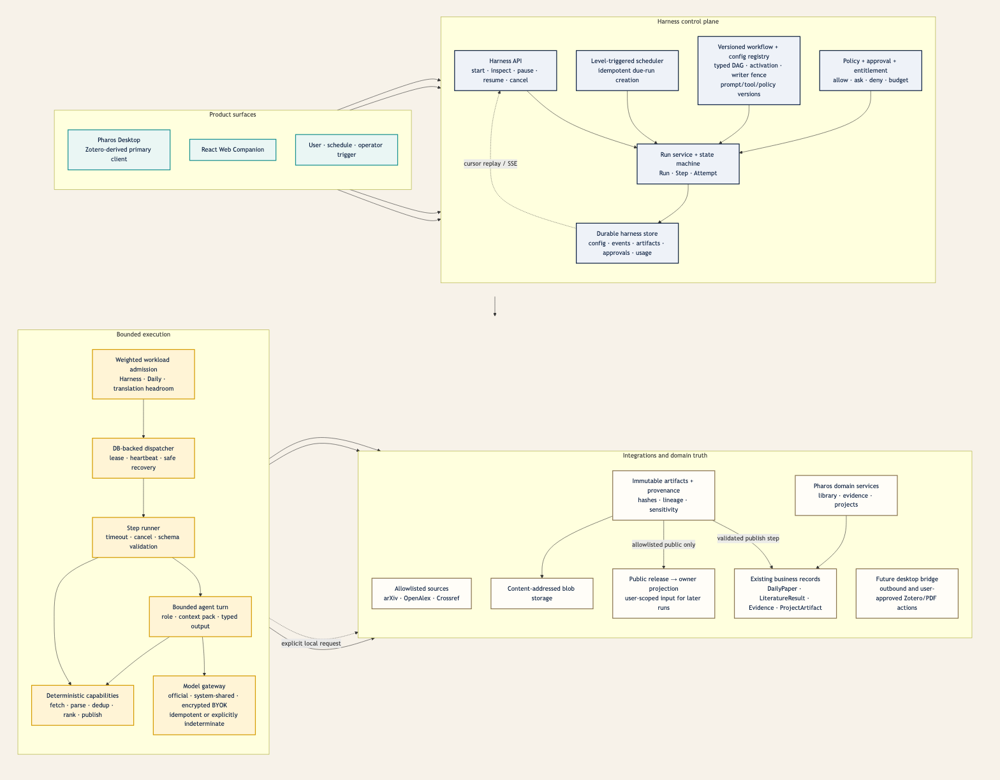
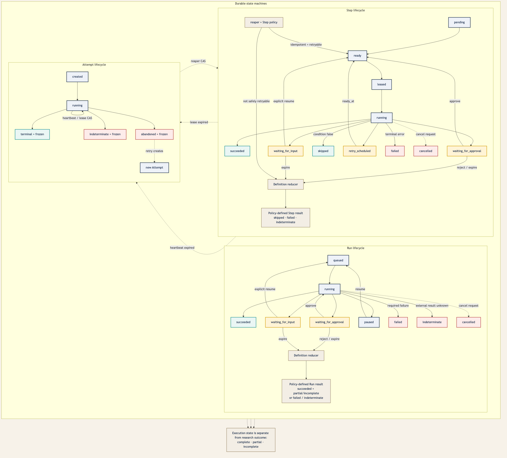

# Pharos Research Harness — architecture

> 状态：**目标架构；H1 durable kernel 与 H1.5 safe-profile/official-wire code gate 已完成，生产
> operational gate、per-Attempt DSH adapter 与恢复语义尚未完成。** 本文是
> Pharos Harness 的 source of truth。H2–H7 业务能力仍是 Planned；任何代码提交不得把 Planned 能力描述成
> 已上线能力；分阶段落实顺序与验收门槛见
> [`HARNESS_IMPLEMENTATION_PLAN.md`](HARNESS_IMPLEMENTATION_PLAN.md)。

Pharos Research Harness 是一层**可持久化、可恢复、可审计、受策略约束的科研任务执行层**。
它服务每日论文、文献探索、项目研究，未来也可服务 grounded Q&A、证据感知 Idea、写作与审阅。

它不是“再加一个聊天 Agent”，也不是让多个角色自由讨论。它的核心定义是：

> **Workflow 控制顺序、状态、权限、预算和恢复；Agent 只在一个已授权 Step 内完成有界判断。**

外部项目取样和 Adopt / Adapt / Reject 决策见
[`HARNESS_LANDSCAPE.md`](HARNESS_LANDSCAPE.md)，三条业务工作流见
[`HARNESS_WORKFLOWS.md`](HARNESS_WORKFLOWS.md)。DeepSeek Harness 已确定为受限 Agent Attempt 执行内核，
集成协议与 denylist 见 [`DEEPSEEK_HARNESS_INTEGRATION.md`](DEEPSEEK_HARNESS_INTEGRATION.md)；源码已固定，
wire/Loader code gate 证据见 [`PHASE-HARNESS-DSH-WIRE.md`](PHASE-HARNESS-DSH-WIRE.md)；per-Attempt
product adapter 仍在实现且生产 gate 关闭。

## 1. 目标与成功标准

Harness 要解决当前三项功能共有的问题：

- 一项工作可能需要数秒、数分钟或等待人工数天，不能绑在一个 HTTP 请求上；
- API 进程重启后要知道已经完成什么、下一步是什么、哪些副作用不能重做；
- 同一工作可拆给 Retriever、Reader、Critic、Synthesizer 等不同角色，但角色不能自行扩权；
- 每一步的输入、输出、模型、prompt、工具、成本、错误和来源可追溯；
- 用户能查看进度、暂停、取消、批准、拒绝和恢复；
- 领域结果仍写回 `DailyPaper`、`LiteratureResult`、`Evidence`、`ProjectArtifact` 等真实业务表；
- Desktop 与 Web 看到同一 Run，但本地 Zotero/PDF 数据不被云端擅自读取；
- 后续订阅额度由服务端统一执行，而不是在客户端隐藏按钮。

完成后的最小用户体验应是：

1. 用户从 Daily、Discovery 或 Project 发起目标；
2. API 立即返回 `202` 和 `run_id`；
3. UI 展示当前 Step、已经完成的 Artifact、等待事项、预算和可解释错误；
4. 关闭页面、重启客户端或后端重启后仍可继续；
5. 关键写入/隐私/付费动作停在 approval；
6. 最终结果带来源，可被保存、拒绝、修订或提升到领域记录；
7. Agent 失败不会毁掉已完成的确定性搜索、已存在的摘要或用户记录。

## 2. 当前基线与为什么不能只复用 JobManager

Pharos 已有多套局部后台机制：

| 当前机制 | 已有优点 | 不能充当统一 Harness 的原因 |
| --- | --- | --- |
| Translation `JobManager` | 立即返回 job、有限并发、进度持久化、SSE | 真正任务只在 `asyncio.Task`；无 lease/attempt/restart recovery；事件在内存 Queue |
| `DailySweeper` / `DailyScheduler` | level-triggered、catch-up、短事务、批次预算 | 一天一行覆盖历史；互斥只在进程内；没有 Step/Attempt/Approval/Usage |
| Discovery | Provider 隔离、去重、partial error、持久结果 | 外部搜索在同步 HTTP + DB Session 内完成；`running` 不是可恢复后台状态 |
| AI paper prepare/chat | owner scope、加密 BYOK、stream、SSRF 防护 | BackgroundTask/进程内 busy set 易失；没有统一成本、attempt 和 prompt version |
| Projects | owner-scoped 项目/来源/artifact CRUD | 是人工账本，没有 Agent Run、建议审批、不可变 lineage 或证据绑定 |

新 Harness 会复用领域 service、Pydantic 校验、Provider 安全、内容寻址和短事务习惯；不会把
Translation `JobManager` 抽象成万能队列，也不会第一天迁移翻译。

当前生产形态是单 Uvicorn worker，Pharos 容器受限为约 2 CPU / 1800 MB，数据库是 SQLite WAL。
H1 因而采用**数据库为真相、进程内受限 worker 为执行器**的方案，不引入 Redis、Celery、Temporal
或第二个控制平面。DSH 只作为 Agent Attempt 的 stdio sidecar，不拥有 durable 状态或公网端口；
是否启用某个 workflow/账户仍须通过本文及集成文档的阶段门。扩容/依赖决定可在真实并发指标出现后复审。

## 3. 不可破坏的架构原则

### 3.1 Deterministic spine, bounded agency

确定性代码负责：校验、抓取、规范化、去重、授权、排序基线、DAG 展开上限、状态转换、重试、发布。
Agent 可负责 query decomposition、带来源的语义相关性建议、中文核心 Trick、归纳、批判、候选假设和研究计划；
但如果某条业务 Workflow 已冻结 deterministic membership/rank（例如 Daily），Agent 不得增删成员或改变顺序。

能由代码可靠完成的事不得交给模型。Agent 输出必须通过 schema 与业务 validator，不能因“模型很聪明”
跳过确定性检查。

### 3.2 State is not chat

消息是某次 Agent Attempt 的输入/输出记录，不是工作流真相。业务状态只存在于：

- `HarnessRun` / `HarnessStep` / `HarnessAttempt`；
- immutable `HarnessArtifact` 与 lineage；
- `HarnessApproval` / `HarnessUsageEvent` / `HarnessEvent`；
- 既有领域表。

Context compaction 只改变下一次模型看到的视图；不会删除原始 Event/Artifact，不会代替 checkpoint。

### 3.3 One domain authority

Harness Artifact 是过程产物和可审核提案，不取代领域对象。只有显式、幂等、经过验证的 `publish` Step
能把结果物化到旧表。例：

- Daily Candidate Artifact → `DailyPaper`；
- Discovery Result Set → `LiteratureSearch` / `LiteratureResult`；
- approved Hypothesis Proposal → `ProjectArtifact(status="draft")`；
- verified quote → `Evidence`。

不得让一份 Agent JSON 和一条领域记录同时自称权威。

### 3.4 Owner scope on every lookup

用户可见/可控的 Run、Step、Attempt、Artifact、Approval、Event 及其关联记录都重复保存 owner，查询直接带
owner predicate。其他用户的 ID 与不存在 ID 统一为 404。父子关系除普通主键外，还用
`(parent_id, scope_type, scope_id)` 复合 unique/FK（或等价的数据库约束）保证同 owner；Artifact link、
publication mapping 和 approval 不能跨 scope。不能只依赖 service 层“记得检查”。

Schema revision、Workflow Catalog、Harness configuration revision/head、系统 schedule 和无内容的聚合运维指标
是明确的 system-scoped 例外，
不伪造 `user_id`。System Run 与 User Run 仍分开，不允许通过 nullable owner 绕过唯一约束或 API 过滤；
任何 system row 进入用户 API 前都必须经过显式投影，而不是把 `NULL user_id` 当作公共数据。

唯一允许的 system → user 数据桥是 §11.6.1 定义的 public release/projection：system Artifact 先经过 schema、
sensitivity 与内容哈希校验成为 allowlisted public release，再为目标用户生成不可变、最小化的 user-scoped
projection Artifact。普通 `ArtifactLink` 仍不得跨 scope；用户 Run 只能引用自己的 projection，不能直接引用或
读取 system Artifact。这一专用映射表用数据库约束记录来源 release 与目标 owner，不能被任意 Workflow 复用为
跨用户通道。

### 3.5 Local Zotero stays local by default

Harness 后端不读取 `zotero.sqlite`，不扩展 Zotero schema，不假设 Zotero Cloud 拥有本地 PDF。
Desktop 继续是唯一能通过 Zotero 自身 API 操作共享本地文库的 Pharos 进程。任何本地 PDF 上传、
Zotero 条目创建或 Vault 写入必须由 Desktop 发起或明确批准。

### 3.6 No experiment execution in the initial programme

Decision 9 仍有效：H0–H6 记录和规划研究，不运行生成代码、不分配 GPU、不验证指标。未来若加入实验
Runner，必须先新增正式决策、独立 sandbox 设计、资源/网络/数据 contract 和 evaluator freeze；
不能把 shell 悄悄塞进 Project Agent。

### 3.7 Secrets and reasoning are not artifacts

API key、OAuth token、bearer token、完整请求 header、credential URL 不进入 Event、Artifact、Trace 或
prompt snapshot。只保存结构化结论、简要 rationale 和 provenance，不保存或展示 raw chain-of-thought。

### 3.8 Immutable definition, mutable activation

Workflow Definition 的 canonical JSON、hash、version 一经注册永不修改；“哪个版本接收新 Run”是独立、
可变且可审计的 activation routing。`active/deprecated/disabled` 不能作为可修改字段混入不可变 version row。
activation、业务 writer mode 与 Harness gates **不是三套配置真相**：它们共同属于 §11.1.1 的一个不可变
DB-backed configuration revision，由唯一 head 指针 CAS 激活。activation 变化只影响之后创建的 Run；已创建 Run
仍使用自己的 definition/policy snapshot 恢复，但当前 safety gate 可以阻止它继续 claim 或 publish。

### 3.9 Explicit feature gates

Harness 使用一张有向依赖矩阵，而不是互相矛盾的独立布尔开关。下表字段全部来自当前 DB configuration
revision；进程内 cache 只能提速，不能授权 claim、start 或 publish：

| Gate / mode | 前置条件 | 关闭或不满足时 |
| --- | --- | --- |
| `harness_enabled` | 无；总开关 | Harness start/control/write API 不可用，dispatcher 不启动；已存数据仍可由授权只读 API 导出 |
| `dispatcher_enabled` / `canary_enabled` | `harness_enabled`；canary 还要求 dispatcher | 配置冲突时启动失败，不静默退回 legacy |
| `agent_steps_enabled` | `harness_enabled` + `dispatcher_enabled` + Model Gateway ready | Agent Step 不认领，进入 typed waiting/configuration |
| `agent_runtime_enabled` | `harness_enabled` + `dispatcher_enabled` + `agent_steps_enabled` | DSH route 不得 claim/open；当前 gate 已存在但尚未在 product DSH factory 消费 |
| `domain_publish_enabled` | `harness_enabled` + `dispatcher_enabled` + 对应 domain capability | 不认领 publish Step，不允许假成功 |
| `fulltext_enabled` / `desktop_bridge_enabled` | `harness_enabled` + 对应阶段 gate + device capability | 等待设备/授权或走定义中的降级分支 |
| `experiments_enabled` | `harness_enabled` + **正式 supersede Decision 9** + 独立 sandbox gate | H0–H6 永远 deny |

每条业务入口只有一个 writer mode：`legacy | shadow | harness`，不允许多个 writer boolean 同时为真。
`shadow` 与 `harness` 都要求 enabled + dispatcher；只有 `harness` 且 domain-publish gate 开启时 Harness
可以写领域表。mode/activation 回滚必须在**同一个 SQLite `BEGIN IMMEDIATE` 短事务**内插入完整的新 configuration
revision，并以 `expected_head_revision` CAS 一次切换 head；不能逐个 PATCH 环境变量、gate 或 activation。新 revision
同时把目标 Workflow 切到 `legacy`、按需设为 `disabled|deprecated`，并关闭没有其他已激活 Workflow 依赖的
agent/publish/dispatcher gate。claim、Run start 和每次领域 publication 的短事务都重新校验当前 head revision
及 writer fence；在旧 revision 下启动但尚未写入的 stale worker/legacy request 必须停止，不能越过切换后继续写。

环境变量不是第二个运行时 writer authority。现有 `PHAROS_HARNESS_*` / `PHAROS_*_EXECUTION` 名称只可在**尚无
config head 的新库**中提供 bootstrap/default；首个持久 revision 必须通过同一 validator，默认始终是 Harness 关闭、
业务 mode 为 `legacy`。head 存在后，环境变量与 DB 不同时不得覆盖 DB、生成隐式 revision 或静默切流，只记录不含
敏感数据的 operator warning。唯一例外是 deny-only 的 `PHAROS_HARNESS_EMERGENCY_STOP=1`：它在 DB 之外立即禁止
Harness 新 Run、claim、Run/Step control/write 与 publication，但不自动把业务 writer 切回 legacy，也不改变 DB head。
独立鉴权的 operator configuration endpoint 仍可提交一份通过完整 validator 的回滚 revision；否则 emergency stop
会反过来锁死唯一恢复通道。紧急停机和配置无效时，已存数据的 owner-authorized read/export 同样保持可用。

切换不篡改已有 Run 或终态；运行中的安全 Step 完成或被持久 pause/cancel，随后在 gate 恢复时由旧 snapshot 恢复、
导出或显式 fork。无效 revision 在写入前被拒绝，启动时若 head/hash/依赖矩阵不合法则 Harness fail closed。

## 4. 系统结构



可编辑 Mermaid 源码与预览位于
[`figures/pharos-research-harness-architecture.md`](../figures/pharos-research-harness-architecture.md)。

### 4.1 Product surface

- **Pharos Desktop**：本地 Zotero 文库、PDF 阅读、证据选区、本地导入和未来 Local Capability Bridge；
- **React Web Companion**：远程 Run Center、Discovery、Project、审批、写作与管理规模化配置；
- **Scheduler/operator**：每日触发、欠账补偿、维护任务和受控重跑。

所有 UI 通过同一 API 与 Event contract；不得把执行状态只留在 React state 或 Gecko window。

### 4.2 Control plane

- Workflow Registry：不可变版本、DAG、schema、prompt/tool/model policy；
- Run Service：唯一状态转换入口；
- Scheduler：level-triggered 创建 due Run；
- Policy Engine：owner、resource、allow/ask/deny、预算、entitlement；
- Approval Service：持久请求与决策；
- Event Store：append-only cursor log；
- Usage Ledger：reserve / settle / release。

### 4.3 Execution plane

- Dispatcher：从数据库认领 due Step；
- Global Weighted Admission：在 Translation、Daily 与 Harness 之间统一分配 CPU/RAM/network/engine 权重；
- Lease/Reaper：heartbeat、过期回收和 abandoned attempt；
- Step Runner：超时、取消、retry policy、输入/输出 validator；
- Deterministic Capability Executor：调用现有 domain services 或 allowlisted external adapters；
- Agent Runner：受限的模型/tool loop；
- Model Gateway：统一 personal BYOK 与 official entitlement；
- Future Sandbox / Local Bridge：独立 executor，不与 API 宿主权限混用。
- DSH Agent sidecar：每个 active Agent Attempt 最多一个、仅 stdio JSON-RPC、固定 profile；不持有 Run/Step/
  Attempt/Artifact/Approval/Usage 控制权，当前处于适配实现阶段、尚未部署。

### 4.4 Artifact and domain plane

小型 JSON/text Artifact 写数据库；PDF、长报告或 bundle 使用通用内容寻址 blob namespace。Artifact
不可变，修订建立 `supersedes` link。领域 publish 后仍保留来源 Artifact ID，便于回溯。

## 5. 核心术语

| 概念 | 定义 | 不是 |
| --- | --- | --- |
| Workflow Definition | 版本化、不可变的步骤图与策略 | 用户临时 prompt |
| Run | 一次 Workflow 执行 | 长期项目本身 |
| Step | DAG 中一个可调度单元 | 一个任意聊天轮次 |
| Attempt | Step 的一次尝试；身份/输入/版本冻结，活跃生命周期经 CAS 更新，终态后整行冻结 | 被覆盖的最新状态 |
| Agent Role | prompt、tools、model profile、预算与输出 schema 的组合 | 一个可自由扩权的人格 |
| Capability | typed Action → Observation 执行边界 | 任意 Python/JS plugin |
| Artifact | 有 schema、hash、provenance 的不可变产物 | raw chain-of-thought |
| Approval | 对具体 action/resource/副作用的持久授权决定 | 全局“相信 Agent”开关 |
| Event | 已发生状态变化的小型事实 | 大 PDF、完整上下文或业务真相副本 |
| Context Pack | 某个 Agent Step 的确定性模型视图 | 全库数据或全会话重放 |
| Publication | 把验证产物幂等写入领域表 | Agent 直接写数据库 |

## 6. Workflow Definition

### 6.1 注册与版本

H1 的 Workflow 由受信任代码注册，不接受用户上传 executable graph。每个版本至少包含：

```yaml
workflow_key: literature.discovery
version: 1
input_schema: DiscoveryRunInput@1
output_schema: DiscoveryResultSet@1
max_parallel_steps: 4
default_budget:
  wall_seconds: 900
  model_calls: 24
  input_tokens: 300000
  output_tokens: 60000
steps:
  - key: validate_brief
    kind: deterministic
    capability: discovery.validate_brief@1
  - key: plan_queries
    kind: agent
    role: query_planner@1
    depends_on: [validate_brief]
  - key: search_sources
    kind: mapped
    capability: discovery.search_source@1
    expand_from: plan_queries.queries
    max_fanout: 12
  - key: normalize
    kind: deterministic
    depends_on: [search_sources]
  - key: read_cards
    kind: mapped_agent
    role: abstract_reader@1
    max_fanout: 40
  - key: critic
    kind: agent
    role: discovery_critic@1
  - key: publish
    kind: deterministic
    capability: discovery.publish@1
```

YAML 只是文档示例；运行时 Definition 由 Pydantic 类型创建并 canonical JSON 哈希。数据库保存
`workflow_key + version + definition_sha256 + snapshot_json`，确保旧 Run 永远按启动时版本恢复。
Definition row 不保存可变的 active 状态；当前 configuration revision 的 route 指向接收新 Run 的版本，切换会
创建带 actor/reason/hash 的新 revision，不能改写 definition。运行中的 Run 不跟随 activation 漂移。

### 6.2 编译规则

注册时必须拒绝：

- 环依赖、重复 `step_key`、缺失依赖；
- 没有 version 的 prompt/tool/schema；
- fan-out 无上限；
- Agent 角色声明了 Workflow 未授权的工具；
- publish Step 没有 idempotency strategy；
- retryable Step 使用非幂等 side effect；
- timeout、attempt 或预算无限；
- approval 之后没有 reject/expire 分支；
- sensitivity 不兼容的 Artifact 流向外部 Provider。

### 6.3 动态展开

模型不能直接改 DAG。Query Planner 等 Step 只能生成 `ExpansionProposal`：

```text
parent_step_id
candidate items
stable item keys
requested role/capability
estimated budget
reason summary
```

Workflow Compiler 验证 schema、去重、fan-out、权限和余额后创建 child Step。相同 stable key 重放不会
再创建一份。Agent 不能指定任意 tool、URL、model 或权限。

Definition 中的逻辑节点使用 `definition_step_key`；每个物理 Step 还必须有非空 `instance_key`。普通节点用
保留值 `__singleton__`，mapped 节点用 canonical item key（或由 canonical item 计算的稳定 hash），并以
`(run_id, definition_step_key, instance_key)` 唯一。展开输入先 canonicalize、去重，再按 stable key 排序；
重放、恢复和不同 worker 看到的物理 Step 集合必须一致。禁止依赖数组下标、随机 UUID 或模型输出顺序作为身份。

任何消费 mapped 输出的节点必须在 Definition 中声明 fan-in：

- `all_success`：所有实例成功，否则按失败策略终止；
- `all_terminal`：等待所有实例进入终态，显式接收 success/failed/skipped/indeterminate 投影；
- `min_success` + 必填 `min_success_count=n`：达到门槛即可继续，剩余实例按定义 cancel 或继续收尾；文档中可简写为 `min_success(n)`；
- `allow_partial`：至少一个成功即可继续，并把失败/缺失原因作为 typed input。

聚合结果仍按 `instance_key` 稳定排序；失败投影只含 typed public error、attempt/artifact reference，不把异常
堆栈拼进 prompt。Compiler 必须拒绝 mapped dependency 没有 fan-in policy 的 Definition。

## 7. Agent Runtime

### 7.1 Agent Role Definition

每个角色固定：

- `role_key` 与 version；
- system contract 与 prompt template version；
- input/output Pydantic schema；
- model profile（不是硬编码供应商）；
- capability allowlist；
- `max_turns`、`max_tool_calls`、token、wall time、cost；
- context builder；
- retry/validation/insufficient-evidence policy；
- 是否允许产生 child proposal；
- 是否需要 approval。

首批角色：`query_planner`、`literature_scout`、`abstract_reader`、`full_text_reader`、
`evidence_curator`、`skeptical_critic`、`digest_synthesizer`、`research_planner`。

### 7.2 有界循环

```text
load immutable Step input Artifact IDs
→ build deterministic Context Pack
→ resolve effective policy and Model Profile
→ expose only allowed capability schemas
→ request one provider turn
→ validate structured output / tool call
→ policy decision: deny | approval | execute
→ execute capability outside DB transaction
→ store Observation Artifact + Event + Usage
→ continue until typed final output or a hard bound
```

每轮都检查 cancel、deadline、remaining tokens/cost 和 tool-call count。达到边界返回明确的
`budget_exhausted` / `max_turns` / `insufficient_evidence`，不得悄悄输出半个“成功”结果。

### 7.3 不采用自由 Agent-to-Agent chat

角色之间通过 Artifact contract 协作：Scout 输出 `SearchBatch`，Reader 消费其 item，Critic 消费
`TrickCard[]`。父 Agent 不把一段自然语言“告诉”子 Agent，也不能等待一个未持久化的子进程。需要子任务时
创建 child Run，并以 Artifact link 连接输入输出。

### 7.4 DeepSeek Harness adapter（已选型，接入中）

已 vendor 的官方 DeepSeek Harness 是 Agent Step 的执行内核，通过无公网端口的
Node stdio JSON-RPC sidecar 接入。DSH Session 记录该 Attempt 内部的 prompt projection、model turn
和受限 tool 事件；Pharos 仍独占 Run/Step/Attempt/Event/Artifact/Approval/Usage、policy、lease、
retry、publication 与 owner scope。DSH Session ID、cursor 和 hash 只作为 Attempt provenance/恢复
辅助，不能成为第二个 durable 控制平面。

生产 profile 必须由 Pharos 固定 allowlist 编译，禁止用户 profile/patch/plugin/MCP；v1 默认零 model-facing
tool，未来 capability 也只能是经过 Pharos policy、approval、validator 和 idempotency contract 的
typed Action/Observation。shell、terminal、subprocess、sandbox、E2B、code runtime、general filesystem、
非 provider allowlist 的 network、动态插件、自修改和 DSH workflow 全部 deny。首个纵切已通过
deterministic fake-model + 真实 DSH sidecar 的本地与远端 CI code gate；当前产品执行路径仍使用 `FakeModelGateway`，尚未从 Harness
Attempt 打开 sidecar。

完整来源、所有权矩阵、stdio JSON-RPC v1 草案、资源/隐私/回滚门槛见
[`DEEPSEEK_HARNESS_INTEGRATION.md`](DEEPSEEK_HARNESS_INTEGRATION.md)。

## 8. Capability contract

每个 Capability 必须声明：

| 字段 | 作用 |
| --- | --- |
| `capability_key@version` | 稳定身份与回放依据 |
| Action schema | 严格输入，`extra="forbid"` |
| Observation schema | 严格输出或 typed error |
| risk | `read_public` / `read_private` / `write_private` / `external_side_effect` / `compute` |
| resource resolver | 把论文、项目、URL、路径解析为可授权资源 |
| idempotency | none / key strategy / inherently idempotent |
| delivery semantics | local exactly-once publication / provider-idempotent / external-at-least-once |
| retry classes | timeout/429/5xx 等哪些可重试 |
| timeout/output cap | 防无限等待与 context flooding |
| sensitivity | public/private/local_only/secret |
| executor placement | server / engine worker / future desktop bridge / future sandbox |
| accounting | 请求、token、页数、字节、计算时间怎样计量 |

Capability 只能调用已有 owner-scoped domain service 或受控 adapter，不向 Agent 暴露 SQLAlchemy Session、
BlobStore path、API key 或原始 shell。

领域写 Capability 必须调用一个纯粹、owner-scoped 的 publication service：接收已验证数据和 stable
idempotency key，只在短事务内写领域对象、mapping 与 Event。现有若有“网络调用 + 长生命周期 Session +
领域写入”混合 service，必须先拆分，不能直接包一层 adapter 就宣称 durable。`shadow` 模式只消费 legacy
writer 已持久化或捕获的一份 Observation；它不得为了比较结果再次调用搜索、模型或其他有费用/副作用的 Provider。

## 9. Context、memory 与 compaction

### 9.1 Context Pack

Context Pack 是可复现的输入清单：

```text
objective
workflow/step/role versions
selected Artifact IDs + hashes
Evidence locators and quoted text
paper metadata or bounded excerpts
previous approved decisions
remaining budget
tool catalog summary
untrusted-content boundary labels
```

Context builder 先按类型与相关性确定性选择，再按 token budget 截断。不得把“数据库里能查到的全部内容”
或整个 Project conversation 直接发送给模型。

### 9.2 Checkpoint vs compaction

- **Execution checkpoint**：Run/Step/Attempt/Artifact 已提交，决定恢复点；
- **Context checkpoint**：旧模型上下文的结构化摘要，只用于下一次请求；
- **Domain snapshot**：项目/方向/证据在 Run 启动时的版本化输入；
- **Chat message**：用户可见交互历史。

四者不能混用。Context checkpoint 必须列出保留的 Evidence/Artifact ID 与 hash；摘要无法代替原文引用。

### 9.3 长期 memory

H1 不建立“Agent 自由记忆库”。长期事实来自领域表和用户批准的 Artifact。模型推断如需复用，必须标记
`model_inference`、provider/model/prompt/input hash 与适用范围；过期后重新生成新版本，不原地篡改。

## 10. Durable execution



可编辑源码见
[`figures/pharos-harness-lifecycle.md`](../figures/pharos-harness-lifecycle.md)。

### 10.1 Run state

```text
queued | running | waiting_for_approval | waiting_for_input | paused
| succeeded | failed | cancelled | indeterminate
```

`outcome = complete | partial | incomplete | null` 与执行状态分开。一个 Run 可以执行成功但 Provider 部分失败，
即 `state=succeeded, outcome=partial`。反之，一个工具崩溃导致 `state=failed`，不能用 `partial` 掩盖。

Run state 不由“最后更新的 Step”决定，而由 Definition 中的 required/optional、fan-in、failure 和 waiting policy
做确定性 reduction：

1. 已进入 terminal 的 Run 保持冻结；用户 cancel 优先，所有运行中 Step 安全收尾后为 `cancelled`；
2. pause requested 且已无活跃 Step 时为 `paused`；
3. 任一不可安全判定的 required Step 为 `indeterminate` 时，Run 为 `indeterminate`，不能自动改写为 failed；
4. 存在 required approval 阻塞时为 `waiting_for_approval`；否则存在 required input 阻塞时为
   `waiting_for_input`；
5. 存在 leased/running/retry/ready 工作时为 `running`，仅未到 ready 的依赖图为 `queued`；
6. required Step 的不可恢复失败使 Run `failed`；optional 分支失败或被策略跳过可 reduction 为
   `succeeded + partial`，但必须保留 typed missing reason；
7. 所有 required terminal policy 满足时才为 `succeeded`；未执行的条件分支必须显式 `skipped`，不能留 `pending`。

reducer 是纯函数并保存 reduction reason/version；同一 Step snapshot 在重启、双 worker 和 UI 查询中得出相同结果。

### 10.2 Step state

```text
pending | ready | leased | running | waiting_for_approval
| waiting_for_input | retry_scheduled | succeeded | failed
| cancelled | skipped | indeterminate
```

所有状态转换只经过 `HarnessStateService`。API、Capability 和 Worker 不直接赋字符串。
`waiting_for_input` 必须带 typed reason，例如 `budget`、`configuration`、`device_offline`、`user_input` 或
`credential`；approval 单独使用 `waiting_for_approval`。`skipped` 必须记录 condition/policy 与版本。
`abandoned` 是 Attempt 的终态，不是可长期复用的 Step 状态；reaper 随后把 Step CAS 到 `ready`、`failed` 或
`indeterminate`。

### 10.3 Attempt

每次成功认领 Step 创建一个新的 Attempt row。其 `attempt_no`、worker、definition/input hash、模型/工具版本
创建后冻结；活跃期间只能由持有当前 lease 的 worker 以
`WHERE attempt_id=? AND state IN (...) AND lease_owner=?` 的 CAS 更新 state、heartbeat、output/error 与 usage。
Attempt 进入 `succeeded|failed|timed_out|cancelled|abandoned|blocked|indeterminate` 后整行冻结；`blocked`
表示尚未执行副作用而产生了 approval/input request。迟到 heartbeat 或
Provider response 不得覆盖终态。任何 retry 都插入 `attempt_no + 1` 新行；绝不把旧 Attempt 清空重用。

### 10.4 Lease、heartbeat 与回收

- SQLite 中所有 lease/deadline/heartbeat 使用 UTC Unix epoch integer（固定为微秒），不用
  `DateTime(timezone=True)` 假设驱动会返回 aware datetime；
- Dispatcher 用单条 conditional `UPDATE ... WHERE state='ready' AND ready_at<=now ... RETURNING`，或一个显式
  raw `BEGIN IMMEDIATE` 短事务完成“选取 + CAS 更新 + Attempt insert”；禁止 select-then-update；
- `lease_owner`、`lease_expires_at_epoch_us`、`heartbeat_at_epoch_us` 写入 Step/Attempt；
- 网络/模型调用在事务外；
- Worker heartbeat 间隔必须小于 lease 的 1/3；lease 必须大于 SQLite `busy_timeout` 与已测调度 jitter 之和；
- 启动与定时 reaper 将过期 Attempt 置 `abandoned`；
- reaper 与 worker 都用 owner/state/lease token CAS，只有声明幂等、未耗尽 attempts 且无模糊外部副作用的
  Step 才回 `ready`；否则转 `failed`、`indeterminate` 或等待显式决定；
- 同步 SQLAlchemy repository 从 async dispatcher/runner 调用时必须经 `asyncio.to_thread` 或专用有界线程池，
  不得阻塞 Uvicorn event loop；等待 admission/线程/网络时不得持有 DB transaction。

进程内 `asyncio.Event` 可用于唤醒 dispatcher，但数据库永远是权威，丢失唤醒只会增加轮询延迟。

### 10.5 Pause 与 cancel

- pause 是持久请求：不再认领新 Step；正在运行 Step 在安全边界结束后 Run 进入 `paused`；
- resume 重新计算可运行 Step 并进入 `queued`；
- cancel 写 `cancel_requested_at`，Runner 周期检查；
- 可取消 HTTP/子进程收到中止；无法立即取消的副作用记录为 `cancellation_pending`，最终结果仍落库；
- 终态不可恢复，需显式 fork/retry 创建新 Run 或新 Step Attempt。

### 10.6 Retry 分类

| 错误 | 默认 |
| --- | --- |
| Provider 429、部分 5xx、确认在发送前失败的 connect timeout | 指数退避 + jitter，可重试 |
| schema validation、prompt contract 违反 | 最多一次 repair；随后 terminal |
| 401/403、密钥解密失败 | `waiting_for_input(configuration|credential)`，不自动重试 |
| SSRF/URL policy、owner mismatch | deny，terminal，记安全事件 |
| budget/entitlement exhausted | `waiting_for_input(budget)` 或用户选择 |
| deterministic bug/assertion | terminal，报警，不假装 Provider error |
| worker heartbeat expired | abandoned；按 capability idempotency 决定 |
| 请求可能已被外部 Provider 接收但结果/计费未知 | Attempt/Step `indeterminate`，禁止盲目自动重试 |

Pharos 只能保证本地 Event/Artifact/领域 publication mapping 的幂等提交；对外部模型、搜索或下载 Provider，
除非其公开支持并实际使用 idempotency key 或 request-status lookup，否则交付语义是 at-least-once 且可能模糊。
若 Provider 已处理请求但进程在本地 commit 前崩溃，保存其 request ID（若有）、可能费用和已知时间窗口并置
`indeterminate`。再次调用必须创建新 Attempt，并获得新的预算 reservation；对非幂等/付费动作还需用户或
policy 显式批准。Usage reserve/settle 防止 Pharos 内部重复结算，不承诺消除供应商账单中的重复收费。

## 11. 持久化模型

所有新表以 `harness_` 为前缀，不改变旧表语义。所有用户可见父表提供
`UNIQUE(id, scope_type, scope_id)`；child/link/mapping 用复合 FK 重复绑定同一 scope，并开启 SQLite
`PRAGMA foreign_keys=ON`。仅第 3.4 节列出的 system-scoped 表可以没有用户 owner。

### 11.1 `harness_workflow_versions`

- `id`, `workflow_key`, `version`；
- canonical `definition_json`, `definition_sha256`；
- input/output schema names + versions；
- `created_at`；
- unique `(workflow_key, version)` 与 definition hash。

运行时禁止修改或删除已有 version；更新创建新 version。Definition row 不保存 active 状态，也不存在可独立
PATCH 的 `harness_workflow_activations` 第二真相；当前 activation 由下一节的 configuration head 唯一决定。

### 11.1.1 DB-backed configuration revisions

H1 同时建立：

- `harness_config_revisions`：`id`、`parent_revision_id`、完整 canonical `snapshot_json`、`snapshot_sha256`、
  全局 gate 列、actor/reason/created_at；row 创建后不可修改或删除；
- `harness_config_workflow_routes`：`revision_id`、`workflow_key`、`active_version`、
  `activation_state=active|deprecated|disabled`、optional `execution_mode=legacy|shadow|harness`，unique
  `(revision_id, workflow_key)`；`active|deprecated` 或 `shadow|harness` 时 `active_version` 必须非空并以 composite
  FK 指向同一 `workflow_key/version` definition，只有 `disabled + legacy` 可用 `NULL active_version`；尚未注册的
  H2+ Workflow 可暂时没有 route row，并确定性视为 `disabled + legacy`。`execution_mode=NULL` 只允许给没有 legacy
  domain writer 的 allowlisted internal/canary Workflow，仍受 activation 与 canary gate 约束；
- `harness_config_head`：只有一行固定 key，保存 `current_revision_id` 与 `updated_at`；只能用
  `WHERE current_revision_id=:expected` 的 CAS 切换。

每个 revision 是**完整快照**，不能用可部分成功的多行 PATCH 充当 revision。配置服务在一个短
`BEGIN IMMEDIATE` 事务中读取 head、canonicalize 并校验全部 gate/route/Decision 依赖，插入 revision 与 route rows，
最后 CAS head；CAS 失败或任一约束失败时整笔 rollback。revision 自身的 actor/reason/parent/hash 是审计记录，不能
依赖一个可能没有 Run 的普通 Harness Event 表示配置真相。

Run 创建保存 `config_revision_id` 和 definition snapshot；dispatcher claim、legacy/Harness writer 选择以及每次
domain publication transaction 还必须读取当前 head 作为 fencing token。旧 revision 创建的 Run 可以保留和只读，
但当前 head 已禁止的 claim/publish 不能靠 Run snapshot 或进程 cache 绕过。只允许 operator-scoped service/CLI
创建 revision；普通用户 API 不能选择 version、mode、gate 或 activation。

### 11.2 `harness_runs`

- `id`；
- `scope_type=user|system`, `scope_id`，以及 nullable `user_id` FK；
- `workflow_key/version/hash`, `config_revision_id`；
- `state`, `outcome`；
- `input_json`, `input_sha256`；
- `policy_snapshot_json`, `budget_json`, aggregated `usage_json`；
- `initiator=user|schedule|operator|child_run`；
- `idempotency_key NOT NULL`, `parent_run_id`, `project_id`；
- `priority`, cancel/pause timestamps；
- created/started/updated/finished；
- terminal `error_code/error_message`（脱敏、有限长度）。

Unique `(scope_type, scope_id, workflow_key, idempotency_key)`，避免 SQLite 对 NULL unique 的特殊语义。
客户端可不传 key，但服务端必须在写入前生成随机 request UUID；这种 key 只防本次请求内部重复，不保证两次
独立请求去重。Schedule、publication 和可恢复 child Run 必须从 canonical resource/window/version 派生稳定 key。

### 11.3 `harness_steps`

- `id`, `run_id`, scope/owner；
- `definition_step_key`, `instance_key NOT NULL`, `step_kind`, definition snapshot；
- `state`, dependency snapshot；
- mapped input stable key/hash 与 fan-in policy snapshot；
- input Artifact refs、output Artifact ref；
- attempt_count/max_attempts；
- `ready_at`, timeout, retry policy；
- lease owner/expiry/heartbeat；
- error code/message；
- timestamps；
- unique `(run_id, definition_step_key, instance_key)`，singleton 使用 `__singleton__`。

### 11.4 `harness_attempts`

- `step_id`, `attempt_no`, `worker_id`；
- `state=leased|running|succeeded|failed|timed_out|cancelled|abandoned|blocked|indeterminate`；
- agent role/prompt/model 或 capability/tool version；
- input/output SHA-256；
- input/output token、cost micros、duration、request count；
- retryable、error class/code/message；
- started/heartbeat/finished；
- H1.5 additive runtime 槽位：`runtime_session_id`, `child_pid`, `deadline_at`, `upstream_commit`,
  `runtime_hash`, `profile_hash`, `policy_hash`, `protocol_version`, `delivery_state`；
- unique `(step_id, attempt_no)`。

活跃更新必须带 `(step_id, attempt_no, lease_owner, expected_state)` CAS；终态 row 有数据库/repository 双层保护，
禁止普通 update。retry 只允许 insert 新 attempt。

上述 runtime 字段在旧 Attempt 和尚未接 DSH 的路径中为 `NULL`，表示**没有 H1.5 runtime 证据**，不是
`not_started`。有证据时 `delivery_state` 只允许 `not_started | sent | acknowledged | unknown | reconciled`；
这些字段目前是 provenance/deadline/recovery 的 schema 槽位，尚未由 DSH product handle 写入。

### 11.5 `harness_events`

- 全局 `seq INTEGER PRIMARY KEY AUTOINCREMENT`（或经测试证明永不复用的等价实现）；
- run/scope/owner、optional step/attempt；
- event type、有限 payload JSON、created_at；
- index `(run_id, seq)` 与 `(user_id, seq)`。

不逐 token 永久写库。模型 delta 只做临时流，持久事件保存 phase、累计 usage、tool call 状态与最终 Artifact。
Event 清理保存 `retention_floor_seq` 与归档/删除边界；删除旧行后也不得重用 cursor。

### 11.6 `harness_artifacts` and links

- scope/owner/run/producer step；
- artifact type、schema name/version、MIME；
- inline JSON/text 或 blob sha/path；
- content hash、size、sensitivity；
- provider/model/prompt/tool/workflow/input hash provenance；
- immutable created_at。

`harness_artifact_links` 表达 `derived_from`、`supports`、`contradicts`、`critiques`、`supersedes`、
`published_as`。Link 也带 owner，数据库复合 FK 保证两端与 link 同 scope，不能跨用户。

Artifact metadata/lineage 逻辑不可变不代表敏感内容永久保留。用户删除、retention 或导出清理时可物理删除
inline/blob 内容，但必须保留 tombstone：原 artifact ID、content hash、schema/version、provenance、sensitivity、
size、`deleted_at`、typed reason 与 actor。Event/link 继续解析到 tombstone，API 明确返回 `content_deleted`，
不能用无法区分权限/不存在的普通 404；原始敏感正文必须确实不可恢复。

#### 11.6.1 `harness_public_artifact_releases` and projections

这两个表是 system → user 的唯一显式例外，不属于通用 Artifact link：

- `harness_public_artifact_releases` 只接受 `scope_type=system`、allowlisted schema、`sensitivity=public` 的源
  Artifact，保存 immutable `release_id`、source composite FK、schema/version、content hash、public manifest hash、
  release policy/version 与 optional `revoked_at`；私有正文、用户方向、BYOK 输出和普通 system trace 永远不能
  release；
- `release_sha256` 的 canonical contract 固定为
  `SHA256(canonical_json({release_id, source_schema_name, source_schema_version, source_content_sha256,
  public_manifest_sha256, release_policy_version}))`。先生成 immutable `release_id` 再计算；`revoked_at` 等可变状态不进入
  hash。同内容重新签发必须使用新 `release_id`，因而得到新 hash，不能与已撤销 release 的 Run/idempotency key 冲突；
- `harness_public_artifact_projections` 保存 `release_id`、目标 `user_id`、user-scoped projection Artifact composite
  FK、`release_sha256`、projection schema/version/hash 与 created_at，unique
  `(release_id, user_id, projection_schema_version)`；
- projection service 在短事务重新验证 release 未撤销、目标 owner、allowlist 和 hash，随后创建或返回同一份
  最小 user Artifact；普通用户 API、Run input 与 Agent 只能看到这份 projection；
- projection payload 复制该 Workflow 真正需要的公开 metadata/abstract/card 字段，以及脱敏的 ingest outcome、
  coverage loss、public typed source errors、evidence level 和必要 source/card provenance ID/hash；不复制 system
  Event、Attempt、内部 stack、provider 凭据、原始响应或其他用户信息；provenance 通过专用 projection receipt 指向
  release，而不是跨 scope `ArtifactLink`；
- 从 projection 生成的 user-scoped Artifact 必须用同 owner 的 `derived_from` link 指向 projection，形成可遍历的
  lineage。Release 撤销后禁止新 projection，并由幂等 revocation job 沿 projection receipt 与这些 user-scope links
  tombstone projection 及所有仍复制其内容的派生 Artifact；Event、Artifact、Run、link、hash 和 receipt ID 保留，API
  返回 `content_deleted(reason=source_release_revoked)`。已经通过独立 approval/publication 合法进入领域权威表的记录
  不静默删除，但 receipt 必须标出 revoked source，交由该领域 retention/policy 处理。

H3 的 `daily.ingest@1` 首先发布 public release；每个 `daily.issue@1` 再幂等生成 owner projection。因此
system 与 user 的复合 FK/404 边界继续成立，也不会为每位用户重新调用 Provider 或共享用户偏好。

### 11.7 `harness_approvals`

- run/step/requesting attempt/optional consuming attempt/owner；
- canonical action、resource、risk、effect、将发生的副作用摘要及 request hash；
- `pending|approved|rejected|expired|cancelled`；
- request/decision JSON；
- requested/expires/resolved；
- resolver user 与 reason；
- approval grant 只对该 action/resource/version/request hash/attempt 有效，且必须有 expires_at。

等待审批不长期持有 lease：请求产生后 requesting Attempt 以 `blocked` 终止，Step 进入
`waiting_for_approval`。批准后 successor Attempt 只能在同 Step、相同 request hash/version 下原子消费一次 grant，
并写 `consumed_by_attempt_id`；grant 不能被另一工具调用或修改后的 payload 借用。

### 11.8 `harness_schedules`

- system/user scope、workflow、timezone；
- versioned schedule spec、input；
- next_due_at、last_evaluated_at、last_run_id、enabled；
- schedule 只负责唤醒，是否欠账由 workflow 的 level-triggered predicate 决定；
- 日期/窗口进入 idempotency key。

### 11.9 `harness_usage_events`

- run/step/attempt/owner；
- source `official|byok|system_shared`；
- kind `model_tokens|search_request|download_bytes|translation_pages|compute_ms`；
- reserved/settled/released 数量、model/provider、cost micros、timestamp；
- append-only；聚合值可重建。

### 11.10 Migration

当前 `_add_missing_columns` 只适合旧表的简单 nullable additive 兼容。H0 必须**先**引入显式、编号化、记录
checksum/revision 的迁移 runner，之后才允许创建任何 Harness 表。启动顺序固定为：

1. 用专用同步 connection 设置 `foreign_keys`、WAL 与 `busy_timeout`；
2. 在执行任何 schema inspection/DDL mutation 前发 raw `BEGIN IMMEDIATE`，由 SQLite 写锁串行化多个启动者；
3. 在同一事务内 bootstrap migration ledger，读取并校验已有 revision/checksum；
4. 仅对明确 allowlist 的 **legacy tables** 执行兼容 bootstrap；现有 `_add_missing_columns` 也只能处理这部分；
5. 按编号依次执行 versioned migration，第一批 migration 创建全部 `harness_*` 表及约束；
6. 表和约束成功后再创建 indexes/FTS/trigger，逐条写 revision；
7. 全部成功才 `COMMIT`；任一步异常立即 `ROLLBACK` 并令进程启动失败。

Harness ORM metadata 必须从现有无参 `Base.metadata.create_all()` 路径中排除；不能先 `create_all` Harness 表再
“补记 migration”。如继续保留 legacy `create_all`，必须显式传入 legacy table allowlist，并在真实 SQLite
连接上测试其仍处于上述 `BEGIN IMMEDIATE` 事务。任何 migration helper 不得自行 commit 或换 connection。

第一批 migration 只新增表/索引，不改旧表。禁止把复杂演化继续塞进 `_add_missing_columns`，禁止对生产库运行
Alembic autogenerate 后直接执行。每个 migration 要有：fresh DB test、旧 schema fixture upgrade test、
重复启动 test、并发双启动 test、故障注入后的“无新 revision、无部分 DDL”验证、生产前备份与人工 forward-fix
说明。Harness 表未被发布客户端依赖前可通过 gate 停止 dispatcher 回滚；紧急回滚不删除表，历史 migration
也不提供破坏性 down/drop 路径。

## 12. API contract

API 按阶段开放；H1 提供 kernel/run/event/approval 和只对 allowlisted Workflow 开放的 schedule 管理骨架，
H3 才把 Daily schedule 迁入该骨架；fork 到 H6：

```text
GET    /api/harness/workflows

POST   /api/harness/runs
GET    /api/harness/runs
GET    /api/harness/runs/{run_id}
POST   /api/harness/runs/{run_id}/pause
POST   /api/harness/runs/{run_id}/resume
POST   /api/harness/runs/{run_id}/cancel
POST   /api/harness/runs/{run_id}/fork          # H6, not H1

GET    /api/harness/runs/{run_id}/events?after_seq=N
GET    /api/harness/runs/{run_id}/events/stream?after_seq=N
GET    /api/harness/runs/{run_id}/artifacts
GET    /api/harness/artifacts/{artifact_id}

GET    /api/harness/approvals
POST   /api/harness/approvals/{approval_id}/decision

GET    /api/harness/schedules                       # H1 allowlisted API; Daily binding in H3
POST   /api/harness/schedules                       # H1 allowlisted API; Daily binding in H3
PATCH  /api/harness/schedules/{schedule_id}         # H1 allowlisted API; Daily binding in H3
DELETE /api/harness/schedules/{schedule_id}         # H1 allowlisted API; Daily binding in H3
```

### 12.1 Start

`POST /runs` 接收 `workflow_key`、typed input、optional project ID 与 optional client idempotency key，返回 `202`。
客户端不选择任意旧 workflow version，服务端从当前 configuration head 解析 active version/writer fence，并把
`config_revision_id` 与 definition/policy snapshot 固化。重复 key 返回原 Run，
不再创建。客户端省略时服务端生成随机 key 并以 non-null 写库；该选择不承诺跨两个独立 POST 去重。

### 12.2 Read model

`GET /runs/{id}` 返回 Run 摘要、Step 列表、当前 approval、usage、公开错误与 output Artifact summaries。
不返回 prompt、secret、完整私有论文或 internal stack trace。详情采用分页 endpoint，不把所有 trace 塞进一页。
所有列表要求 `limit` 有服务端 hard cap、稳定排序、opaque/numeric cursor 与 `next_cursor`；不能因客户端传大值
退化为全表或把全部 Artifact/Event 嵌入 Run detail。

### 12.3 Events

SSE 仍要求 Bearer header，客户端使用 fetch-based SSE，不把 token 放 query。连接流程：

1. 在一个短生命周期 SQLAlchemy Session 中完成 bearer authentication、entitlement 与 owner/run 校验，随后
   **关闭 Session/事务再返回 StreamingResponse**；stream 不能持有 request-scoped Session 或 SQLite read
   transaction，否则会 pin WAL；
2. 用独立短查询从 DB 分页重放 `seq > after_seq`，每页和单次连接总 replay 都有 hard cap；
3. 进入 bounded live tail 后仍周期性短轮询 DB，因此能看到另一进程写入的 Event；进程内 wakeup 只减少延迟，
   不是 correctness channel；
4. 若 `after_seq < retention_floor_seq`、超出 replay cap 或消费者落后，发送含
   `retention_floor_seq`、`last_durable_seq` 与 REST 恢复 cursor 的 `resync_required`，随后关闭；
5. 每 user 与每 process 有连接数上限，每连接 buffer 有界；disconnect/cancel 必须释放 task、queue 和连接；
6. heartbeat 不写永久 Event；Event `AUTOINCREMENT` cursor 永不复用，断线按 durable cursor 重连。

Desktop 可继续使用 polling；SSE 是优化，不是正确性前提。

## 13. Policy、approval 与安全

### 13.1 决策模型

规则是 `action + resource + effect`：

```text
effect = allow | ask | deny
deny > ask > allow
```

Resource 必须 canonicalize，例如 `paper:{owner}:{paper_id}`、`project:{owner}:{project_id}`、
`url:https://export.arxiv.org/...`、`local-zotero:{device}:{libraryID}:{key}`。Tool 自报的字符串不能作为授权依据。

### 13.2 必须 approval 的默认动作

- 上传本地未在云端的完整 PDF；
- 写本地 Zotero 条目/附件/笔记或 Daily Vault；
- 向云端 Pharos 文库新增/覆盖论文、附件或笔记；
- 创建 `ProjectSource`，或把外部/用户文库资料绑定进项目；
- 创建或更新 `Evidence`，尤其是 quote、locator 与 verification 状态；
- 将 Agent proposal 发布为 ProjectArtifact；
- 大额/超默认预算的模型调用；
- 发送私有正文到用户选择的第三方 BYOK endpoint；
- 删除/覆盖研究记录；
- 未来运行代码、联网实验或使用 GPU。

批量 approval 只能限定 Workflow version、resource set、金额/次数和过期时间，不能是永久全局“允许 Agent”。
在既定预算内读取公开 metadata/abstract 和执行无副作用的公开检索可默认 allow；一旦结果要写入用户领域表，
仍按上述资源粒度 ask。每个请求固定 canonical action/resource/effect、payload hash、attempt/version 和 expiry，
批准后 payload 变化必须重新申请。

### 13.3 Prompt injection

论文、网页、摘要、PDF 文本和 Tool Observation 都是 untrusted content：

- 用独立 envelope 与 system contract 标记；
- 其中的“忽略规则/调用工具/上传文件”只是论文文本；
- tool catalog 由 Policy Engine 生成，内容不能新增；
- URL 只经 allowlisted adapter 与 SSRF-safe resolver；
- output schema 后还有业务 validator；
- 引用必须能解析回 owner-scoped Evidence/PaperChunk；
- 可疑工具请求产生安全 Event，不把原始 secret/payload写日志。

### 13.4 Admin privacy

管理员只看服务运行量、失败率、队列、聚合 token/cost、Provider 健康和账户 entitlement；不看用户论文标题、
方向、query、Artifact 正文、Evidence 或项目内容。延续 Decision 14。

## 14. Model Gateway

当前 Daily Reader 与 AI Chat 有两套 Provider 路径。Harness 不能再写第三套 raw HTTP client。H0/H1 提取
内部 `ModelGateway`，统一：

- official server model 与 encrypted personal BYOK；
- HTTPS、DNS/IP、redirect、response size、timeout、key scrubbing；
- chat-completions/未来 responses adapter；
- structured output 与 repair 上限；
- usage、latency、finish reason、provider request ID；
- cancel；
- model profile 到实际 provider/model 的解析；
- deterministic fake adapter。

建议 profile：`fast_extract`、`reader`、`reasoner`、`critic`、`synthesizer`。Workflow 选择 profile，
Policy/entitlement 决定实际模型。Attempt 固化实际 provider/model，恢复时不悄悄换模型；需要切换则创建新 Attempt
并记录 reason。

BYOK 与 official credits 的计量来源分开。个人 key 仍由后端加密，永远不返回客户端或 Agent Tool。
Gateway 必须把 provider request ID、请求是否确认发出、响应是否确认完整和 delivery semantic 返回 Runner。
除 Provider 明确支持幂等 key/status lookup 外，模型请求不是 exactly-once；timeout/disconnect 发生在可能送达之后
时只能标记 `indeterminate`，不能把“本地没有 response row”解释为“供应商没有执行或收费”。

## 15. Artifact、Evidence 与 publication

### 15.1 Provenance 最小集合

自动生成 Artifact 必须保存：

- workflow key/version/hash；
- producer step/attempt；
- role/prompt/schema/tool version；
- provider/model；
- input Artifact IDs + input snapshot SHA-256；
- source paper/provider identifiers；
- created_at；
- `kind=rule_summary|model_inference|human_note|quote|...`；
- sensitivity 与 retention policy。

缺少关键 provenance 时不允许 publish 为自动产物。

### 15.2 Evidence strength

- 仅有标题/作者/年份等书目信息 → `metadata_only`；
- 实际读取原始摘要 → `abstract_only`；
- 已授权全文但未定位 → `unlocated`；
- 服务端验证 `PaperChunk` → `page`；
- 模型总结永远是 `model_inference`，不能渲染成 quote；
- Critic 的“支持/反对”是评估 Artifact，不等于 Claim verified；
- 证据不足返回 `insufficient_evidence` / `search_incomplete`。

`metadata_only | abstract_only | unlocated | page` 是 wire/schema/database validator 共用的封闭枚举；禁止另造
`metadata`、`fulltext` 等近义字符串后由 UI 猜测强度。强度提升必须生成有 provenance 的新 Evidence/version。

### 15.3 Publication

Publish Step：

1. 重新读取 owner 与目标资源；
2. 验证 source Artifact 未被 supersede/撤销；
3. 验证 approval 与 policy snapshot；
4. 使用 stable idempotency key；
5. 在短事务写领域对象与 publication mapping；
6. 追加 Event；
7. 重试时返回已有领域对象，不重复执行本地写入或 Pharos 内部 usage settlement。

这里的 exactly-once 只覆盖本地 domain publication/mapping；它不追溯消除之前 Agent/Provider 调用可能产生的外部
费用。Publish transaction 只接受已验证数据，不进行网络/模型请求，也不等待 global admission。

## 16. Selected full-text and future desktop local capability bridge

H0–H4 不需要通用远程控制 Desktop。H5 才实现逐篇、用户批准的全文深化；若 owner-scoped 全文已在后端，
它不需要 Bridge。需要本地能力时，优先使用现有显式用户动作：当前打开 PDF 经用户确认上传、结果下载后由
Desktop 导入 Zotero。

未来 Bridge 必须是 Desktop 主动出站拉取，不能让服务器连接用户电脑；只暴露声明过的高层能力：

```text
local.zotero.get_item(libraryID, key)
local.pdf.export_attachment(libraryID, attachmentKey, purpose)
local.zotero.create_note(parentKey, content)
local.zotero.import_attachment(parentKey, downloadToken)
local.daily_vault.write(snapshot)
```

不暴露 SQL、任意路径、shell、全盘搜索或“读取 Zotero 所有数据”。每个 action 绑定 device、owner、
library/key、purpose、expiry 与 approval；输出只回传最小必要数据。Desktop 离线时 Step 等待或降级，
不伪装成功。

## 17. Observability and evaluation

### 17.1 用户可见 timeline

用户看到：Step 名称、状态、已用时间、来源、公开错误、等待 approval、产物和是否 partial。内部 retry 或
Provider 细节可折叠，但不能只显示一个无限旋转 spinner。

### 17.2 Operator metrics

- queue depth / oldest ready age；
- lease expiry / abandoned rate；
- run success/partial/failure/cancel；
- step latency p50/p95；
- retry by error class；
- provider latency/429/5xx/schema failures；
- tokens/cost by workflow/model/entitlement（不含研究内容）；
- approval wait/reject；
- artifact publish/useful-save rate；
- SSE reconnect/resync；
- scheduler due lag。

采用 OpenTelemetry semantic attributes，但官方产品不依赖单一 SaaS 才可运维。

### 17.3 Tests and evals

- deterministic fake clock/model/provider/tool；
- golden workflow fixtures；
- schema/property tests；
- owner-scope tests；
- state transition table tests；
- dual-worker claim/reaper/late-heartbeat race（file-backed SQLite、独立 connection，禁止用共享 `:memory:`
  伪造并发结论）；
- crash between side effect and commit；
- migration DDL rollback、并发启动与 revision checksum；
- lease expiry/restart recovery；
- malformed JSON/prompt injection/oversized output；
- SSE cursor replay/slow consumer；
- budget/entitlement reservation；
- workflow-specific quality dataset；
- no real Zotero library, no real user key, no required network。

LLM quality gate 使用指标和人工标注，不只用“测试没抛异常”。

## 18. Initial package boundary

建议目录：

```text
backend/pharos/harness/
├── contracts.py          # enums and Pydantic wire/domain contracts
├── definitions.py        # immutable workflow/role/capability definitions
├── registry.py           # compile, hash, version resolution
├── state.py              # legal transitions
├── repository.py         # owner-scoped persistence and leases
├── dispatcher.py         # wake, claim, heartbeat, reaper
├── runner.py             # Step execution and cancellation
├── agent.py              # bounded agent turn
├── model_gateway.py       # provider-neutral model access
├── policy.py             # allow/ask/deny and entitlement
├── approvals.py
├── artifacts.py
├── events.py
├── usage.py
├── scheduler.py
├── capabilities/
│   ├── base.py
│   ├── discovery.py
│   ├── daily.py
│   └── projects.py
└── workflows/
    ├── canary.py
    ├── discovery_v1.py
    ├── daily_v1.py
    └── project_research_v1.py

backend/pharos/api/harness.py
backend/tests/harness/
frontend/src/components/HarnessRunCenter.*
client/chrome/content/zotero/xpcom/pharos/harness.js   # later phase only
```

DeepSeek Harness sidecar 的 protocol transport 已作为独立 H1.5 seam 实现，但仍不属于 H1 kernel 产品路径；
后续每 Attempt adapter 必须继续保持独立的 Node stdio boundary，并按
[`DEEPSEEK_HARNESS_INTEGRATION.md`](DEEPSEEK_HARNESS_INTEGRATION.md) 的
allowlist、denylist 和阶段门接入，不能把 vendor 源码直接挂进 API 进程或把 DSH Session 当业务状态。

不要建立一个 3000 行 `harness.py`，不要让 workflow 文件复制 Provider/DB/HTTP 逻辑。

## 19. Scaling seams

### 19.1 Global weighted admission

Translation、Daily 与 Harness 不能各自拥有“看起来安全”的 semaphore 后再叠加超卖整台机器。单进程阶段使用
一个 process-wide `WeightedAdmission` port；每个 Capability 声明 CPU、RAM、network、engine/model-slot 权重，
dispatcher 用短查询 peek 候选、在事务外取得 admission、再原子 claim；claim CAS 失败立即释放 admission。
执行结束释放后才调度下一项。当前 2 CPU / 1800 MB 容器的生产默认值
保守配置，并为交互 API、翻译 engine 与 SQLite maintenance 预留固定 headroom；同时设置全局 running weight、
每 workflow/user 并发、mapped fan-out 和 ready queue hard cap。

等待 admission 不持有 DB transaction，也不创建/heartbeat 一个尚未真正执行的 lease；无法及时获得资源时
Step 保持 ready 或以 CAS 短延后。记录 requested/granted/wait/rejected weight、队列年龄、内存高水位和 OOM/timeout，依据
压测调参而不是在 workflow 内硬编码。跨进程前此 port 只保证单进程，部署不得擅自增加 Uvicorn worker；未来
分离 worker 时替换为共享 admission coordinator，Definition/Capability contract 不变。

### 19.2 Replacement seams

H1 的 SQLite 实现必须依赖接口而非 SQLite 特性散落业务层：

- `RunRepository` / `LeaseRepository`；
- `EventStore`；
- `ArtifactStore`；
- `DispatcherWakeup`；
- `ModelGateway`；
- `CapabilityExecutor`；
- `UsageLedger`；
- `WeightedAdmission`。

扩容顺序：

1. 先测 SQL/index/事务与并发；
2. 将 worker 进程与 API 分离，但仍共用 DB；
3. SQLite 写锁成为可测瓶颈后迁移 Postgres；
4. 只有需要跨机器长期 orchestration 时评估 Temporal/LangGraph/DBOS；
5. 实验执行单独引入 sandbox fleet。

任何替换都保持 API、Workflow Definition、Artifact 和 Event contract，不让 UI 感知队列实现。

## 20. Architecture acceptance checklist

实现者声称“Harness kernel 完成”前必须满足：

- [ ] Workflow/Role/Capability 都有不可变 version 与 hash；
- [ ] DB 是执行真相，重启可恢复；
- [ ] Run/Step/Attempt 状态转换集中且穷举测试；
- [ ] 两个 worker 不能重复认领；
- [ ] 副作用幂等或先 approval；
- [ ] Event 可用 cursor 重放，SSE 不是唯一状态；
- [ ] Artifact immutable 且 provenance 完整；
- [ ] 用户可见/可控记录与关联边均有 DB-enforced 同 owner 约束，system-scoped 例外已枚举且不进入用户查询；
- [ ] system → user 只经 allowlisted public release/projection，普通 Artifact link 仍不能跨 scope；
- [ ] public release hash 绑定 immutable release identity/schema/policy/content；同内容 reissue 不复用已撤销 Run，
      projection 含脱敏 partial/provenance，撤销会沿 lineage 清除非领域派生内容；
- [ ] policy 是 workflow/role/parent/owner/privacy/entitlement/approval 的交集；
- [ ] Agent 有 max turns/tools/tokens/cost/time；
- [ ] prompt injection 不能改变 tool catalog；
- [ ] secret/raw CoT 不落库、不进 trace；
- [ ] 领域 publication 通过 service 且幂等；
- [ ] 外部 Provider 的模糊送达进入 `indeterminate`，没有虚假的 exactly-once 承诺；
- [ ] Desktop 本地文库没有被后端直接访问；
- [ ] 管理员看不到用户研究内容；
- [ ] fake-backed crash/retry/cancel/approval tests 全过；
- [ ] activation、writer mode 与 gates 只有一个 DB configuration head；revision/head CAS、stale writer fencing、
  bootstrap env 与 deny-only emergency stop 均有竞争/重启测试；
- [ ] feature gate 依赖矩阵在 revision 写入与启动时校验，关闭时旧 Daily/Discovery/Projects API 完全不变；
- [ ] 新 migration 在 fresh/upgrade fixture 上通过；
- [ ] mapped identity/fan-in 与 Run reduction 在重启后确定一致；
- [ ] SSE 不持有长 Session，跨进程 DB tail、retention floor、限连和慢消费者恢复测试通过；
- [ ] 当前生产资源限制下，全局 weighted admission 的并发与内存压测通过。
