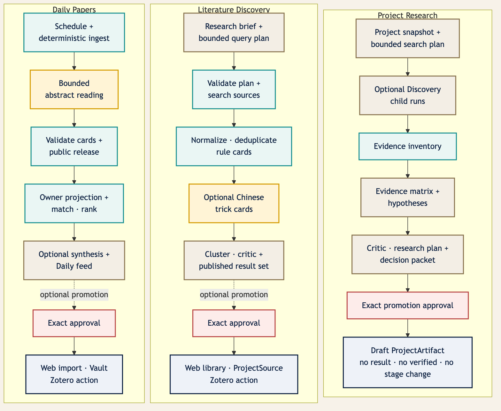

# Pharos Research Harness — 三条工作流规范

> 状态：**目标工作流，尚未实现。** 本文定义 Daily Papers、Literature Discovery 与 Project
> Research 三条工作流族的业务 contract。执行内核、状态机、权限、预算和持久化的 source of truth 是
> [`HARNESS_ARCHITECTURE.md`](HARNESS_ARCHITECTURE.md)；竞品取舍见
> [`HARNESS_LANDSCAPE.md`](HARNESS_LANDSCAPE.md)。本文不得被产品文案解释成已经上线的自动化能力。



可编辑 Mermaid 源与文本预览见
[`figures/pharos-harness-workflow-family.md`](../figures/pharos-harness-workflow-family.md)。

## 1. 本文解决什么问题

Pharos 已经有每日论文、文献探索和研究项目，但三者目前仍是相互靠人工衔接的功能：每日论文由一个
进程内 sweeper 执行；文献探索在同步 HTTP 请求中完成；研究项目主要是人工 CRUD 账本。Harness
不是再添加一个聊天框，而是把这三项功能改造成**可持久、可暂停、可恢复、可审核、可组合**的研究流程。

本文约束四件事：

1. 哪些步骤必须由确定性代码执行，哪些步骤才允许 Agent 判断；
2. 每一步消费和产生什么 typed Artifact，以及它能声称多强的证据；
3. 哪些动作可以自动进行，哪些必须等用户批准；
4. 怎样在不破坏现有 API、数据库和 Desktop 本地文库的前提下 shadow、切流和回滚。

### 1.1 初始范围

首期只覆盖：

- 每日候选抓取、摘要级阅读、个性化筛选和中文 digest；
- 多查询、多来源的文献探索、摘要级核心 Trick、聚类和研究空白建议；
- 项目研究计划、来源整理、证据矩阵、假设提案、批判和决策包；
- 用户审批后将结果发布到已有领域表。

首期明确不做：

- 不运行代码、shell、notebook、训练、仿真或实验；
- 不分配本地或云端 GPU，不宣称任何指标已经被复现；
- 不自动把 `ProjectArtifact` 标为 `verified`；
- 不自动推进或回退 `ResearchProject.stage`；
- 不从服务端读取 `zotero.sqlite`、任意本地目录或未授权 PDF；
- 不用 Agent 自由聊天替代 DAG、状态机、Artifact 和 approval；
- 不保存 raw chain-of-thought，只保存结构化结论和简短 rationale。

### 1.2 当前真实基线

本文是在现有实现上迁移，不是假设三块功能为空：

| 模块 | 当前权威实现 | 已有能力 | Harness 迁移时必须解决的缺口 |
| --- | --- | --- | --- |
| Daily | [`models.py`](../backend/pharos/db/models.py) 的 `DailyPaper/UserDirection/UserDailyConfig/DailyRun`；[`daily.py`](../backend/pharos/api/daily.py)、[`service.py`](../backend/pharos/daily/service.py)、[`scheduler.py`](../backend/pharos/daily/scheduler.py) | 全局抓取/阅读、用户方向与 query-time 匹配、手动刷新、导入、Vault | sweeper/互斥/任务是进程内状态；一天一条 `DailyRun` 不能保存 Attempt；重跑覆盖摘要运行视图；共享 `imported_paper_id` 不能表达多用户导入 |
| Discovery | `LiteratureSearch/LiteratureResult`；[`discovery.py`](../backend/pharos/api/discovery.py) 与 research services | arXiv/OpenAlex、并发来源隔离、DOI/标题去重、partial errors、规则卡与单篇 AI analyze | 外部调用仍绑同步请求；持久 `running` 不能从进程崩溃恢复；仅标题/摘要，无 query decomposition、全文轨、聚类/gap 与 durable step |
| Project | `ResearchProject/ProjectSource/ProjectArtifact`；[`projects.py`](../backend/pharos/api/projects.py) | 九阶段项目、来源、六类 Artifact、四种人工状态、手动推进/回退 | 仍是人工可变账本；没有 Run/lineage/approval；Claim↔Evidence 尚无强制绑定；`verified` 只能是用户判断 |

Daily Vault v1 的便携格式与 merge 语义继续以
[`DAILY_VAULT_FORMAT.md`](DAILY_VAULT_FORMAT.md) 为准；现有研究功能与证据边界继续以
[`RESEARCH_WORKFLOW.md`](RESEARCH_WORKFLOW.md) 和 [`PHASE-EVIDENCE.md`](PHASE-EVIDENCE.md) 为准。
Harness 不能直接把当前 `DailySweeper`、同步 Discovery handler 或 Project CRUD 包一层“Agent”就宣称完成；
必须先把执行状态移入 durable Run/Step/Attempt。

## 2. 三条工作流共用的执行契约

### 2.1 Workflow keys 与逻辑边界

三条产品工作流族在注册表中落成四个主 Workflow Definition。下表用 `key@version` 作人类可读简写；
数据库仍按架构 contract 分开保存 canonical dotted `workflow_key` 与整数 `version`：

| 产品工作流族 | Workflow key | Scope | 用途 |
| --- | --- | --- | --- |
| Daily Papers | `daily.ingest@1` | system | 一个逻辑公告窗口只建立一条共享 ingest，复用成功 Observation 与阅读结果 |
| Daily Papers | `daily.issue@1` | user | 用某位用户的方向与配置生成私有 feed/digest，不把偏好写进共享论文行 |
| Literature Discovery | `literature.discovery@1` | user | 从 research brief 规划检索、抓取、去重、摘要阅读、聚类和发布 |
| Project Research | `project.research_cycle@1` | user | 冻结项目快照、调用 Discovery 子 Run、形成证据/假设/批判/决策提案 |

另注册一个不出现在产品导航中的兼容辅助 Definition：`literature.result_analysis@1`。它只承接旧
`POST /api/discovery/results/{result_id}/analyze` 的单篇分析，仍使用 Harness Attempt、Artifact、usage 与
publication lineage；它不是第五个产品工作流。

Daily 仍然是一条用户可理解的产品工作流，只是在执行层拆成 system ingest 与 user issue。拆分是隐私和
成本边界，不是 UI 中要求用户理解的两个功能。

每个 Definition 固化 `version + definition_sha256 + schema versions + role/tool/prompt versions`。旧 Run
按启动时快照恢复；不能在原 version 上修改 DAG 后继续旧 Run。

命名与状态词也属于 contract：Workflow、Artifact 与 Capability key 使用小写 dotted key，例如
`daily.issue`、`paper.trick_card`、`discovery.search_source`；Role key 沿用架构注册表的 canonical
snake_case，例如 `research_planner`；Definition 内的 Step key 也使用稳定 snake_case。`@1` 只在文档中表示
version。Run state 只使用
`queued | running | waiting_for_approval | waiting_for_input | paused | succeeded | failed | cancelled | indeterminate`，
Run outcome 只使用 `complete | partial | incomplete | null`。`primary`、`done`、`error`、`pending` 等词只能是
rollout、领域兼容投影或用户文案，不能作为 Harness Run state 的别名。

### 2.2 通用 Run input envelope

所有工作流的业务输入外层使用同一 envelope：

```json
{
  "schema": "harness.run_input@1",
  "workflow_key": "literature.discovery",
  "idempotency_key": "user-supplied-or-server-derived-stable-key",
  "initiator": "user",
  "locale": "zh-CN",
  "timezone": "Asia/Shanghai",
  "project_id": null,
  "objective": "研究目标的用户原文",
  "resource_refs": [],
  "policy_request": {
    "allow_public_search": true,
    "allow_private_full_text": false,
    "allow_library_write": false
  },
  "budget_request": {
    "wall_seconds": 900,
    "model_calls": 24,
    "input_tokens": 300000,
    "output_tokens": 60000
  }
}
```

约束：

- `objective` 是输入，不是 system prompt；论文中的指令同样是不可信内容；
- `policy_request` 只能收窄权限，不能越过服务端 entitlement、role allowlist 或父 Run 权限；
- `budget_request` 是请求上限，实际预算取 workflow、账户、父 Run 和请求的交集；
- `resource_refs` 只能使用 canonical owner-scoped ID，不能接受任意服务器路径；
- `idempotency_key` 在同一 scope/workflow 下唯一，重复提交返回已有 Run；
- 输入固化 SHA-256。用户后来修改方向、项目或论文，不会悄悄改变正在执行的 Run。

### 2.3 通用 Artifact envelope

业务 Artifact 的 payload 不直接裸存；所有 Artifact 都带以下 envelope：

```json
{
  "artifact_type": "paper.trick_card",
  "schema_version": 1,
  "scope": {"type": "user", "id": "<user-id>"},
  "sensitivity": "private",
  "evidence_level": "abstract_only",
  "content": {},
  "quality": {
    "status": "valid",
    "confidence": 0.78,
    "warnings": []
  },
  "provenance": {
    "run_id": "<run-id>",
    "step_id": "<step-id>",
    "attempt_id": "<attempt-id>",
    "workflow_version": 1,
    "producer_kind": "model_inference",
    "role_version": "abstract_reader@1",
    "prompt_version": "abstract-reader-zh@1",
    "provider": "resolved-at-runtime",
    "model": "resolved-at-runtime",
    "input_artifact_ids": [],
    "input_sha256": "...",
    "source_refs": []
  }
}
```

通用硬约束：

- Artifact 不可变；修订产生新 Artifact 并用 `supersedes` link 连接；
- `confidence` 是模型/校验器对当前输出的置信，不是论文质量或事实概率；
- `producer_kind=model_inference` 的文字永远不能显示成原文 quote；
- `quality.status` 只能是 `valid | partial | insufficient_evidence | invalid`；
- schema validator 通过不等于事实正确；UI 必须同时显示 evidence level 与来源；
- secret、完整 header、credential URL、raw CoT、内部 stack trace 不进入 Artifact；
- Artifact 只在确定性 publish Step 中物化到旧领域表。

### 2.4 摘要级与全文级的统一边界

证据强度使用以下枚举，UI 不得把它们混为一个“AI 已阅读”：

| `evidence_level` | 模型实际看到的内容 | 允许的表述 | 禁止的表述 |
| --- | --- | --- | --- |
| `metadata_only` | 标题、作者、年份、venue、引用数等 | 主题/年代/来源的粗筛 | 方法、结果、局限的事实性总结 |
| `abstract_only` | metadata + 原始摘要 | 摘要声称的贡献、方法轮廓、核心 Trick | “全文证明”、页码引用、未在摘要出现的实验细节 |
| `unlocated` | 已授权全文，但无法可靠定位页码 | 全文级综合，并明确不可定位 | 可点击的页级证据或 verified quote |
| `page` | owner-scoped `PaperChunk`/`Evidence`，含页码 | 带 locator 的引文、支持/反对关系 | 超出所引文本的强断言 |

规则：

1. Daily v1 只走 `metadata_only → abstract_only`，不会自动下载或上传全文；
2. Discovery 默认只走摘要轨；全文轨必须由用户对具体论文显式发起；
3. Project 可以组合摘要级来源和页级 Evidence，但每个结论逐项标强度，不能用一个全文来源给整个报告
   自动“升级”；
4. 摘要卡与全文卡是不同 Artifact。全文卡可 `derived_from` / `supersedes` 摘要卡，但绝不原地改写；
5. 找不到依据时输出 `insufficient_evidence`，不能用语言流畅度填空；
6. `page` 只来自后端验证过的 `PaperChunk` / `Evidence` locator，不接受模型自报页码。

### 2.5 Deterministic Step 与 Agent Step 的分工

确定性代码负责：

- owner、输入、schema、URL、provider 和预算校验；
- 到期判断、idempotency、DAG 展开、fan-out 上限；
- provider 抓取、大小/超时限制、规范化、去重和排序基线；
- 数据库读取、状态转换、短事务、publication 和事件；
- 权限、approval、费用预留/结算/释放；
- evidence locator 验证、Artifact hash 和 lineage；
- retry 分类、pause/cancel 检查和 crash recovery。

Agent 只负责：

- 把开放式研究目标拆为有限查询；
- 对标题/摘要或明确授权的全文作结构化理解；
- 生成中文核心 Trick、主题簇、空白候选、假设候选和研究计划；
- 从给定证据中找冲突、缺口与替代解释；
- 综合已经通过 validator 的 Artifact。

Agent 不得：

- 自选未注册工具、URL、模型、数据库表或本地路径；
- 修改 Run 状态、项目阶段、`verified` 状态或领域表；
- 把一个自然语言指令变成额外 child Run；只能提交受 schema 与 fan-out 限制的 proposal；
- 运行实验、代码或 shell；
- 将摘要推断标为全文事实。

### 2.6 Approval 的统一语义

Approval 针对一个精确的 `action + resource + version + effect`，不是“以后都相信 AI”。

默认无需 approval：

- 在套餐/预算内检索 allowlist 中的公共学术 provider；
- 读取已由用户提交给服务端且授权用于该 Run 的 metadata/abstract；
- 创建仅对 owner 可见、不会改变领域数据的 Harness Artifact；
- 对公开摘要作受限模型推理。

默认必须 approval：

- 上传 Desktop 本地 PDF，或把私有正文发到第三方 BYOK endpoint；
- 写 Zotero、文库、Daily Vault 或其他本地资源；
- 把 Harness proposal 发布为 `ProjectArtifact` 或 `ProjectSource`；
- 超出默认模型/检索预算；
- 删除、覆盖或批量修改领域记录；
- 未来任何代码、网络实验、GPU 或外部副作用。初始版本对此不是 `ask`，而是直接 `deny`。

Approval 在输入 Artifact、目标资源、权限或项目快照变化后失效。拒绝或过期进入显式分支，不把 Run
伪装成失败；通常为 `state=succeeded, outcome=incomplete` 或保留在 `waiting_for_approval` 直到过期。

### 2.7 失败、重试、暂停与取消的统一规则

| 情况 | Step 行为 | Run reduction | 副作用处理 |
| --- | --- | --- | --- |
| 429、明确未发送的 connect timeout、可重试 5xx | 指数退避+jitter，新 Attempt | 重试期间 `state=running, outcome=null`；耗尽后按 Definition reduction | 只重试声明幂等的 capability |
| 请求已发送但响应丢失 | Attempt 记 `external_outcome=indeterminate` 并使 Step `indeterminate` | required Step 通常 `state=indeterminate, outcome=incomplete`；optional Step 可归约为 `state=succeeded, outcome=partial` | 不把未知当失败后盲重试，不承诺第三方未计费 |
| 一个 optional provider 失败，其他成功 | 记录 typed provider error | 达到 quorum 时 `state=succeeded, outcome=partial` | 保留成功 sibling；只重试失败 item；不确定 item 先对账 |
| 模型 JSON/schema 不合法 | 最多一次 repair；再失败 terminal | required 为 `state=failed, outcome=incomplete`；optional 可为 `state=succeeded, outcome=partial` | 原输出只作脱敏 Attempt 诊断，不 publish |
| 401/403、key 解密失败 | Step `waiting_for_input(reason=credential)` | `state=waiting_for_input, outcome=null`；超时后按 Definition reduction | 不自动换到收费 key |
| 预算耗尽 | Step `waiting_for_input(reason=budget)` 或跳过 optional 分支 | 等待时 `state=waiting_for_input, outcome=null`；结束后按 required/optional 归约为 `state=failed, outcome=incomplete` 或 `state=succeeded, outcome=partial` | 只释放确定未使用的 reserve；不确定调用待对账 |
| owner/SSRF/policy 失败 | terminal deny；条件分支可显式 `skipped` | required 为 `state=failed, outcome=incomplete`；optional 可为 `state=succeeded, outcome=partial` | 记录安全事件，不重试 |
| Worker 消失 | Attempt 终态 `abandoned`，reaper CAS Step 到 `ready`、`failed` 或 `indeterminate` | 由 Step 集合确定性 reduction；`abandoned` 不是 Run/Step state | 未知副作用绝不盲重跑 |
| 用户 pause | 不再认领新 Step | `state=paused, outcome=null` | 在安全边界落 checkpoint |
| 用户 cancel | 周期检查并中止可取消调用 | `state=cancelled`，outcome 由 Definition 固化 | 已发布的领域行不删除；未发布 Artifact 保留审计 |

取消不是事务回滚。已经完成的公共抓取、不可变 Artifact 或幂等领域 publish 不会被删除；Run 终态记录
截止位置。用户需要继续时创建 fork/retry Run，而不是复活终态 Run。

### 2.8 Mapped fan-in 与 partial 语义

所有 `mapped` / `mapped_agent` Step 在编译后为每个 stable item 建立独立 child Step。Definition 必须逐个声明
`all_success | all_terminal | min_success | allow_partial` 之一及聚合输入规则；`min_success` 另有必填正整数
`min_success_count=n`（正文可简写 `min_success(n)`）。Fan-in 遵守：

- fan-in 只在全部 child 进入终态，或 Workflow 定义的 deadline/quorum 已满足后运行；不能把仍在
  `retry_scheduled` / `running` 的 child 当成“没有结果”；
- child 结果按 stable item key 排序，重试、并发完成顺序和 worker 数不能改变聚合 hash；
- 每个 child Step 必须进入 `succeeded | failed | cancelled | skipped | indeterminate` 之一，并在 fan-in summary
  中保留；`abandoned` 只属于 Attempt，由 reaper 先归约为合法 Step state；
  不允许静默丢弃失败项；
- `required` child 失败使下游不可运行，Run 通常为 `state=failed, outcome=incomplete`；required child
  `indeterminate` 则使 Run 为 `state=indeterminate, outcome=incomplete`；
- `optional` child 部分失败时，fan-in 消费成功 Artifact，Run 可为 `state=succeeded, outcome=partial`，同时
  输出 failed item keys、typed errors、coverage loss 和是否仍满足最小 quorum；
- “合法的零结果”必须是 `state=succeeded` 并显式输出 `empty_success=true`；它不同于 provider 未返回、超时或
  被取消；
- retry 只创建失败 child 的新 Attempt。已成功 sibling 不被有意重发，但外部调用结果不明确时仍按
  §2.9 的 `indeterminate` 规则处理；
- 父 Run cancel 会请求取消未终态 child；已经成功的 Artifact 保留，fan-in 不再发布新领域副作用。

Daily 的 provider/reader map、Discovery 的 query/provider/reader map、Project 的 child Discovery 都使用该
contract；各工作流只能收窄 required/optional/quorum，不能自行发明另一套 partial 含义。

### 2.9 Publication、usage 与外部调用不确定性

每个 publication Step 都必须：

1. 重新校验 owner 和目标领域对象；
2. 重新读取 approval、policy、entitlement 和目标版本；
3. 确认源 Artifact 没有被 supersede、撤销或判为 invalid；
4. 使用稳定 idempotency key；
5. 在短事务调用现有 domain service；
6. 写 `published_as` link 与 publication receipt；
7. 重放时返回已有领域对象，不重复创建或写本地资源。

Pharos 只对自己控制的边界承诺 exactly-once：领域 publication 使用稳定 idempotency key；内部 usage ledger
以 append-only event/CAS 保证每个 reserve 只完成一次 `settle`、`release` 或 `pending_reconciliation` 转换。它
**不承诺第三方 Provider 调用或实际账单 exactly-once**：
请求发出后连接中断时，Provider 可能已经处理/计费，但 Pharos 没收到响应。

这类 Attempt 必须记录 `external_outcome=indeterminate` 与已知 provider request ID；预留 usage 进入
`pending_reconciliation`，不能伪报 settled/released。只有 Provider 支持并实际使用幂等 request key，或动作本身
可安全重复时才自动重试；否则等待 policy/operator/user 决定。UI 与 operator metrics 分别显示“结果不确定”和
“待对账”，不能写成“绝不会重复收费”。

## 3. Daily Papers 工作流族

### 3.1 目标与不可变语义

Daily 的目标是：每个公告窗口只建立一条逻辑 ingest，在摘要级生成可复用的中性阅读卡，再按每位用户的
研究方向生成私有的精简 feed。成功 Observation 不被有意重发；网络结果不明确时仍遵守 §2.9，而不声称
第三方请求物理上 exactly-once。它不是“模型替用户读完全文”，也不是一个隐式文库导入器。

现有 `DailyPaper` 与 `DailyRun` 是全局共享数据；`UserDirection` 和 `UserDailyConfig` 是 owner-scoped。
新流程保留这一语义，尤其不得把用户研究方向、私人排序理由或 BYOK 结果写进共享 `DailyPaper`。

Scope 是强制边界：`daily.ingest@1` 固定为 `scope_type=system, scope_id=daily-global`；
`daily.issue@1` 固定为 `scope_type=user, scope_id=<user_id>`。System Run 不绑定或借用任何用户账户、personal
BYOK、方向或 entitlement；User Run 的 Artifact、approval、usage 与错误只能由该 owner 读取。

两者不建立普通跨 scope Artifact link。Ingest 完成后，只有 allowlisted、`sensitivity=public` 的
metadata/abstract/card manifest 能注册为 `PublicArtifactRelease`；Issue 启动时先通过 Architecture §11.6.1 的
专用映射为目标 owner 生成最小 `daily.ingest_projection@1`。User Run 后续只读自己的 projection，不能直接拿
system Artifact ID 做输入或从 system Event/Attempt 补数据。这样共享抓取只执行一次，但 DB 同 owner 约束仍成立。

### 3.2 触发方式与幂等键

| 触发 | 创建的 Run | 幂等键 | 备注 |
| --- | --- | --- | --- |
| Scheduler 检查某公告日欠账 | `daily.ingest@1` | `daily.ingest:{date}:{schedule_ref}:{definition_sha256}` | system scope；同一公告窗口重复唤醒返回原 Run，不能因用户配置漂移另建一条 |
| Operator 对某日补跑 | `daily.ingest@1` | 原 key 的显式 retry Attempt，或新的 fork key | 不能覆盖旧 Attempt；可能重发的外部调用须显示成本/不确定性 |
| 用户点击“刷新” | 默认只确保当日 ingest 存在，再创建 issue | ingest 使用 system key；issue 使用 owner+快照 hash | 普通用户不能改变 system input 或触发无界全局重读 |
| ingest 发布或用户打开某日 | `daily.issue@1` | `daily.issue:{date}:{ingest_release_sha256}:{direction_config_sha256}:{issue_policy_sha256}` | key 位于 user scope；policy hash 覆盖 display/model policy；任一快照变化只生成该用户的新 issue |
| 用户恢复 Daily Vault | 不直接创建 ingest | `daily.vault_import:{archive_sha256}` | user scope；先走既有完整校验与 merge；必要时另开 issue |

`ingest_release_sha256` 不是裸 manifest/content hash，而是 Architecture §11.6.1 的 canonical release envelope：
`SHA256(canonical_json({release_id, source_schema_name, source_schema_version, source_content_sha256,
public_manifest_sha256, release_policy_version}))`。`release_id` 先生成且不可变；同一内容被撤销后重新签发也必须使用新的
`release_id` 和 `release_sha256`，因此自然生成新的 issue key，绝不命中已撤销 release 对应的 Run。

Scheduler 使用公告日/时区规则，而不是“进程启动后睡 24 小时”。停机恢复时由 due predicate 创建欠账
Run；补跑窗口继续遵守既有单次数量上限和 arXiv 速率约束。

首个 system Run 创建时冻结完整 `input_sha256`，其中包含 category/provider/fetch/reader/schedule policy；后续同
幂等键但 input hash 不同的请求返回既有 Run 或明确 conflict，绝不改写快照。用户方向或系统模型策略在窗口内
变化只影响新的 user issue 或下一公告窗口；需要回补时由 operator 创建有 lineage 的显式 fork，而不是让
scheduler 悄悄生成第二条同窗 ingest。

### 3.3 输入 contract

`DailyIngestInput@1`：

| 字段 | 类型 | 规则 |
| --- | --- | --- |
| `announcement_date` | `YYYY-MM-DD` | 必填；作为抓取窗口与 idempotency 一部分 |
| `category_snapshot` | `string[]` | 由所有 enabled 用户配置的并集确定性生成并去重；不是 Agent 选择 |
| `provider_set` | `string[]` | v1 固定 allowlist；首期沿用现有 arXiv adapter |
| `fetch_limits` | object | 每分类页数、总候选、响应字节、请求超时的服务端上限 |
| `reader_policy` | object | 固定 `model_source=system_shared`，含 profile、最大论文数、并发、token/费用上限；禁止 personal BYOK |
| `schedule_ref` | string/null | 触发本 Run 的 schedule 版本 |

`DailyIssueInput@1`：

| 字段 | 类型 | 规则 |
| --- | --- | --- |
| `date` | `YYYY-MM-DD` | 必填 |
| `ingest_release_id` | Public release ID | 必须是同日成功/部分成功 ingest 的未撤销 allowlisted public release；API 不接受 system Artifact ID |
| `direction_snapshot` | object[] | name、normalized keywords、enabled、position；owner 私有 |
| `config_snapshot` | object | categories、`max_per_day`、enabled、locale、timezone |
| `display_policy` | object | 默认精简卡；标题保持原文，其余解释中文 |
| `model_policy` | object | 该 owner 的 official/personal BYOK 解析策略与预算；输出不得进入 system/shared cache |

方向/config 在 Run 开始时冻结 hash。执行中修改配置不会污染当前结果；新配置触发新 issue。System reader 的
cache key 至少包含 paper identity、abstract hash、workflow/prompt/schema/model version；User issue 的任何模型输出
即使输入相似也保持 owner scope，不提升为共享卡。

服务端必须由 `ingest_release_id` 解析并冻结上述 canonical `ingest_release_sha256`，客户端不能提交或覆盖该 hash；
release ID、hash、日期、schema 或 policy 任一不一致时返回 typed conflict，不得继续运行或退回旧 release。

### 3.4 `daily.ingest@1` 步骤

| Step | 类型 | 输入 → 输出 | 成功条件与降级 |
| --- | --- | --- | --- |
| `D-I-00 validate_due` | deterministic | input → `daily.due_decision@1` | 日期、provider、上限合法；同 key 已发布则 `state=succeeded` 并返回 replay receipt |
| `D-I-10 build_fetch_plan` | deterministic | category snapshot → `daily.fetch_plan@1` | stable 排序、去重、fan-out 有上限；空并集以 `state=succeeded, empty_success=true` 结束 |
| `D-I-20 fetch_batches[*]` | mapped capability | 每个 provider/category/window → `daily.provider_batch@1` | SSRF-safe、timeout/size cap；每批独立 retry |
| `D-I-30 normalize` | deterministic | provider batches → `daily.candidate_set@1` | arXiv ID 去版本、字段限长、日期校验；坏条目隔离并计数 |
| `D-I-40 deduplicate` | deterministic | candidate set → canonical candidate set | 同日 canonical key 唯一；结果 stable，重放 hash 相同 |
| `D-I-50 publish_metadata` | deterministic publish | canonical set → `DailyPaper` + receipt | 幂等 upsert metadata；新条目 `read_status=pending` |
| `D-I-60 read_abstracts[*]` | mapped Agent | 单篇 metadata+abstract → `paper.abstract_card@1` | 只读摘要；无摘要返回 insufficient，不猜内容 |
| `D-I-70 validate_cards[*]` | deterministic | abstract card → valid/invalid card | 中文字段、长度、枚举、禁止页码/全文措辞、来源一致性 |
| `D-I-80 publish_cards[*]` | deterministic publish | valid card → `DailyPaper` reader fields + receipt | 每篇独立短事务；失败不阻塞其他论文 |
| `D-I-90 aggregate` | deterministic | 所有 Step/Event → `daily.ingest_report@1` | 统计 fetched/read/failed/provider errors/outcome |
| `D-I-100 release_public_ingest` | deterministic publish | safe manifest/report → public release + receipt | 除公开 metadata/abstract/card 外，只发布脱敏 outcome、coverage loss、public typed source errors、evidence level 与必要 provenance ID/hash；拒绝用户方向、凭据、原始响应和 system trace |

`D-I-50` 与 `D-I-80` 分开，因此模型不可用时 metadata 仍按现有产品语义出现为 pending，而不是整天没有
论文。模型卡不得携带任何用户方向或个人 relevance。

Daily 的 fan-in 进一步收窄为：非空 fetch plan 的 `D-I-20` 使用 `all_terminal` 聚合；至少一个 batch 成功
（其中 provider 合法返回零条也算成功）才能继续，部分 batch error 使最终 `outcome=partial`，全部 batch error
使 Run `state=failed, outcome=incomplete`。`D-I-60` reader map 使用 `allow_partial`；metadata publish 是 required，
单篇 reader 是 optional，因此 reader 部分或全部失败时保留 metadata，并以 missing card keys 和 typed errors
表达 coverage loss。每个 fan-in 都按 stable batch/paper key 排序。

### 3.5 `daily.issue@1` 步骤

| Step | 类型 | 输入 → 输出 | 说明 |
| --- | --- | --- | --- |
| `D-U-00 project_public_ingest` | deterministic publish | release + owner → `daily.ingest_projection@1` + receipt | 同 owner/release 重放返回原 projection；非 public/已撤销 release 拒绝 |
| `D-U-10 validate_snapshot` | deterministic | projection + user input → frozen snapshot | owner、日期、release/projection hash、方向/config 校验 |
| `D-U-20 load_candidates` | deterministic | owner projection + category config → bounded candidates | 只读投影中的同日公开字段；不直接读 system Artifact、不重新访问 provider |
| `D-U-30 match_directions` | deterministic | title/abstract + keyword snapshot → matches | 延续当前“任一关键词匹配”语义；输出命中词和方向 |
| `D-U-40 rank_and_cap` | deterministic | matches + quality fields → ordered feed | 规则版本化、stable tie-break、应用 `max_per_day` |
| `D-U-50 synthesize_digest` | bounded Agent，可选 | 排序后的摘要卡 → `daily.digest@1` | 只综合给定卡；失败时 feed 仍可用 |
| `D-U-60 validate_digest` | deterministic | digest → valid/partial | 检查每个结论引用的 projection card key、中文和字数 |
| `D-U-70 publish_feed` | deterministic | feed/digest → `daily.personal_feed@1` + receipt | 首期只发布 user Harness Artifact/read model，不改变共享论文；所有复制 release 内容的 user Artifact 都以同 owner `derived_from` link 指向 projection |

排序必须可解释：方向匹配和 cap 是确定性规则；Agent 只能写“今日脉络/值得关注”，不能暗中删掉或重排
候选。若以后允许 Agent rerank，必须新增独立分数、保留规则基线并可在 UI 切换。

`D-U-50` 是 optional Step：失败或被 model policy 跳过时，`D-U-70` 仍发布 deterministic feed，Run 为
`state=succeeded, outcome=partial` 并显示“今日综合不可用”，不能把 feed 误报为失败或静默伪造 digest。

### 3.6 Agent roles

#### `abstract_reader@1`

- 输入：标题、作者、venue/year、原始摘要、provider IDs；
- 输出：中文短摘要、核心 Trick、贡献、方法轮廓、摘要报告的结果、明确局限/未知项；
- 可用 capability：无外部检索，只消费 input Artifact；
- 禁止：声称读过全文、生成页码、使用用户方向打分、下载 PDF；
- 上限：单篇一次主调用，最多一次 schema repair；
- 证据等级：固定 `abstract_only`。

#### `digest_synthesizer@1`

- 输入：已经确定性排序和裁剪的 `paper.abstract_card` 列表与方向名；
- 输出：3–7 条“今日脉络”、可选跨论文联系、每条引用 card IDs；
- 不可见：其他用户方向、未入选论文、私有文库；
- 禁止：改变列表成员、将相似性写成因果或已验证研究结论；
- 失败降级：直接展示 deterministic feed。

### 3.7 Daily Artifact schemas

#### `daily.fetch_plan@1`

```text
announcement_date
provider_queries[]: {stable_key, provider, categories[], window, limit}
global_caps: {requests, candidates, response_bytes, wall_seconds}
source_config_hash
```

#### `daily.candidate_set@1`

```text
date
candidates[]: {
  canonical_key, arxiv_id, title, authors[], abstract,
  categories[], arxiv_url, pdf_url, published_at, venue,
  provider_refs[], normalization_warnings[]
}
provider_errors[]
dedup_stats
```

#### `paper.abstract_card@1`

```text
paper_ref
title_original
summary_zh
core_trick_zh
contribution_zh
method_outline_zh
reported_results_zh
limitations_zh[]
unknowns_zh[]
basis: {evidence_level: abstract_only, abstract_sha256}
```

除论文原始标题、作者、venue 和 identifier 外，用户界面解释字段全部使用中文。`reported_results_zh`
必须表述为“摘要报告……”，没有摘要依据的局限进入 `unknowns_zh`，不能被模型补齐。

#### `daily.personal_feed@1`

```text
user_scope
date
config_snapshot_hash
ingest_release_id
ingest_release_sha256
ingest_projection_artifact_id
items[]: {
  daily_paper_id, projection_card_key, direction_id, direction_name,
  matched_keywords[], deterministic_rank, rank_components
}
truncated_count
generated_at
```

#### `daily.digest@1`

```text
feed_artifact_id
headline_zh
themes[]: {title_zh, summary_zh, card_artifact_ids[]}
watch_next_zh[]
warnings[]
```

#### `daily.ingest_report@1` / publication receipt

记录每批成功/失败、候选/去重/发布/阅读数量、旧领域 ID 映射、provider error class、费用和最终
`complete | partial | incomplete`。不包含其他用户方向或私有内容。

#### `daily.ingest_projection@1`

```text
release_id / release_sha256 / release_policy_version / date
ingest_outcome: complete | partial
coverage: {
  requested_batches, successful_batches, failed_batches,
  missing_card_keys[]
}
public_source_errors[]: {
  source_key, public_error_code, retryable, coverage_effect
}
items[]: {
  projection_card_key,
  public metadata/abstract/card fields,
  evidence_level,
  source_refs[], source_content_sha256,
  card_schema_version, card_content_sha256
}
projection_receipt
```

公开错误只能使用 allowlisted code 和脱敏 source key，不能包含 endpoint、响应正文、stack 或凭据。Projection 不包含
system Run/Event/Attempt、聚合用户 category 或任何其他 owner 数据；provenance 只经 receipt 指向 release，普通
Artifact link 不能反向穿透到 system Artifact。所有复制 projection 内容的后续 user Artifact 必须以同 owner
`derived_from` link 连接该 projection。

### 3.8 Approval 与用户动作

| 动作 | 默认 |
| --- | --- |
| Scheduler 公共抓取与套餐内摘要阅读 | allow（system budget 与 provider rate limit 内） |
| 用户生成自己的 issue（其中 digest synthesis 可选） | allow |
| 用户手动要求整日重新读取 | 超预算时 ask；普通用户不能覆盖全局已完成卡 |
| 把一篇 Daily 论文导入 Web 文库 | ask，继续走既有 `/api/daily/papers/{id}/import` owner service |
| Desktop 写入本地 Zotero | Desktop 当次明确动作/approval |
| 写/覆盖 Daily Vault | ask；由客户端写本地目录 |
| 为 Daily 自动上传或读取全文 | deny（v1 不在工作流内） |

### 3.9 失败、重试和取消细则

- 某 provider/category 批次失败：只重试该 stable batch；其他批次继续；达到最小成功条件时最终
  `state=succeeded, outcome=partial`；
- 所有公共抓取都失败：不新建空 `DailyPaper`，Run 为 `state=failed, outcome=incomplete`，已有该日数据保持不变；
- 某条记录 malformed：隔离并记录，不让整批失败；超过坏记录比例阈值则该批 terminal；
- Reader 429/5xx：按策略重试；耗尽后论文保持 `pending/error`，metadata 仍可看；
- Reader schema 失败：一次 repair；不能把未验证自由文本写入 `DailyPaper.highlights`；
- Digest Agent 失败：不影响 feed，Run 为 `state=succeeded, outcome=partial`；
- 用户 cancel issue：只取消该用户 Run，不影响 system ingest 或其他用户；
- operator cancel ingest：已发布 metadata/card 保留，未开始 batch 不再认领；次日或 fork 可从 Artifact 恢复；
- public release 被撤销：立即拒绝新 projection/issue；幂等 revocation job 从 projection receipt 出发，沿同 owner
  `derived_from` lineage tombstone projection 及仍复制源内容的 feed/digest 等派生 Artifact payload，并保留
  Run/Event/Artifact/link/hash/receipt ID 供审计，读取返回 `content_deleted(reason=source_release_revoked)`；已经独立
  approval/publish 到领域权威表的记录不静默删除，但 publication receipt 必须标记 revoked source；
- 进程崩溃：按 batch/paper stable key 恢复已成功 sibling；对已发送但无响应的 Provider/模型 Attempt 标
  `indeterminate` 并待对账，不把它谎报为“绝不会再次计费”。

### 3.10 与现有 API/表的兼容

保留现有 API：

```text
GET  /api/daily/status
GET  /api/daily/dates
GET  /api/daily/{date}
POST /api/daily/refresh
POST /api/daily/papers/{paper_id}/read
POST /api/daily/papers/{paper_id}/import
GET/POST/PATCH/DELETE /api/daily/directions...
GET/PATCH /api/daily/config
GET  /api/daily/vault/export
POST /api/daily/vault/import
```

兼容规则：

- `/api/daily/refresh` 在 cutover 后变成“确保对应 Harness Run 存在”，仍立即返回 `202`；旧响应字段在
  deprecation window 内保留，新增 `harness_run_id` 只能是可选字段；
- `GET /api/daily/{date}` 继续读 `DailyPaper` 加 query-time owner matching，Harness publication 保证旧
  Desktop/Web 无需同时升级；
- `DailyPaper` metadata 映射保持原字段；摘要卡可映射到 `summary_zh/highlights/read_model/read_at`；
- 用户特定匹配/排序只在 `daily.personal_feed` 或读取层，不写共享 `matched_domain`/reader JSON；
- `DailyPaper.imported_paper_id` 只有一个共享列，不能表示多个用户，因此在 Daily cutover 前新增完整的
  owner-scoped `daily_paper_imports` mapping。最小字段为 `user_id`、`daily_paper_id`、
  `target_kind=web_paper|local_zotero`、canonical `target_ref`、nullable `paper_id`、optional
  `receipt_artifact_id` 与 timestamps；Web ref 为 owner `Paper` ID，本地 ref 只能是 Desktop receipt 返回的
  `(libraryID,key)`，不得是路径；同一 owner/论文/target kind/ref 使用唯一稳定键；
- Web 导入在创建/复用 owner `Paper` 的同一 publication transaction 写 mapping。H5 以前本地 Zotero 仍由
  Desktop 自己完成；H5 以后只有收到经过 approval 的最小 local receipt 才写 `local_zotero` mapping，且不保存
  本地路径；
- `GET /api/daily/{date}` 按当前 owner 的 mapping 动态投影导入状态。旧 `imported_paper_id` 列仅作发布客户端的
  兼容 fallback，不再是多用户真相，也不得被另一位用户的导入覆盖；
- `DailyRun` 每日唯一且重跑会覆盖运行视图，不能承担 Attempt 历史。完整历史只在 `harness_*` 表；它仅作
  旧 API 兼容摘要；
- `UserDirection`/`UserDailyConfig` 保持权威，Harness 只读冻结快照；
- Daily Vault v1 格式、幂等 merge 和排除项完全不变。Harness Artifact 不直接塞入 v1 archive，除非将来
  发布 Vault v2 并提供双读迁移。

### 3.11 Shadow、cutover 与 rollback

执行所有权使用统一 feature flag：
`PHAROS_DAILY_EXECUTION=legacy|shadow|harness`。

1. **Legacy**：现有 `DailyScheduler/DailySweeper` 完全照旧；Harness 表可存在但不执行。
2. **Shadow**：旧 sweeper 是唯一领域 writer。Harness 从同一份已捕获 provider batch/旧运行结果构造
   Artifact，不重复请求 provider、不写 `DailyPaper`；比较候选 hash、去重数、卡 schema、耗时和费用。
3. **Publish canary**：仅 operator 指定日期由 Harness materialize，旧 scheduler 对该 idempotency key no-op；
   旧 API 仍只读领域表。
4. **Harness**：scheduler 只创建 Harness Run，`publish_metadata/cards` 写旧表；旧 sweeper 保留但禁用。
5. **Rollback**：提交一个原子配置 revision，同时设置 `PHAROS_DAILY_EXECUTION=legacy`、关闭不再需要的
   agent/publish gate 并恢复旧 scheduler；在验证完整最终快照后只重启一次，不执行会产生非法中间组合的多步切换；
   不删 Harness 表/Artifact，不回滚已发布 `DailyPaper` 或 owner import mapping，因为 publication 幂等且字段兼容。

不得让 old sweeper 与 Harness 同时对同一天写 reader 结果；切流锁以日期+workflow key 为 stable key，而不是
进程内 bool。

### 3.12 Daily 阶段验收

| 阶段 | 交付与测试 | 退出条件 | 回滚门槛 |
| --- | --- | --- | --- |
| D0 Contract | fake arXiv、fake model、golden candidate/card/feed/release fixtures | canonical release hash 逐字段一致；同内容 reissue 得到新 release ID/hash/issue key；schema/中文/evidence guard 全过 | 保持 `PHAROS_DAILY_EXECUTION=legacy`，关闭 Harness kill switches |
| D1 Shadow | 7 个公告日只产 Harness Artifact | 候选集合与旧链路差异可解释；shadow 不主动发第二组 provider/model 调用 | 原子 rollback revision：legacy + 关闭相关 gates |
| D2 Canary | 测试账户/指定日期 publish | 重启恢复、两 worker 不重复认领；旧 API/UI 无回归 | 原子 rollback revision：legacy + 恢复旧 scheduler |
| D3 Harness | system ingest + user issue | projection 暴露脱敏 outcome/coverage/public typed errors/provenance；revoke 阻止新 issue 并沿 lineage tombstone 非领域派生内容；provider partial、reader failure、cancel、budget exhausted 均有确定 UI；p95 在预算内 | 原子 rollback revision；旧表继续可读 |
| D4 Vault/desktop | approval 后本地写入仍由 Desktop 完成 | 未批准时 0 本地写；Vault v1 round-trip fixture 不变 | 关闭本地 capability |

Daily 完成定义：不是“页面出现了 Agent 文案”，而是跨重启准确恢复、同一 publication key 不重复写领域行、
内部 usage ledger 不重复结算、外部不确定调用可见且可对账、旧 API 可用、摘要级措辞诚实、用户偏好不进入
共享数据。

## 4. Literature Discovery 工作流

### 4.1 目标与默认用户体验

Discovery 接受一个想法或研究问题，自动构建有限查询，从多个公共学术来源找论文，去重后输出紧凑的中文
核心 Trick 卡、主题簇与空白候选。默认路径只基于 metadata/abstract；用户无需等待全文即可快速建立地形图，
但界面必须清楚显示“摘要级”。

论文标题保持原文；标题下默认只展示一条中文核心 Trick 和必要的年份/来源/证据徽标。贡献、方法、结果、
局限、聚类理由放入展开区，而不是把每篇论文渲染成大卡片。

### 4.2 触发方式与幂等键

| 触发 | 幂等键建议 | 行为 |
| --- | --- | --- |
| 用户提交 research brief | `user:{id}:brief:{normalized-hash}:policy:{hash}` 或客户端 UUID | 创建新 Run，立即返回 `202` |
| Project 调用 child Discovery | `parent:{run}:objective:{hash}:branch:{stable-key}` | 权限/预算取父子交集，结果通过 Artifact link 返回 |
| 用户“扩大检索/换关键词” | 新 input/new Run | 不改写旧计划；用 `derived_from` 连接 |
| 对失败 provider 重试 | 原 Run 的新 Attempt | 只在 retry policy 内；终态后创建 retry/fork Run |
| 用户请求全文深化 | `discovery:{run}:paper:{canonical}:fulltext:{content-hash}` | 独立可选分支，不修改摘要卡 |

“打开历史搜索”只读取 Run/领域结果，不自动再次调用 provider 或模型。

### 4.3 输入 contract：`DiscoveryRunInput@1`

| 字段 | 类型 | 规则 |
| --- | --- | --- |
| `brief` | string | 2..4000；用户原始问题，可包含背景/目标但不是任意 prompt |
| `must_include_terms` | string[] | 可选，规范化去重、有数量和长度上限 |
| `must_exclude_terms` | string[] | 可选；由 provider adapter 安全转换 |
| `date_range` | `{from,to}`/null | 确定性校验；无效范围拒绝 |
| `providers` | enum[] | v1 为 `arxiv/openalex`，不能由模型发明 |
| `result_limit` | integer | 1..50（沿用现有公开上限）；内部 oversampling 另有系统上限 |
| `project_id` | string/null | 只作 owner-scoped 上下文/lineage；不自动添加 ProjectSource |
| `context_refs` | Artifact/领域 ID[] | 可选已有来源、Evidence 或用户 note；逐个 owner 校验 |
| `language` | enum | 输出首期固定中文，原始标题/metadata 保留 |
| `full_text_policy` | enum | 默认 `abstract_only`；只能请求 `selected_after_approval`，不能 all |
| `budget_request` | object | 查询数、provider requests、card 数、模型 token/cost 上限 |

### 4.4 默认摘要轨步骤

| Step | 类型 | 输入 → 输出 | 关键边界 |
| --- | --- | --- | --- |
| `L-00 validate_brief` | deterministic | input → normalized brief | owner、长度、provider、日期、预算、project 权限 |
| `L-10 plan_queries` | Agent | brief/context → `discovery.search_plan@1` | 最多 12 个 query proposal；不能直接访问 provider |
| `L-20 validate_plan` | deterministic | proposal → compiled plan | 去重、语法/长度、fan-out、预算；稳定 query keys |
| `L-30 search_sources[*]` | mapped capability | provider query → `discovery.provider_batch@1` | arXiv/OpenAlex 并行；20s/12MiB 等现有安全上限继续由 adapter 执行 |
| `L-40 normalize` | deterministic | batches → canonical records | DOI、arXiv/OpenAlex ID、URL、作者/年份规范化 |
| `L-50 deduplicate` | deterministic | canonical records → `literature.canonical_set@1` | 优先 DOI/provider ID，回退规范化标题；保存全部来源 |
| `L-60 baseline_rank` | deterministic | set + brief → ranked candidates | provider rank/关键词/时间/引用等可解释基线，stable tie-break |
| `L-65 build_rule_cards[*]` | deterministic | 每篇 metadata/abstract → `paper.rule_card@1` | 只保存原始摘要句；无摘要为 `metadata_only`；不伪造中文 Trick |
| `L-70 read_abstracts[*]` | mapped Agent，可选 | rule card + title/abstract → `paper.trick_card@1` | 默认最多 40；有摘要时严格 `abstract_only` |
| `L-80 validate_cards[*]` | deterministic | card → valid/invalid | 中文、引用、禁全文措辞、未知项与长度检查 |
| `L-90 critique_set` | Agent | plan + valid cards + errors → critique | 找覆盖不足、重复、冲突与检索偏差，不制造论文 |
| `L-100 cluster_and_gaps` | Agent + deterministic validator | cards/critique → cluster map + gap report | 每个簇/空白都引用 card IDs；空白标为 hypothesis |
| `L-110 assemble_result` | deterministic | 全部 Artifact → `discovery.result_set@1` | 保留 baseline rank、partial errors 和证据强度 |
| `L-120 publish_legacy` | deterministic publish | result set → `LiteratureSearch/Result` + receipt | 只在结果已组装后短事务物化 |

Query Planner 只提出查询字符串、意图和期望覆盖面；真正 provider、limit、URL 和 fan-out 由 compiler 决定。
`L-90/L-100` 的“研究空白”是基于当前检索集合的候选，不得写成已完成系统综述后的新颖性证明。

Discovery 的 `L-30` 使用 `all_terminal` 聚合：provider 合法返回零条是成功结果；至少一个 batch 成功后可继续，
部分错误使最终 `outcome=partial`，全部 batch error 使 Run `state=failed, outcome=incomplete`。`L-70` 使用
`allow_partial`，规则卡始终保留；Reader 失败只能造成缺少中文 Trick 卡和 `outcome=partial`，不能让失败论文从
结果集中消失。`L-90/L-100` 是 optional 质量分支，失败时仍可发布有序论文/有效卡，但 cluster/gap 字段必须
显式缺失并携带 typed error。

### 4.5 可选全文深化轨

全文轨不作为默认搜索 fan-out 的一部分。用户在结果页选择具体论文后才可触发：

| Step | 类型 | 说明 |
| --- | --- | --- |
| `LF-00 resolve_selected_paper` | deterministic | 解析 selected canonical result 与 owner；检查是否已有 owner `Paper`/`PaperChunk` |
| `LF-10 request_content` | approval | 若全文只在 Desktop，本地上传/导出必须 ask；若公开 URL 也经 URL/policy/版权/size 校验 |
| `LF-20 acquire_or_load` | capability | 只取得被批准论文；不扫描 Zotero、不批量上传文库 |
| `LF-30 chunk_and_locate` | deterministic | 优先复用后端 `PaperChunk`；无法可靠分页则标 `unlocated` |
| `LF-40 read_full_text` | Agent | bounded excerpts/full text → `paper.fulltext_card@1` |
| `LF-50 validate_grounding` | deterministic | 检查每个 claim 的 locator/evidence ref；错误引用剔除 |
| `LF-60 attach_to_result` | deterministic | 用 Artifact link 关联原 trick card；不覆盖 `LiteratureResult` 的摘要分析 |

如果只有扁平 `Paper.full_text`、没有可验证页边界，最多是 `unlocated`。只有指向 owner-scoped
`PaperChunk`/`Evidence` 的结论可标 `page`。模型输出的“第 7 页”不自动成立。

### 4.6 Agent roles

#### `query_planner@1`

- 输入：brief、包含/排除词、日期、context 摘要、预算；
- 输出：查询 proposal `{stable_intent, query, rationale_summary, expected_coverage}`；
- 上限：最多 12 个 proposal、一次 repair；
- 禁止：直接搜索、构造任意 URL、扩大 provider allowlist、上传材料。

#### `abstract_reader@1`

- 与 Daily 使用同一角色族和证据规则，但输出 Discovery 的精简 `paper.trick_card@1`；
- 只能从当前论文 metadata/abstract 得出结论；
- 不因论文匹配 brief 就提高“事实置信度”；relevance 与内容理解分开。

#### `skeptical_critic@1`

- 输入：brief、compiled plan、候选/卡、provider errors；
- 输出：遗漏概念、provider/年份偏差、互相冲突、需要全文验证项；
- 可标 `search_incomplete`，不能自行扩展搜索或引用未返回论文；
- critique 是评估 Artifact，不是 verified claim。

#### `literature_scout@1`

- 用于主题簇、研究谱系和 gap candidate 综合；
- 每个结论必须列 supporting/contradicting card IDs；
- “gap”必须带搜索覆盖警告与建议追加查询，不能宣称全领域没人做过。

#### `full_text_reader@1`

- 只在批准的 selected paper 上运行；
- 输出逐项 locator、quote ref 与推断层；
- 无 locator 时诚实降级，禁止伪造页码；
- 不获得文库写权限或任意文件访问权。

### 4.7 Discovery Artifact schemas

#### `discovery.search_plan@1`

```text
brief_normalized
concepts[]
queries[]: {
  stable_key, intent_zh, query, providers[], date_range,
  expected_coverage_zh, priority
}
coverage_matrix
max_fanout
planner_warnings[]
```

#### `discovery.provider_batch@1`

```text
query_key
provider
requested_limit
records[]: {raw_provider_id, metadata fields, source_rank}
request_started_at / completed_at
response_truncated
typed_error
```

不得把 provider credential、完整响应 header 或无限原始响应存为 Artifact。

#### `literature.canonical_set@1`

```text
records[]: {
  canonical_key, title_original, authors[], abstract_original,
  year, venue, doi, url, pdf_url, citation_count,
  sources[], source_ids{}, matched_query_keys[], source_ranks[],
  dedup_basis, normalization_warnings[]
}
dedup_report
provider_errors[]
```

#### `paper.trick_card@1`

```text
canonical_paper_ref
title_original
core_trick_zh                 # 默认卡片唯一主文案，短句
summary_zh
contribution_zh
method_zh
reported_results_zh
limitations_zh[]
relevance: {score, reasons_zh[]}
evidence_level: abstract_only
basis_refs[]
unknowns_zh[]
```

渲染 contract：论文标题保留原文；其他解释默认中文；列表态只显示 `core_trick_zh`、年份、来源与证据
徽标；其他字段按需展开。`limitations_zh` 若不是摘要明确说明，必须写成“摘要未提供/待全文核验”，不能把
模型猜测包装成作者承认的局限。

#### `paper.rule_card@1`

```text
canonical_paper_ref
title_original
abstract_original
extracted_sentences_original[]
evidence_level: metadata_only | abstract_only
analysis_mode: rules
ai_status: pending | unavailable | failed
```

规则卡是无模型时的诚实降级，不是低质量的中文卡。它不定义 `core_trick_zh`、`summary_zh` 等字段；UI
显示原始摘要与“待 AI 分析/AI 暂不可用”。只有 `paper.trick_card@1` 通过中文与依据校验后，才显示中文
核心 Trick。`discovery.result_set@1` 的条目可以引用 rule card、trick card，或在 AI 失败时同时保留 rule
card 与 typed failure。

#### `discovery.cluster_map@1`

```text
clusters[]: {
  cluster_id, label_zh, description_zh,
  paper_card_ids[], shared_tricks_zh[], disagreements_zh[]
}
unclustered_card_ids[]
method: model_inference
```

#### `discovery.gap_report@1`

```text
gap_candidates[]: {
  statement_zh,
  supporting_card_ids[], contradicting_card_ids[],
  confidence, coverage_limits_zh[],
  followup_queries[]
}
global_search_limits_zh[]
```

#### `paper.fulltext_card@1`

```text
canonical_paper_ref
source_paper_id
content_sha256
evidence_summary: {levels[], strongest_level, mixed: true|false}
claims[]: {
  claim_id, statement_zh,
  kind: quote | model_inference,
  evidence_level: unlocated | page,
  evidence_refs[], page_locators[]
}
sections: {
  core_trick_claim_ids[], method_claim_ids[],
  result_claim_ids[], limitation_claim_ids[]
}
unresolved_questions_zh[]
```

证据强度属于每一条 claim，不属于整张卡。卡片顶层只做汇总；只要卡内强度不同就必须 `mixed=true`。
`page` claim 必须有服务端验证的 locator；模型综合句即使参考页级 Evidence，`kind` 仍是
`model_inference`，不能借卡片中另一条 quote 获得 quote 强度。

#### `discovery.result_set@1`

```text
search_plan_artifact_id
ordered_items[]: {canonical_ref, trick_card_id, baseline_rank}
cluster_map_artifact_id
gap_report_artifact_id
provider_errors[]
coverage_summary
outcome: complete | partial | incomplete
```

### 4.8 Approval 与 publication

| 动作 | 默认 |
| --- | --- |
| 预算内公共搜索、摘要读取、聚类 | allow |
| 超过默认 query/result/model cap | ask 或拒绝后缩小计划 |
| 从私有项目 context 发送正文到第三方模型 | ask，列出 provider、字段和范围 |
| 获取/上传 selected full text | ask，每篇/每批有资源清单和过期时间 |
| 将结果保存到 Web 文库或 Desktop Zotero | ask，分别走对应 owner/local service |
| 将论文加入 ProjectSource | ask；先确保有 owner `LiteratureResult` |
| 将 gap 自动变为“已验证 Idea” | deny；只能作为 proposal Artifact |

`project_id` 出现在搜索输入不代表自动添加全部结果。用户明确选择论文后，publication 才调用现有
ProjectSource service。

`L-120` 只把用户显式发起的搜索物化为 owner-scoped `LiteratureSearch/LiteratureResult`，这是搜索动作本身的
预期结果，不额外弹 approval。它不等于“promotion”：创建 Web `Paper`、写 Desktop Zotero、加入
`ProjectSource` 或把 gap 变成项目 Artifact 都必须经过上表对应的 resource-bound approval，并使用独立
publication key/receipt。

### 4.9 失败、重试和取消细则

- Planner 失败：不调用 provider；一次 repair 后 Run 为 `state=failed, outcome=incomplete`，用户 brief 保留；
- 某 query/provider 失败：只重试该 batch；达到最小成功条件时结果为 `state=succeeded, outcome=partial` 并展示
  缺失覆盖；
- 所有 provider 失败：不创建伪造结果，Run 为 `state=failed, outcome=incomplete`；
- 某论文没有摘要：保留 metadata，卡为 `metadata_only/insufficient_evidence`，不送空文本给 Reader；
- 某 Reader 失败：其他卡继续；result set 列出 missing card；
- Critic/cluster 失败：有序论文与卡仍可发布，Run 为 `state=succeeded, outcome=partial`；
- publish 前 cancel：不创建 `LiteratureSearch/Result`，Artifact 保留；
- publish 后 cancel：领域行保留并链接 receipt；
- 全文上传中 cancel：中止可取消流；已完整内容按 retention policy 处理，不保留半个可读 PDF；
- child Discovery cancel：Project 父 Run 按其 `allow_partial` fan-in 进入 `state=succeeded, outcome=partial`，或随
  用户取消进入 `state=cancelled`；不把父项目改阶段。

### 4.10 与现有 API/表的兼容

现有 API 保留：

```text
POST /api/discovery/search
GET  /api/discovery/searches
GET  /api/discovery/searches/{search_id}
POST /api/discovery/results/{result_id}/analyze
```

迁移期间新增 Harness 通用 `POST /api/harness/runs`，不立即改变旧 endpoint 的同步响应 contract。旧同步
endpoint 是 compatibility facade，不是第二个执行器。

兼容规则：

- 在 `legacy|shadow` mode，旧 `POST /api/discovery/search` 保持当前 legacy writer；在 `harness` mode，它只把
  请求编译成 `literature.discovery@1`，使用 `compatibility_profile=legacy_sync` 限定为旧单 query/provider/
  result cap，不再直接调用 provider 或写领域表；
- compatibility facade 等同一 Harness Run 的 `L-120` publication，然后仍返回旧 `201 +
  LiteratureSearchOut`。它不能把响应改成 `202`；该等待是仅为已发布旧客户端保留的技术债，不是新 API 的
  推荐路径。HTTP 断开不取消 Run，重试只在客户端提供相同 idempotency key 时复用；
- facade 超过冻结的 legacy request SLA 时按旧客户端已能处理的 timeout/error contract 返回，不把未完成 Run
  标成 `state=failed`；Run 在后台继续，领域 publish 仍只有 Harness 一个 writer；
- 新 Web/Desktop 一律使用 Harness `202`，不会经过同步等待；
- 不在请求开始时创建一个长期 `LiteratureSearch(status=running)` 来假装后台执行。Harness 是运行真相，
  领域 `LiteratureSearch/LiteratureResult` 在 `L-120` 组装成功后一次短事务物化；
- `LiteratureSearch.status` 仍只服务旧读模型：`complete | partial | error`；Attempt/retry/cancel 不塞入该列；
- canonical record 映射到现有 title/authors/abstract/year/venue/doi/url/pdf_url/sources/source_ids/
  citation_count/rank；
- 摘要 Trick 卡可以映射到 `summary_zh/contribution/core_trick/method/results/limitations`，并设置
  `analysis_mode=llm`、实际 `analysis_model` 和 warning；
- Harness 保留 rule baseline 与 AI Artifact。`harness` mode 下旧 `/analyze` facade 必须启动
  `literature.result_analysis@1` 单篇 tracked Run；其幂等键至少包含 owner、`result_id`、当前 revision/content
  hash、analysis policy 与 prompt/schema version。该 Run 读取当前领域 revision/hash，生成新的
  `paper.trick_card@1`，再由幂等 publication 更新 `LiteratureResult`；不得在 handler 中裸调模型后直接覆盖；
- 每次 `LiteratureResult` publication 都写 owner-scoped revision mapping：`result_id`、单调 `revision_no`、
  `before_content_sha256`、`after_content_sha256`、source Artifact/Run、`supersedes_publication_id` 与 timestamp。
  新 publication 将旧 `published_as` mapping 标为 superseded，但不修改旧 Artifact；旧客户端仍收到同一领域
  response shape，Run/Artifact 页面可以准确解释当前行来自哪次分析；
- `/search` 与 `/analyze` 都逐请求遵守 single-writer：`legacy|shadow` 由 legacy domain service 写，`harness` 只由
  Harness publication Step 写；handler、shadow executor 与 Harness publish 不得同时更新同一领域行；
- 当前领域表只能保留一份 analysis 字段，全文卡不覆盖摘要卡。全文深化只存在 Harness Artifact，直到有
  独立版本化领域 schema；
- `ProjectSource` 只能引用 `LiteratureResult`。从 Harness 加入项目时先 publish selected result，再走现有
  owner-scoped source service；
- Desktop 本地 Zotero 导入与 Web 后端 `Paper` 导入是两种不同副作用，不能因同一按钮复用云端 ID。

### 4.11 Shadow、cutover 与 rollback

执行所有权使用统一 flag：
`PHAROS_DISCOVERY_EXECUTION=legacy|shadow|harness`；opt-in/canary 账户由独立 allowlist 控制，
不再增加第二个可能同时取得写权的 mode。同一个请求只选择一个 writer：`legacy|shadow` 的旧 facade 走
legacy，`harness` 的新入口和旧 facade 都走 Harness。

1. **Legacy**：所有旧客户端继续同步 API。
2. **Shadow**：用户仍得到旧结果；Harness 消费同一 provider capture 或脱敏 fixture，只写 Artifact，不写
   `LiteratureSearch/Result`，因此不会主动发第二组 provider/model 请求；外部计费不作 exactly-once 承诺。
3. **Opt-in**：仅新版 UI 的“研究检索”创建 Harness Run；历史页同时显示 legacy search 与 run link；旧
   endpoint 不变。
4. **Harness**：新版默认 Harness；完成后物化旧表，旧列表/项目功能继续工作；旧 endpoint 进入上述 facade，
   而不是继续拥有 legacy writer。
5. **Minimum supported Desktop**：先发布支持异步 Run 的 Desktop 并观察实际升级率；服务端明确公布
   `minimum_desktop_version_for_async_discovery`。在仍受支持的任一 Desktop 依赖同步 contract 时不得删除 facade；
   只有经过公告/宽限期并提升最低支持版本后，过旧客户端才收到明确 `upgrade_required`，不能静默收到 202。
6. **Facade retirement**：最低支持 Desktop、Web 和正式 release 都不再调用旧 search/analyze 后，另一个阶段性
   提交删除同步等待；GET 历史接口仍保留。
7. **Rollback**：用一个原子配置 revision 同时设 `PHAROS_DISCOVERY_EXECUTION=legacy` 并关闭不再需要的
   agent/publish gate；验证最终快照后只重启一次。已物化领域行
   与 revision mapping 继续可读，未发布 Artifact 不进入旧列表，无需删除新表。

不能用“同时跑两遍真实网络搜索”做 shadow 对比，因为 provider 排名会漂移且会重复成本；对比必须基于同一
捕获批次或受控 golden corpus。

### 4.12 Discovery 阶段验收

| 阶段 | 交付与测试 | 退出条件 | 回滚 |
| --- | --- | --- | --- |
| L0 Contract | fake arXiv/OpenAlex、planner/reader/critic golden fixtures | 计划/fan-out 有界；同批次 dedup/order hash 稳定 | 保持 `PHAROS_DISCOVERY_EXECUTION=legacy` |
| L1 Shadow | 真实旧结果的 capture replay | canonical 集合差异可解释；摘要/全文标记 100% 正确 | 不写领域表 |
| L2 Opt-in | 新 Run Center、progress/cancel/partial UI | API 立即 202；重启恢复；任何 owner 越权统一 404 | UI 回 legacy |
| L3 Publish | selected canary Run 物化旧表 | 无 orphan `running` search；旧列表/项目 source 正常；重放不重复行 | 禁用 publish step |
| L4 Quality | 人工标注 trick/相关性/覆盖集 | 核心 Trick 中文精简；引用卡准确；gap 明确非新颖性证明 | 回退规则卡 |
| L5 Full text opt-in | 每篇 approval、locator validator | 未批准 0 次上传；伪页码 0 次通过；摘要卡不被覆盖 | 关闭全文 branch |

Discovery 完成定义：搜索不再绑在 HTTP 生命周期上；partial 被准确表达；用户一眼看到中文核心 Trick；任何
全文级结论都能说明实际读了什么，并且旧搜索/项目链路仍兼容。

## 5. Project Research 工作流

### 5.1 目标与最高优先级安全边界

Project workflow 把一个 `ResearchProject` 中的研究问题、选定来源、Evidence 和人工记录冻结成快照，再提出
可审核的研究计划、证据矩阵、假设候选、反驳和下一步建议。它的产物是**研究提案与记录草稿**，不是自动
完成研究的证明。

以下规则没有例外：

- Harness **不得自动把任何 `ProjectArtifact` 标为 `verified`**；
- Harness **不得自动修改 `ResearchProject.stage`**，包括“前进”和“回退”；
- Harness **不得执行实验**，不得创建声称由系统运行所得的 `result`；
- `experiment_plan` 只是一份文字计划，不代表代码、数据、环境、GPU 或指标已经运行；
- Agent 的“建议进入下一阶段”只存 proposal，必须由用户另行使用现有项目操作决定；
- 用户批准 publication 时，最多创建 `ProjectArtifact(status="draft")`，且不覆盖既有 artifact。

### 5.2 触发方式与幂等键

| 触发 | 幂等键 | 行为 |
| --- | --- | --- |
| 用户在项目中点击“开始研究周期” | `project:{id}:snapshot:{hash}:objective:{hash}` | 冻结当前项目/来源/Evidence/选定 Artifact |
| 用户要求“补充文献” | parent run + branch stable key | 调用一个或多个 Discovery child Run |
| 用户在项目中加入新来源后重新分析 | 新 snapshot hash | 新 Run；旧结论保留并可对比 |
| 用户拒绝某提案后修改目标 | 新 Run 或明确 fork | 不在原 Agent 会话中无限继续 |
| 定时自动推进项目 | 不支持 | Project 不因时间/Artifact 完成自动改阶段 |

仅查看项目、打开 PDF、编辑普通 note 不自动消耗模型预算。需要重新分析时由显式用户动作触发。

### 5.3 输入 contract：`ProjectResearchInput@1`

| 字段 | 类型 | 规则 |
| --- | --- | --- |
| `project_id` | string | 必填，owner-scoped |
| `objective` | string | 本周期具体目标，不等同长期项目名称 |
| `project_snapshot_version` | hash | 项目字段、stage、updated_at 的 canonical hash |
| `selected_source_ids` | string[] | 必须属于本项目；未选中来源不进入模型 context |
| `selected_evidence_ids` | string[] | 必须属于 owner，并与可见 Paper/Project 关系相容 |
| `selected_artifact_ids` | string[] | 只读取显式选择的旧记录，避免全项目无限 context |
| `literature_policy` | object | 是否允许 child Discovery、provider/日期/数量边界 |
| `deliverables` | enum[] | `research_profile/search_execution_plan/evidence_matrix/hypotheses/critique/research_plan/decision_packet` |
| `full_text_policy` | enum | 默认只用已选 Evidence；额外全文必须逐项 approval |
| `budget_request` | object | parent 总预算和 child reserve 上限 |

快照必须记录每个输入领域对象的 ID、updated_at/content hash 与 evidence level。Run 中途用户编辑项目不会
改变上下文；publication 时发现 hash 已变化必须判 `stale_target`，不能静默覆盖。

### 5.4 步骤图

| Step | 类型 | 输入 → 输出 | 关键边界 |
| --- | --- | --- | --- |
| `P-00 authorize_and_snapshot` | deterministic | project/input refs → `project.snapshot@1` | owner、选择集、hash、stage、权限与证据强度 |
| `P-10 normalize_research_profile` | Agent + validator | objective/snapshot → `project.research_profile@1` | 把目标变成问题/约束/成功判据的 proposal，不改项目 |
| `P-20 propose_search_execution_plan` | `research_planner` Agent | profile → `project.search_execution_plan@1` | 只规划本 Run 的补充检索与证据活动；实验步骤不可进入执行图 |
| `P-30 compile_search_plan` | deterministic | search plan proposal → bounded DAG proposal | 移除未授权 action，限定 child Run/fan-out/预算 |
| `P-40 discovery_children[*]` | optional mapped child Run | compiled optional branches → Discovery result artifacts | 复用 `literature.discovery@1`；父子权限和预算取交集；无 branch 时显式 `empty_success` |
| `P-50 collect_evidence` | deterministic | sources/Evidence/child results → evidence inventory | 区分 abstract/fulltext/page；验证 owner/locator |
| `P-60 curate_evidence_matrix` | `evidence_curator` Agent | inventory + profile → `project.evidence_matrix@1` | 支持/反对/未知逐项引用，不改变 Evidence |
| `P-70 propose_hypotheses` | `research_planner` Agent | profile/matrix → `project.hypothesis_set@1` | 候选假设、可证伪性、替代解释；全为 proposal |
| `P-80 skeptical_review` | `skeptical_critic` Agent | search plan/matrix/hypotheses → `project.critique@1` | 找证据缺口、反例、混淆和不可执行处 |
| `P-90 revise_hypotheses` | Agent，可选一次 | hypotheses + critique → superseding hypothesis artifact | 最多一次；不回写已经执行的 search plan，也不自动再展开搜索 |
| `P-95 draft_research_plan` | `research_planner` Agent + validator | profile/matrix/hypotheses/critique → `project.research_plan@1` | 形成后续研究建议；实验只作为不可执行文字计划 |
| `P-100 assemble_decision_packet` | deterministic + synthesizer | validated artifacts → `project.decision_packet@1` | 列出提案、证据强度、风险、待用户决定项 |
| `P-110 await_promotion_approval` | approval | exact artifact/resource/version → decision | 批准/拒绝/过期可恢复；项目仍不变 |
| `P-120 promote_selected` | deterministic publish | approved selection → draft `ProjectArtifact` + receipt | 只创建 draft；不 verified、不 advance、不覆盖 |

`P-40` 是可选 bounded branch，不是 Project Run 成功的前置条件；Definition 对它声明 `allow_partial`。search
execution plan 没有补搜 branch 时，聚合 Step 以 `state=succeeded, empty_success=true` 结束；optional child 部分
失败或取消时按 §2.8 fan-in，后续可在现有来源上继续，父 Run 为 `state=succeeded, outcome=partial`，且 decision
packet 必须标 `search_incomplete` 并列出 coverage loss。不能因缺失步骤仍生成“高置信结论”。

### 5.5 Agent roles

#### `research_planner@1`

- 三种受 schema 区分的 mode：`search_execution_plan`、`hypothesis_proposal` 与 `research_plan`；
- 输入只包括 frozen snapshot 和明确选择的 artifacts；
- search execution plan 只描述本 Run 内可编译的检索/证据活动；research plan 在 critic 之后描述用户后续研究；
- 假设输出包含可证伪陈述、支持/反对依据、替代解释和区分实验建议；
- “实验建议”是文字，不具备 shell/tool/compute capability；
- 禁止生成 `result` 或声称性能提升已实现。

#### `evidence_curator@1`

- 输入：确定性 inventory，其中每项已标 evidence level 与 owner-safe ref；
- 输出：claim proposal × supporting/contradicting/unknown evidence matrix；
- 不得把模型摘要当 quote，不得给 abstract-only 记录编页码；
- 不修改原 Evidence，不改变其 verification 状态。

#### `skeptical_critic@1`

- 输入：profile、search execution plan、matrix、hypotheses 与 search limitations；
- 输出：致命缺口、可修复缺口、反例、混淆因素、数据泄漏风险、替代解释；
- 可以建议 `do_not_proceed`，但不能自行取消项目或改阶段；
- 审查结论仍是 model inference，不是实验验证。

#### `digest_synthesizer@1`（Project mode）

- 只把已验证 schema 的产物编排为 decision packet；
- 不引入新事实/来源；
- 每一项建议引用其来源 Artifact ID；
- 缺失证据保留为显式 open question。

### 5.6 Project Artifact schemas

#### `project.snapshot@1`

```text
project: {id, name, description, research_question, status, stage, version_hash}
selected_sources[]: {
  project_source_id, literature_result_id, paper_id,
  metadata, evidence_level, content_hash
}
selected_evidence[]: {evidence_id, paper_id, page, quote_hash, verification_state}
selected_domain_artifacts[]: {id, type, stage, status, content_hash}
snapshot_created_at
```

`snapshot` 不复制未选择的整个文库或聊天历史；大文本通过 owner-scoped ref/context builder 按预算选择。

#### `project.research_profile@1`

```text
objective_zh
research_questions[]
scope_in / scope_out
constraints[]
assumptions[]
success_criteria_proposals[]
unknowns[]
rationale_summary
```

成功判据是用户待确认 proposal，不是 Agent 承诺。

#### `project.search_execution_plan@1`

```text
profile_artifact_id
literature_branches[]: {
  stable_key, objective_zh, brief,
  providers[], date_range, result_limit,
  required_or_optional: optional,
  expected_coverage_zh,
  budget_cap, reason_zh
}
evidence_inventory_actions[]: {
  stable_key, selected_source_or_evidence_refs[], purpose_zh
}
max_child_runs
max_total_results
max_model_calls
human_checkpoints[]
explicitly_excluded_actions[]: ["execute_code", "allocate_gpu", "claim_verified_result"]
```

该 Artifact 是可编译的**当前 Run 执行计划**。所有 literature branch 在 compile 时重新校验 provider、查询长度、
fan-out、owner、budget 和 parent policy；Agent 不能给出任意 URL/tool。它不包含后续实验方案，也不会因为
critic 提出新问题就在同一 Run 内无限追加 branch。

#### `project.research_plan@1`

```text
profile_artifact_id
search_execution_plan_artifact_id
evidence_matrix_artifact_id
hypothesis_set_artifact_id
critique_artifact_id
prioritized_work_items[]: {
  stable_key, title_zh,
  kind: read_more | collect_evidence | design_experiment | write | review,
  purpose_zh, required_inputs[], expected_observation_zh,
  falsifier_or_stop_condition_zh,
  dependencies[], risks_zh[], human_checkpoint
}
unresolved_questions_zh[]
recommended_next_stage
recommended_next_stage_is_advisory: true
non_executable: true
```

该 Artifact 是 critic 之后给用户看的**后续研究建议**，不是 Harness 当前执行图。即使某一 work item 的
`kind=design_experiment`，也只能是文字计划：没有 command、code bundle、GPU、网络或 execution capability，
不会创建 `result`，不会改变 Project stage。

#### `project.evidence_matrix@1`

```text
claim_proposals[]: {
  claim_id, statement_zh,
  supports[]: {source_ref, evidence_level, locator, reason_zh},
  contradicts[]: {...},
  unknowns_zh[],
  strength: insufficient | weak | mixed | moderate,
  caveats_zh[]
}
coverage_summary
```

首期不使用 `strong/verified` 自动强度。即使多条页级证据支持，最终 `verified` 仍是用户领域状态，而不是
矩阵枚举。

#### `project.hypothesis_set@1`

```text
hypotheses[]: {
  hypothesis_id, statement_zh, novelty_candidate_zh,
  falsifiability_zh,
  supporting_claim_ids[], contradicting_claim_ids[],
  alternative_explanations_zh[],
  discriminating_observations_zh[],
  evidence_gaps_zh[],
  status: proposed
}
```

`novelty_candidate_zh` 必须带 Discovery 覆盖范围，不能写“已证明创新”。

#### `project.critique@1`

```text
findings[]: {
  severity: blocking | major | minor,
  target_artifact_id, issue_zh, basis_refs[],
  fix_or_test_zh, unresolved
}
overall_recommendation: revise | gather_more_evidence | ready_for_human_review | do_not_proceed
limitations_zh[]
```

`overall_recommendation` 只决定 UI 排序/提示，不触发 stage change。

#### `project.decision_packet@1`

```text
snapshot_artifact_id
profile_artifact_id
search_execution_plan_artifact_id
evidence_matrix_artifact_id
hypothesis_set_artifact_id
critique_artifact_id
research_plan_artifact_id
summary_zh
decisions_required[]: {
  decision_key, action, resource_refs[], side_effect_zh,
  options[], recommended_option, rationale_summary
}
recommended_next_stage: null | one_of_project_stages
recommended_next_stage_is_advisory: true
search_incomplete
stale_if_project_hash_changes
```

#### `project.promotion_receipt@1`

```text
approval_id
source_harness_artifact_ids[]
created_domain_artifacts[]: {
  project_artifact_id,
  type: hypothesis | experiment_plan | claim | draft | review,
  status: draft
}
skipped_items[]
project_stage_before
project_stage_after             # 必须与 before 相同
idempotency_key
```

### 5.7 Proposal 生命周期与领域状态隔离

Harness proposal 使用：

```text
proposed | accepted_for_promotion | rejected | superseded
```

这与现有 `ProjectArtifact.status = draft | ready | verified | rejected` 是两个不同层级：

- `accepted_for_promotion` 只表示用户允许创建领域草稿；
- publication 创建 `ProjectArtifact(status=draft)`；
- Harness 不调用 PATCH 把草稿变成 `ready` 或 `verified`；
- 用户以后在项目 UI 中人工编辑和改变领域状态；
- proposal 被拒绝不会删除，保留理由和审计；
- 新 proposal 用 `supersedes` 连接旧 proposal，不覆盖旧文本。

### 5.8 Approval matrix

| 动作 | 默认 effect | 说明 |
| --- | --- | --- |
| 读取选中的项目字段/来源 metadata | allow | 仍需 owner 与 snapshot 校验 |
| 读取已选择的 `page` Evidence | allow | 仅用于当前 Run 和允许的 model policy |
| 创建私有 proposal Artifact | allow | 不改变项目 |
| 启动公共 Discovery child Run | 在 parent budget 内 allow；超预算 ask | 结果不自动成为 ProjectSource |
| 上传本地全文/发送私有正文给第三方 | ask | 列出论文、provider、用途、保留期 |
| 添加选定论文为 ProjectSource | ask | 先 publish 为 owner LiteratureResult |
| 将提案变为 ProjectArtifact | ask | 逐项选择，目标 status 固定 draft |
| 修改既有 ProjectArtifact | deny by Harness | 用户在领域 UI 人工编辑；Harness 只新建 revision proposal |
| 将 artifact 标为 ready/verified | deny by Harness | 用户决定 |
| 推进/回退 project stage | deny by Harness | 用户使用现有 `/advance` 或项目编辑动作 |
| 运行实验/代码/GPU/联网 benchmark | deny | 初始 programme 明确排除，不弹“批准即可运行” |

`P-120` 的 approval 与 publication 只覆盖选中的 `ProjectArtifact(status=draft)`。即使 child Discovery 返回了
论文，它也不得顺手创建 `ProjectSource`；用户另行选择来源并批准后，才由既有 owner-scoped
ProjectSource service 以独立 publication key/receipt 写入。两种 approval 不得合并为一个“批准全部”。

### 5.9 失败、重试、取消和 stale snapshot

- Snapshot owner/hash 失败：在任何模型调用前 terminal，Run 为 `state=failed, outcome=incomplete`；
- Project 在 Run 中途被编辑：Run 可继续产生只读 proposal，但 `P-120` 必须检测 stale 并停止 publication；
- 用户可选择按新 snapshot fork，而不是 Agent 自行 merge；
- 某 child Discovery 为 `outcome=partial`：matrix 保留已有来源并标覆盖缺口；用户可批准补搜或接受 partial；
- Evidence locator 失效/论文被 purge：对应项降为缺失，不把旧 quote 当仍可验证；
- Planner/curator/critic schema 失败：每 Step 最多一次 repair；已完成 Artifact 保留；
- Critic terminal：不阻止用户查看前序 proposal，但 `P-95/P-100/P-110/P-120` 不运行，Run 为
  `state=failed, outcome=incomplete`；不得用未经过 critic 的 packet 请求批量 promote；
- Promotion 中一个条目失败：每条 stable publication key 独立；receipt 记录成功/失败，重试不重复成功项；
- cancel before approval：proposal 保留，Run 进入 `state=cancelled`，不改项目；
- cancel during approval：approval 与 Run 进入 `state=cancelled`；
- cancel after publication：已创建 draft 保留，不自动删除用户记录；
- 任何错误路径都不得创建 `result` 或把 status 改为 `verified`。

### 5.10 与现有 API/表的兼容

现有项目 API 保留：

```text
GET/POST      /api/projects
GET/PATCH     /api/projects/{project_id}
DELETE        /api/projects/{project_id}
POST          /api/projects/{project_id}/advance
POST          /api/projects/{project_id}/sources
PATCH/DELETE  /api/projects/{project_id}/sources/{source_id}
POST          /api/projects/{project_id}/sources/autolink
GET/POST      /api/projects/{project_id}/artifacts
GET/PATCH/DELETE /api/projects/{project_id}/artifacts/{artifact_id}
```

兼容规则：

- `ResearchProject` 仍是项目权威；Harness Run 用 `project_id` 和 snapshot hash 引用，不复制成第二套项目；
- 九个 stage（`discovery/ideation/planning/experimentation/analysis/claims/drafting/review/complete`）
  原样保留。Harness 只能提出 `recommended_next_stage`；
- `ProjectSource` 必须来自 owner `LiteratureResult`。Harness selection 未 publish 前不能绕过 FK 直接塞 provider ID；
- `ProjectSource.paper_id` 为空意味着 abstract-only；有 owner Paper 且有 verified chunks/evidence 才能形成页级引用；
- `ProjectArtifact` 当前是可变 free text、没有 revision/provenance 列。首期不破坏它：Harness lineage 存新表，
  publication link 指向新建 draft；不新增隐式字段、不覆盖用户 body；
- 六种 type 保留。Harness 可在批准后创建 `hypothesis`、`experiment_plan`、`claim`、`draft`、`review`
  的草稿；**不得自动创建 `result`**；
- 四种 status 保留。Harness publication 固定 `draft`；`ready/verified/rejected` 继续由用户操作；
- `Evidence`/`PaperChunk` 是页级依据的权威；Harness matrix 只引用，不修改 verification；
- 当前尚无 Project UI 级 Claim↔Evidence 强绑定时，关联先存在 Harness Artifact links。不能用自由文本中的
  “[证据 1]”冒充数据库约束；
- 管理员只能看聚合 Run/费用/错误，不可查看项目标题、query、artifact 或 evidence 内容。

### 5.11 Shadow、cutover 与 rollback

Project 当前没有自动执行器，因此迁移不是替换 CRUD，而是添加一个可关闭的 proposal layer。执行所有权使用
`PHAROS_PROJECT_RESEARCH_EXECUTION=legacy|shadow|harness`；opt-in/canary 账户由独立 allowlist 控制。

1. **Legacy**：项目仍是纯人工记录；所有 CRUD/advance 不变。
2. **Shadow**：只在隔离测试项目/fixture 上运行，不对真实项目调用 publication；比较 schema、证据引用和
   stale detection。
3. **Opt-in**：项目页显式“AI 研究周期”按钮创建 Run；结果进入独立提案区，默认不出现领域 artifacts 中。
4. **Promotion canary**：用户逐项批准后创建 draft；验证幂等、owner、stale 和 project stage 不变。
5. **Harness**：这里只表示提案入口稳定，并不取代人工项目页。CRUD、验证、阶段推进永远保留人工路径。
6. **Rollback**：用一个原子配置 revision 同时设 `PHAROS_PROJECT_RESEARCH_EXECUTION=legacy`、关闭不再需要的
   agent/publish/入口/dispatcher gate；验证最终快照后只重启一次。已创建的 draft 是正常用户领域记录，继续可编辑；未发布 proposal 仍留作审计但不显示在
   默认项目流。无需删除或回写项目表。

### 5.12 Project 阶段验收

| 阶段 | 交付与测试 | 退出条件 | 回滚 |
| --- | --- | --- | --- |
| P0 Snapshot | owner-scoped snapshot、hash、stale fixtures | 任一跨用户 ref 404；项目变更必定阻断 publish | 保持 `PHAROS_PROJECT_RESEARCH_EXECUTION=legacy` |
| P1 Search plan | profile/search execution plan typed Agent + compiler | child branch 有界且无未授权 tool；重放 lineage 完整 | 禁用 child expansion，只保留 artifacts |
| P2 Child Discovery | parent/child link、预算继承、partial fan-in | child crash/cancel 不损坏父/项目；无自动 ProjectSource | 禁用 child expansion |
| P3 Evidence | existing/child source inventory + matrix | abstract/page 边界逐项正确；伪 locator 0 通过 | 禁用 curator，保留 child artifacts |
| P4 Critique/research plan/packet | hypotheses、critic、一次 revision、research plan、decision UI | 每项建议有来源/缺口；research plan 明确 non-executable；no infinite debate | 展示前序 artifacts |
| P5 Promotion | per-item approval + idempotent draft publish | 100% 新建 status=draft；0 verified；stage before=after | 禁用 publish capability |
| P6 Privacy/ops | 聚合指标与管理员视图 | operator 无法看到项目内容；cancel/restart/lease 测试全过 | 原子 rollback revision：legacy + 关闭相关 gates |

Project 完成定义必须包含自动化负面断言：测试证明它**没有**运行实验、没有自动生成 result、没有自动
verified、没有改 stage，而不是只证明它能生成一篇漂亮报告。

## 6. 三条工作流怎样组合

组合只通过 child Run 与 immutable Artifact link，不通过 Agent-to-Agent 自由消息：

```text
daily.ingest(system)
  └─ paper.abstract_card[]
       └─ daily.issue(user)
            └─ 用户选择“围绕这个主题深入探索”
                 └─ literature.discovery(user)
                      ├─ paper.trick_card[]
                      ├─ cluster_map / gap_report
                      └─ 用户选择“加入项目”
                           └─ LiteratureResult → ProjectSource
                                └─ project.research_cycle(user)
                                     ├─ search_execution_plan
                                     ├─ child literature.discovery[]
                                     ├─ evidence_matrix
                                     ├─ hypothesis/critique proposals
                                     ├─ research_plan(non-executable)
                                     └─ approval → ProjectArtifact(draft only)
```

跨工作流规则：

- 每次用户“深入探索/加入项目/生成研究周期”都是显式动作，不因滚动页面自动触发；
- child Run 固化 parent Run/Artifact IDs，权限和预算只能更窄；
- Daily 的共享卡必须先经 public release/projection 生成 owner Artifact，才能进入用户 Issue、Discovery 或
  Project；专用 receipt 标明 release lineage，但不改变 system Artifact，也不建立普通跨 scope link；
- Discovery 结果只有在领域 publication 后才可成为 `ProjectSource`；
- Project 可以请求 Discovery 扩充来源，但不能反过来修改已有搜索或 Daily；
- 一个 Agent 不直接唤醒另一个 Agent；Workflow Compiler 根据合法 ExpansionProposal 创建 child Step/Run；
- 取消父 Run 默认请求取消尚未终态的 child Run；已成功 child Artifact 保留并在父 Run receipt 中列出。

## 7. 横向兼容、发布与回滚策略

### 7.1 API 双轨期

Harness 通用 API 由架构文档定义。双轨期遵守：

- 新客户端通过 `/api/harness/runs` 获得 `202 + run_id`，用 REST cursor/polling/SSE 看状态；
- 旧 Daily/Discovery/Projects endpoint 不删除、不改变必填响应字段；
- 只有 publish Step 写旧领域表，因此旧客户端自然读到最终结果；
- Harness state 不强塞进 `DailyRun.status` 或 `LiteratureSearch.status`；
- Desktop 可以先 polling，Web 可用 fetch-based SSE；SSE 断线不影响正确性；
- feature flag 关闭时所有旧路径行为与当前版本一致。

### 7.2 数据库迁移

- 先引入显式编号 migration，再新增完整 `harness_*` 表；
- 首批不重写 `daily_papers/literature_*/research_projects/project_*`；
- fresh DB、旧 schema fixture upgrade、重复启动幂等测试必须同时通过；
- publication mapping 保存在 Harness link/receipt，而不是给所有旧表临时塞 JSON；
- 回滚优先停 scheduler/dispatcher/publish flag，不删除表、不回滚正常领域行；
- 生产 migration 前备份，失败停止，不用 autogenerate 直接执行。

### 7.3 Desktop 与本地数据

- 后端 Harness 不读 `zotero.sqlite`，也不推断用户的 Zotero data directory；
- 本地 PDF、Zotero 条目和 Daily Vault 写入仍由 Desktop 在用户设备完成；
- H0–H4 可继续用现有显式上传/导入按钮，不把 Local Capability Bridge 作为前置依赖；
- 后续 Bridge 必须 Desktop 主动出站拉取、typed high-level capability、resource-bound approval；
- Desktop 离线时相关 Step 等待或降级，不能显示“已同步”；
- 测试只用隔离 profile/temporary library，绝不在真实 Zotero 文库运行开发迁移。

### 7.4 全局 kill switches

至少提供彼此独立的开关：

```text
PHAROS_HARNESS_ENABLED
PHAROS_HARNESS_DISPATCHER_ENABLED
PHAROS_HARNESS_AGENT_STEPS_ENABLED
PHAROS_HARNESS_DOMAIN_PUBLISH_ENABLED
PHAROS_DISCOVERY_EXECUTION
PHAROS_DAILY_EXECUTION
PHAROS_PROJECT_RESEARCH_EXECUTION
PHAROS_HARNESS_FULLTEXT_ENABLED
```

紧急回退由一个版本化配置 revision 原子更新 writer mode 与全部相关 gate；服务只验证最终快照，不能在多个
逐项修改和重启之间短暂进入非法组合。该 revision 可停止新 Agent/新 publish，同时保持 owner-authorized
Run/Artifact 只读 API 和旧领域功能。Kill switch 不删除数据、不改变终态，不影响 auth、PDF Reader、Zotero
共享文库或翻译。

## 8. 阶段性落实总计划与硬性验收门槛

此处定义业务工作流的顺序；内核阶段以 `HARNESS_IMPLEMENTATION_PLAN.md` 为准。任何阶段未过，不得只凭 UI
演示进入下一阶段。

### W0 — Contract 与评测集

交付：

- 本文所有 input/output Pydantic schema；
- Daily/Discovery/Project 的 golden fixtures；
- fake clock、fake provider、deterministic fake model；
- evidence-level linter、中文卡长度/禁词规则、publication mapping fixtures；
- 人工标注小集：核心 Trick、相关性、检索覆盖、错误 grounding、项目证据矩阵。

门槛：

- 同输入 canonical hash 可复现；
- 所有 schema `extra=forbid`；
- 摘要输入无法产出 `page`；
- Project fixture 中 stage 永远不变、promotion 永远 draft、无 result 自动创建；
- 无网络、无真实 key、无真实 Zotero 即可跑全部 contract 测试。

### W1 — Discovery opt-in → Harness

先让新 UI opt-in，不迫使 Desktop 同步升级。对同一 captured batch 比较 legacy 与 Harness 去重/排序；通过
owner、restart、partial、schema、费用和 publication 幂等门槛后，才把新版默认入口切到 Harness。

### W2 — Daily shadow → Harness

先完成 system ingest 的 durable batch/reader，再完成 user issue。至少观察 7 个有效公告日，覆盖 provider
partial、无论文日、reader 429、进程重启、用户改方向、cancel。通过 §3.12 的 D0–D3 后才停旧 sweeper。

### W3 — Project proposal-only

先完成 snapshot/profile/search execution plan/optional child Discovery/matrix/hypothesis/critique/research plan，
只显示 proposal，不提供 promotion。完成 stale/owner/evidence 测试后开放逐项 approval，且 publication
capability 在代码级限制为 `status=draft`。任何自动 result/advance/verified 测试应作为 release blocker。

### W4 — Selected full-text branch

由 Implementation Plan H5 负责，只在摘要轨稳定后实现。逐篇批准、大小/URL/版权/隐私 policy、
PaperChunk locator、第三方 BYOK 数据披露、
retention 与 cancel 清理全部通过，才能标 beta。不能为了“更聪明”默认上传所有 Zotero PDF。

### W5 — 泛化 cross-workflow composition

W3 已在 `project.research_cycle@1` 内交付可选、受限的 Project → child Discovery；W5 不再把该核心路径延后。
W5 由 Implementation Plan H6 正式交付。本阶段把同一 parent/child contract 泛化到 Daily → Discovery、
Discovery → Project 以及未来新增的受信 Workflow，
统一验证 budget/owner/cancel/fan-in、Artifact lineage 与 ProjectSource publication。禁止用自然语言 Agent
message 替代 link，也不允许通用组合器绕过各 Workflow 的 compiler 与 approval。

### W6 — 稳定性与产品化

在当前 SQLite WAL、单 API worker、约 2 CPU/1800 MB 容器预算下压测：

- 双 worker claim race 和 lease expiry；
- crash between side effect and commit；
- 1000+ Event cursor replay 与慢 SSE consumer；
- 多用户同时 Daily issue/Discovery；
- provider 429/5xx storm、模型 schema failure、预算耗尽；
- admin privacy、日志脱敏、prompt injection、oversized output；
- `legacy|shadow|harness` 每个切换路径和生产回滚演练。

门槛：旧 API 回归全过；同一 publication key 没有重复领域行，usage ledger 没有重复 settle/release，
`indeterminate` 外部调用均可见且进入对账；kill switch 在无需删除数据的情况下恢复旧功能；operator 指标不
暴露任何研究内容。

## 9. Definition of Done

三条工作流只有同时满足以下条件才可称为“完成”，而不是“原型”：

- [ ] 每个 Run/Step/Attempt 在 API 重启后可恢复，状态由数据库而非内存决定；
- [ ] 每个 mapped step 有 fan-out、时间、token、费用和 retry 上限；
- [ ] Agent 只消费 bounded Context Pack，只调用 allowlisted typed capability；
- [ ] Daily 的公共论文卡不含用户偏好，个人 feed 不跨用户；
- [ ] Discovery 论文标题保留原文，核心 Trick 等解释为中文且列表态足够精简；
- [ ] 每个 `metadata_only` / `abstract_only` / `unlocated` / `page` 输出在 schema 与 UI 都可辨认；
- [ ] 所有 gap、hypothesis、critique 都明确是 model inference/proposal；
- [ ] Project 从未自动运行实验、创建 result、标 verified 或改变 stage；
- [ ] 所有领域写入经过 owner-scoped、幂等、可审计 publication；
- [ ] 所有本地 Zotero/PDF/Vault 写入经过 Desktop 与精确 approval；
- [ ] `waiting_for_input`、`waiting_for_approval`、`partial`、`incomplete`、`failed`、`cancelled`、`indeterminate`
  在 UI 中不互相冒充；
- [ ] 旧 Daily/Discovery/Projects API 与已发布客户端在双轨期继续工作；
- [ ] `legacy | shadow | harness`、canary 与 rollback 都经过 fixture 和生产前演练；
- [ ] 质量评测包含人工标注，不以“LLM 返回了 JSON”作为效果验收；
- [ ] 管理员只能看到聚合运行/费用/错误，不能看到用户研究内容；
- [ ] 文档、Workflow Definition、schema、测试和 UI 对能力边界的说法一致。
