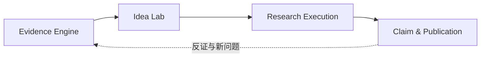

# Pharos Research Workflow

> 状态：**v1 已落地。** 本文描述当前可以实际走通的文献探索与研究项目工作流，并定义它向
> Research OS 演进时必须保持的边界。未接入的自动 Idea 生成、页面级证据、实验执行和自动写作均明确
> 标为 Future，不应从本文推断为现有能力。

本文是 research slice 的唯一详细规范；[`ARCHITECTURE.md`](ARCHITECTURE.md) 只保留全局架构和入口。

## 1. 四个顶层模块

Pharos v1 的工作台由四个真实入口组成：

| 模块 | 当前能力 | 在研究链中的位置 |
|---|---|---|
| **文库** | PDF 导入、翻译、阅读、全文检索、批注、分类与 Zotero 同步 | 用户已经拥有并精读的论文 |
| **每日论文** | 按用户研究方向获取 arXiv 新论文，可用已配置模型生成摘要级阅读结果并导入文库 | 持续发现候选文献 |
| **文献探索** | 查询 arXiv / OpenAlex、跨源去重、保存搜索历史、摘要规则分析/可选 AI 深读、归档结果到项目 | 主动搜索和初步筛选 |
| **研究项目** | 创建和维护项目、纳入文献并记录理由、推进研究阶段、持久化科研记录 | 把零散文献组织成可回溯的研究过程 |

当前产品主线是：

```text
提出查询或 Idea
→ 跨源文献探索
→ 检查摘要级分析与来源
→ 将有价值的结果纳入研究项目并写下理由
→ 记录 hypothesis / experiment plan / result / claim / draft / review
→ 人工推进项目阶段
```

这不是空白 wireframe：搜索、历史、项目、来源和研究记录都由 FastAPI + SQLite 持久化，刷新页面后仍可
恢复。它也不是自动科研执行器：当前不会替用户运行代码、GPU 实验或自动验证 Claim。

## 2. v1 端到端工作流

### 2.1 创建研究问题

用户可以先创建研究项目，也可以先在“文献探索”中搜索，再在归档结果时选择已有项目或新建项目。

一个项目当前保存：

- `name`：项目名称；
- `description`：背景、范围或工作说明；
- `research_question`：当前研究问题；
- `status`：`active` 或 `archived`；
- `stage`：当前研究阶段；
- 纳入的文献来源与各自备注；
- 各阶段的持久化研究记录。

v1 尚未把 Research Profile 拆成算力、数据、正负过滤条件等细粒度字段；这些内容可以先写入项目描述、
研究问题或对应 artifact，未来再迁移为结构化 Profile。

### 2.2 执行文献探索

用户输入 query/Idea，选择 `arxiv`、`openalex` 或两者，并提交搜索。

后端并行请求所选来源，并完成：

1. 将不同来源映射到统一的 `LiteratureResult`；
2. 按 DOI 或规范化标题识别跨源重复项；
3. 合并来源标识、作者、摘要、引用数和可用链接；
4. 按用户选择的来源顺序 round-robin 交错结果，避免一个来源占满第一页，同时保持稳定排序；
5. 保存搜索条件、每个来源的错误、规范化结果和完成时间。

搜索历史可以重新打开，不依赖浏览器内存。搜索状态语义为：

- `complete`：所有选定来源都成功返回；
- `partial`：至少一个来源成功，同时至少一个来源失败；
- `error`：没有来源产生可用结果；请求仍返回 201 和完整的失败运行，便于立即展示与重开；
- `running`：数据库中的运行中状态；同步请求异常退出时不得伪装为完成。

单个 Provider 失败不会丢弃其他 Provider 已获得的结果。错误按来源持久化并在 UI 中展示。

### 2.3 阅读搜索结果

每条结果保存标准书目信息、摘要、来源、来源 ID、链接和可用的引用次数。v1 还提供四个结构化字段：

- `core_trick`
- `method`
- `results`
- `limitations`

这些字段默认使用**确定性的摘要规则分析**：只从标题和摘要中抽取实际存在的句子，缺失内容保持为空。
它不调用 LLM、不下载或阅读全文，也没有执行论文中的实验。每条规则结果以
`analysis_mode: "rules"` 和 `analysis_warning` 明示这一限制。

用户可以对单条结果主动执行“AI 深读”。该操作复用已配置的 OpenAI-compatible 阅读 Provider，对标题和
摘要生成经过 schema 校验的中文摘要、贡献、创新点、方法和结果，并记录 `analysis_mode: "llm"` 与
`analysis_model`。它仍然**只读取搜索结果中的标题和摘要**；不会下载 PDF，不得称为全文解读。当前阅读
schema 不要求模型生成局限性，因此 `limitations` 保留规则抽取值，而不是强迫模型补写。

如果没有配置 Provider，AI 深读返回 409 并原样保留规则结果；Provider 请求或返回验证失败时返回 503，
同样不破坏已有结果。

因此，无论 `rules` 还是 `llm`，v1 的“分析”都只能用于快速筛选，不能当作全文证据、复现结论或
论文真实性判断。

### 2.4 纳入研究项目

用户选择搜索结果后，将它保存为 `ProjectSource`。这个独立关系有两个目的：

1. 明确“搜索命中”与“项目证据候选”不是一回事；只有研究者主动选择的结果才进入项目；
2. 保存 `note`，记录**为什么纳入、它支持或反对什么、下一步应核对什么**。

推荐的备注格式：

```text
纳入理由：它提出了与当前问题可迁移的机制。
可能支持：假设 H1。
仍需核对：正文第几页给出关键实验；是否只在单一数据集上成立。
```

`ProjectSource.note` 是研究者的证据备注，不是模型确认过的事实。v1 没有页面级 locator；如果只有摘要，
备注中不能伪造页码或原文引文。

### 2.5 推进研究项目

项目按以下九个阶段前进：

```text
discovery
→ ideation
→ planning
→ experimentation
→ analysis
→ claims
→ drafting
→ review
→ complete
```

阶段由用户显式推进，不因为创建了某条记录就自动跳转。这样可以避免系统把“写了一个实验计划”误认为
“实验已经执行”，或把“记录一个 Claim”误认为“Claim 已证实”。项目可以归档；归档不删除其历史。

### 2.6 持久化研究记录

每条 `ProjectArtifact` 都属于一个项目和一个阶段，包含标题、正文、类型和状态。当前支持的类型：

| 类型 | 用途 | 当前系统是否自动完成 |
|---|---|---|
| `hypothesis` | 可检验的假设、机制和反例 | 否，用户编写/编辑 |
| `experiment_plan` | 数据、基线、指标、预算和停止条件 | 否，系统不执行计划 |
| `result` | 用户带回的实验观察、指标和 artifact 说明 | 否，系统不生成结果 |
| `claim` | 准备由证据或结果支撑的主张 | 否，系统不自动确认 |
| `draft` | 论文或报告草稿片段 | 否，当前没有自动写作流水线 |
| `review` | 审稿意见、反方检查或修改记录 | 否，当前没有自动审稿流水线 |

Artifact 状态为：

- `draft`：仍在编辑；
- `ready`：准备进入下一步人工检查；
- `verified`：用户明确确认已有足够依据；
- `rejected`：已否决但保留历史。

`verified` 是用户在 Pharos 中作出的记录状态，不代表平台独立复现或第三方认证。Artifact 可创建、编辑、
删除；重要研究决定更推荐标记 `rejected` 并保留原因，而不是删除。

## 3. 当前数据链与证据强度

长期数据链是：

```text
Paper → Evidence → Hypothesis → Experiment → Result → Claim → Paper
```

v1 对它的真实映射如下：

| 长期概念 | v1 对应实体 | 当前证据强度 |
|---|---|---|
| Paper | `LiteratureResult`，以及既有文库 `Paper` | 搜索结果主要是元数据和摘要；文库 Paper 可有完整 PDF |
| Evidence | `ProjectSource` + `LiteratureResult` + `note` | 摘要级候选证据，没有页面级引文 |
| Hypothesis | `ProjectArtifact(type=hypothesis)` | 人工记录，未自动查新或评分 |
| Experiment | `ProjectArtifact(type=experiment_plan)` | 计划记录，不执行代码 |
| Result | `ProjectArtifact(type=result)` | 用户录入；平台不验证指标来源 |
| Claim | `ProjectArtifact(type=claim)` | 用户可标记状态，但尚无强制证据绑定 |
| Paper | `draft` / `review` artifact | 研究过程记录，不是完整自动写作系统 |

### 3.1 v1 记录约定

为了让现在的自由文本 artifact 能平滑迁移到未来结构化实体，建议正文至少包含：

**Hypothesis**

```text
假设：什么条件下会发生什么可观察变化？
机制：为什么？
反例/证伪：看到什么结果应放弃？
关联来源：哪些 ProjectSource 支持或反对？
```

**Experiment plan**

```text
主要问题：本实验只回答什么？
数据与基线：使用什么比较？
主指标：成功和失败阈值是什么？
预算：最长时间、GPU-hour 或金额。
停止条件：何时停止或 Pivot？
```

**Result / Claim**

```text
观察/主张：精确陈述。
来源：运行、日志、图表、论文或 ProjectSource。
限制：哪些范围之外不能推广？
状态理由：为什么是 draft / ready / verified / rejected？
```

## 4. 状态与失败策略

### 4.1 Provider 不可用

当前检索 Provider 是 arXiv 与 OpenAlex：

- 一个失败、一个成功：搜索保存为 `partial`，保留成功结果和失败原因；
- 全部失败：保存 `error` 和每个来源的错误并返回该运行；结果列表为空，不创建伪造结果；
- Provider 返回畸形或超大响应：按来源失败，受超时与响应体大小限制保护；
- 历史搜索、已有项目和 artifact 始终可读写；
- 重试产生新的搜索记录，不覆盖历史运行。

v1 的摘要规则分析不依赖 LLM，所以未配置聊天/翻译 Provider 不会阻断搜索、归档或研究项目。可选 AI
深读在未配置 Provider 时返回 409，在 Provider/验证失败时返回 503，并保留原规则结果。Future Idea/评审
同样必须保留阶段产物并允许人工继续，且不能未经用户选择切换远程服务。

### 4.2 人工 checkpoint

当前所有关键转换本身就是人工 checkpoint：

- 用户决定使用哪些搜索来源；
- 用户决定哪些结果进入项目并填写纳入理由；
- 用户创建和修改 hypothesis/plan/result/claim；
- 用户决定 artifact 是否 `ready`、`verified` 或 `rejected`；
- 用户显式推进项目阶段。

Future 自动化可以提出建议，但不得绕过这些 checkpoint，直到产品提供明确、可撤销的自动化授权。

## 5. API 概览（v1）

以下端点属于当前 research slice：

```text
POST          /api/discovery/search
GET           /api/discovery/searches
GET           /api/discovery/searches/{search_id}
POST          /api/discovery/results/{result_id}/analyze

GET/POST      /api/projects
GET/PATCH     /api/projects/{project_id}
DELETE        /api/projects/{project_id}
POST          /api/projects/{project_id}/advance

POST          /api/projects/{project_id}/sources
PATCH/DELETE  /api/projects/{project_id}/sources/{source_id}

GET/POST      /api/projects/{project_id}/artifacts
GET/PATCH/DELETE /api/projects/{project_id}/artifacts/{artifact_id}
```

所有搜索、项目、来源和 artifact 都带用户所有权；后端必须先按当前用户过滤。不存在与属于其他用户的 ID
使用相同 404 语义，不能通过枚举 ID 推断别人的研究方向或项目。

## 6. v1 架构

```text
React workbench
  ├── 文库 / 每日论文
  ├── 文献探索
  └── 研究项目
          │ REST + Bearer auth
          ▼
FastAPI
  ├── discovery API → arXiv/OpenAlex adapters → normalize/deduplicate/rule summary
  │                                      └── optional validated AI abstract reading
  ├── projects API  → project/source/artifact services
  └── SQLAlchemy    → SQLite (user-scoped durable records)
```

Research workflow 直接构建在现有 FastAPI、SQLAlchemy 与 SQLite 上。v1 不引入 Dify、LangGraph、Neo4j
或另一个工作流控制平面；当前流程有界且主要由用户推进，显式 Python/service 代码更容易测试和审计。

自动生成内容只应保存结构化结论、简要理由和来源，不保存或展示 raw chain-of-thought。外部 novelty 搜索
未来只能报告 `likely_distinct`、`likely_overlap` 或 `search_incomplete`，不能声称“确认原创”。

## 7. 四层 Research OS 的演进位置



### Evidence Engine

- **v1：** arXiv/OpenAlex 搜索、去重、摘要级规则分析、可选 AI 摘要深读、搜索历史、ProjectSource
  和纳入备注。
- **Future：** 将文库 PDF 切成 page-aware `PaperChunk`，建立可点击的 Evidence Ledger。

### Idea Lab

- **v1：** 用户在项目中创建和持久化 hypothesis 等 artifact，并人工推进阶段。
- **Future：** Research Profile、Idea Lens、多候选生成、去重、反方评审、查新状态，以及
  Pursue / Refine / Park / Kill 决策。

### Research Execution

- **v1：** 记录 experiment plan 和用户带回的 result；明确显示“不会自动执行”。
- **Future：** Research Contract、Hypothesis Tree、隔离的 Experiment Run、不可变指标与
  Keep / Discard / Pivot 循环。

### Claim & Publication

- **v1：** claim、draft、review artifact 及其人工状态。
- **Future：** Claim 与页面证据/实验结果的强绑定、图表溯源、引用审计和受证据约束的写作。

## 8. Future 证据契约

页面级 Evidence 尚未实现，但后续实现必须满足：

```text
claim
└── evidence statement
    └── paper identity
        └── page + section
            └── exact quote / figure locator
```

必须区分原文 quote、人工备注、规则摘要和模型推断。只有摘要时显示 `abstract_only`；页面未知时不能生成
看似精确的页码。每个自动产物记录 provider、model、workflow/schema version 和输入快照哈希。证据不足
应标记 `insufficient_evidence` 或 `search_incomplete`，而不是补写一个听起来合理的引用。

## 9. 预算、安全与隐私

- v1 搜索限制来源集合、返回数量、超时和响应体大小；单源失败可部分成功；
- 用户论文、查询、项目、来源备注和 artifact 全部按 `user_id` 隔离；
- API key 不进入响应，日志不得包含密钥或完整私有文档；
- v1 不执行模型生成的代码、shell 命令或外部实验；
- Future 执行层默认 deny，必须用 Research Contract 冻结可改文件、命令、网络、数据、主指标、预算和
  停止条件；
- evaluator 在实验开始前冻结，模型不得修改评价程序来制造更好结果；
- 对论文和网页内容按不可信输入处理，避免 prompt injection 改变系统权限；
- 多用户可以复用公开书目信息，但不能复用个性化备注、Idea 或研究记录。

## 10. v1 端到端验收标准

只有同时满足以下条件，才可以称“文献探索与研究项目 v1 已完成”：

1. 登录用户可以在文献探索中选择 arXiv/OpenAlex 并提交查询；
2. 搜索运行、来源错误和去重结果写入数据库，刷新后能从历史重新打开；
3. 一个来源故障时仍展示另一个来源的结果并标记 `partial`；全部故障仍返回并持久化可重开的
   `error` 运行，结果列表为空；
4. 结果明确显示 provider、摘要和当前分析模式；`rules` 显示分析警告，可选 AI 深读记录模型，二者都不
   描述成阅读全文；
5. 用户可以创建项目，或在归档结果时创建项目；
6. 用户可将结果纳入项目、填写/修改纳入理由，并移除来源；
7. 用户可创建、编辑和删除六类 ProjectArtifact，并持久化四种状态；
8. 用户可按九个阶段推进项目，并可编辑、归档或删除项目；
9. UI 明示 artifact 是研究记录，当前没有自动实验执行器，不出现伪造的运行按钮或指标；
10. 搜索、项目、ProjectSource 和 ProjectArtifact 都经过用户隔离，越权访问返回 404；
11. 页面刷新后，搜索历史、项目阶段、来源备注和 artifact 内容均不丢失；
12. 未配置 AI Provider 时深读返回可解释的 409，Provider/验证失败返回 503，且原规则结果不被覆盖；
13. 前后端测试和生产构建通过，且原有文库、每日论文、翻译与阅读流程不回归。

## 11. Future：ARIS 式扩展顺序

1. 先连接文库 `Paper` 与 `ProjectSource`，增加页面级 chunk 和 Evidence Ledger；
2. 再加入 Research Profile、Idea Card 和 Validation Plan 的结构化 schema；
3. 增加带来源的 Idea 生成、独立反方评审和不确定性明确的 novelty search；
4. 在隔离环境中实现 Research Contract 与最小实验闭环；
5. 最后让 Claim 和写作只消费可追溯 Evidence / Experiment Result。

这条顺序确保 Pharos 先建立真实研究记录和证据，再增加自动化程度，而不是先生成无法验证的“完整论文”。

## 12. 品牌风险注记

GitHub 上存在同属自动化科研方向的项目
[OpenNSWM-Lab/FAROS](https://github.com/OpenNSWM-Lab/FAROS)。名称拼写不同，但读音和领域接近；未来
公开推广、域名、SEO 和桌面客户端发布前应做品牌区分评估。本文不对此作法律结论。
